@import "css/vastChallenge.less"

<!-- Everything above this line should probably be left untouched. -->

# VAST Challenge 2019: Disaster at St. Himark

## Diary of Progress

{(timestamp|}16th April, 15:00{|timestamp)}

### A First look at the challenge

Looks like standard structure to the challenge.
3 Mini challenges and one integrating grand challenge.
MC1, MC2 and MC3 all focussing on spatio-temporal patterns from sensor or user data; MC3 on text analyis. Suggests a single framework for all may be possible.

But boy, does the supplied cartography hurt my eyes. As with most years, my first task will be to create a vector basemap onto which the spatial data can be referenced.
We have a shapefile of the region this year which helps to speed things up (no more digitizing in LandSerf).
Looking at MC1 spatial referencing appears to be neighbourhood ID only, but MC2 uses longitude/latitude.
Data description for MC2 provides long/lat bounds for the mapped area, so it makes sense to use this as a common spatial referencing for at least MC1 and MC2.

We also seem to have similar timeframe for all three challenges. Can we use a common time view?

### Georeferencing

The shapefile provided for MC2 uses projected coordinates so need to perform a couple of spatial transformations using [mapshaper](https://mapshaper.org)

- Reproject to long/lat with mapshaper console command:
  - `mapshaper -proj wgs84`
- Export as topojson file
  - `data/StHimark.json`
- Calculate neighbourhood centroids for labelling and georeferencing:
  - `mapshaper -each 'cx=this.centroidX, cy=this.centroidY' -o 'nhCentroids.csv'`

Additional files also created for cartographic output:

- Manually create hospital and powerplant location file from values supplied in the MC2 data description document.
- Manually digitize bridge locations
- Manually digitize shakemap contours

Can use unicode symbols for hospital and powerplant, which will make map labelling easier.

`pois.csv`:

```
id,poi,label,long,lat
1,hospital,Ⓗ,-119.959400,0.180960
2,hospital,Ⓗ,-119.915900,0.153120
3,hospital,Ⓗ,-119.909520,0.151090
4,hospital,Ⓗ,-119.904300,0.121800
5,hospital,Ⓗ,-119.883420,0.134560
6,hospital,Ⓗ,-119.855580,0.182990
7,hospital,Ⓗ,-119.828610,0.041470
8,hospital,Ⓗ,-119.744800,0.065250
9,Nuclear plant,☢️,-119.784825,0.162679
```

Confirm all georeferencing with simple basemap:

^^^elm {v=contextMap}^^^

{(duration|}3 hours{|duration)}

{(timestamp|}17th April, 09:00{|timestamp)}

## MC2 Data Exploration

I want to get a better sense of the spatial coverage of the sensor data in MC2 before considering approaches to VA.

- Added a simple character symbol and PoI name to the `staticSensorLocations.csv` for mapping convenience and consistency with hospital/powerplant PoI file:

```
id,poi,label,long,lat
12,sSensor,⍟,-119.81556,0.20764
15,sSensor,⍟,-119.79033,0.16849
13,sSensor,⍟,-119.80715,0.15979
11,sSensor,⍟,-119.82861,0.04147
6,sSensor,⍟,-119.9043,0.1218
1,sSensor,⍟,-119.9594,0.15689
9,sSensor,⍟,-119.85558,0.18299
14,sSensor,⍟,-119.79265,0.1218
4,sSensor,⍟,-119.90952,0.15109
```

Overlaying data on the basemap, noting that four of the sensors are located at hospitals.

{(question|}Could sensor data at the hospitals indicate higher background radiation rates due to equipment (x-rays etc.)?{|question)}

{(question|}Could sensor data at the hospitals indicate higher radiation rates if contaminated casulties are located there?{|question)}

^^^elm {v=mc2StaticSensorMap}^^^

Visual inspection of `StaticSensorReadings.csv` and `MobileSensorReadings.csv` suggests the `Units` column is superfluous, so I've made copies without this column to reduce file size. Large file cut with

```bash
cut -d, -f1-5,7  ../../MC2/data/MobileSensorReadings.csv > mobileSensorReadings.csv
```

Removed superfluous spaces and quotaton marks from `mobileSensorReadings` to avoid possible data matching problems.

To get a sense of the coverage of the mobile sensor readings, here is a dot map of recorded locations. The file is too large to show every point, but a random sample of 100,000 points, coloured by sensor ID, gives an indication of spatial spread along the road network. (shown as an image rather than live litvis code to speed up rendering):

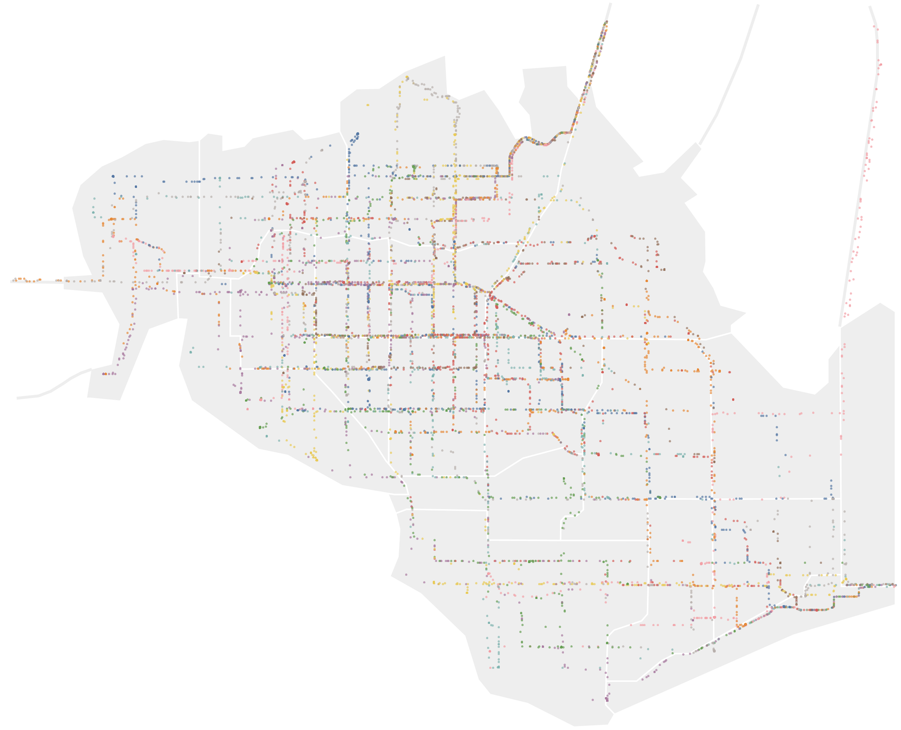

```elm {l=hidden}
mc2MobileSensorMap : Spec
mc2MobileSensorMap =
    let
        specBackground =
            asSpec
                [ neighbourhoodBounds
                , geoshape
                    [ maStroke "white"
                    , maFill "#eee"
                    , maStrokeWidth 2
                    ]
                ]

        specBridges =
            asSpec
                [ bridges
                , geoshape [ maStroke "#eee", maStrokeWidth 4 ]
                ]

        trans =
            transform << sample 100000

        encSensor =
            encoding
                << position Longitude [ pName "long", pMType Quantitative ]
                << position Latitude [ pName "lat", pMType Quantitative ]
                << color [ mName "sensorId", mMType Nominal, mLegend [] ]

        specSensors =
            asSpec [ mc2MobileSensorReadings, trans [], encSensor [], circle [ maSize 10 ] ]
    in
    toVegaLite
        [ width 1280
        , height 1000
        , cfg []
        , layer [ specBackground, specBridges, specSensors ]
        ]
```

{(observation|}

It is clear some mobile sensors have exclusive routes, especially on the bridges.
Radiation readings in these areas will be particularly vulnerable to sensor error so much check their readings carefully.

{|observation)}

{(timestamp|}17th April, 13:00{|timestamp)}

### Temporal distribution of static sensors

To check temporal coverage, here is a stacked histogram of the timestamps of the 744,000 static sensor readings bind into minute intervals:

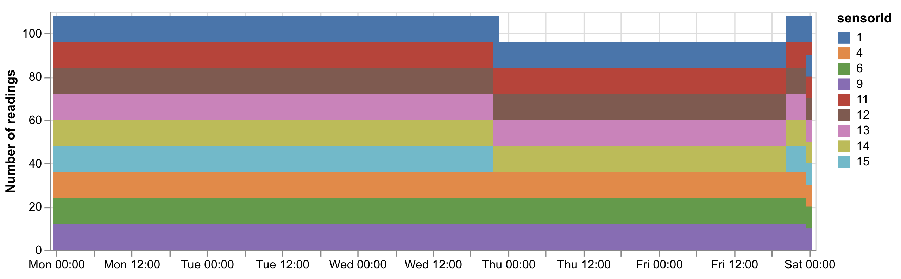

```elm {l=hidden}
mc2StaticSensorTimes : Spec
mc2StaticSensorTimes =
    let
        enc =
            encoding
                << position X
                    [ pName "timestamp"
                    , pMType Temporal
                    , pScale [ scNice niHour ]
                    , pTimeUnit yearMonthDateHoursMinutes
                    , pAxis [ axTitle "", axFormat "%a %H:%M" ]
                    ]
                << position Y
                    [ pAggregate opCount
                    , pMType Quantitative
                    , pAxis [ axTitle "Number of readings" ]
                    ]
                << color [ mName "sensorId", mMType Nominal, mScale staticColours ]
    in
    toVegaLite [ width 640, mc2StaticSensorReadings, enc [], bar [ maBinSpacing 0 ] ]
```

{(observation|}Shows sensor 15 (yellow) is out of action between approximately 22:30 Wednesday and 21:00 Friday.{|observation)}

### Temporal distribution of mobile sensors

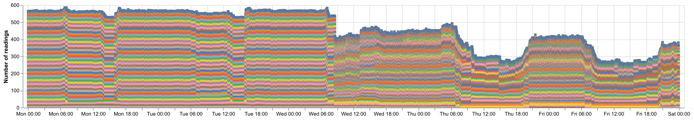

```elm {l=hidden}
mc2MobileSensorTimes : Spec
mc2MobileSensorTimes =
    let
        enc =
            encoding
                << position X
                    [ pName "timestamp"
                    , pMType Temporal
                    , pScale [ scNice niHour ]
                    , pTimeUnit yearMonthDateHoursMinutes
                    , pAxis [ axTitle "", axFormat "%a %H:%M" ]
                    ]
                << position Y
                    [ pAggregate opCount
                    , pMType Quantitative
                    , pAxis [ axTitle "Number of readings" ]
                    ]
                << color [ mName "sensorId", mMType Nominal, mScale staticColours, mLegend [] ]
    in
    toVegaLite [ width 640, mc2MobileSensorReadings, enc [], bar [ maBinSpacing 0 ] ]
```

{(observation|}

Chart above can be used to identify periods of sensor disruption both before and after earthquake events.
Will need to revisit this in more detail once analysis of data begins.

{|observation)}

### Distribution of Radiation Measurements

#### Static Sensors

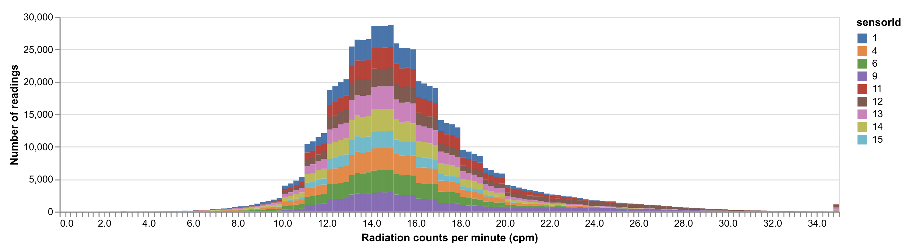

```elm {l=hidden}
mc2StaticSensorDist : Spec
mc2StaticSensorDist =
    let
        enc =
            encoding
                << position X
                    [ pName "cpm"
                    , pMType Quantitative
                    , pBin [ biExtent 0 35, biStep 0.25 ]
                    , pAxis [ axTitle "Radiation counts per minute (cpm)" ]
                    ]
                << position Y
                    [ pAggregate opCount
                    , pMType Quantitative
                    , pAxis [ axTitle "Number of readings" ]
                    ]
                << color [ mName "sensorId", mMType Nominal, mScale staticColours ]
    in
    toVegaLite [ width 800, mc2StaticSensorReadings, enc [], bar [ maBinSpacing 0 ] ]
```

{(observation|}

Radiation values appear to be quantised to some extent to the nearest whole number.
The chart above is constrained between 0 and 36 cpm, but there are some negative values and some outliers with very high values (see right-hand bar).

{|observation)}

Range box-plots on a log scale capture the distribution extrema more effectively:

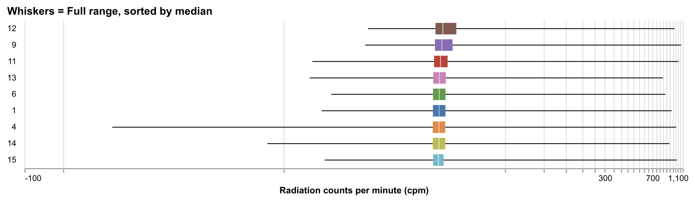

```elm {l=hidden}
mc2StaticRangeBoxplot : Spec
mc2StaticRangeBoxplot =
    let
        enc =
            encoding
                << position X
                    [ pName "cpm"
                    , pMType Quantitative
                    , pScale [ scType scSymLog ]
                    , pAxis [ axTitle "Radiation counts per minute (cpm)" ]
                    ]
                << row
                    [ fName "sensorId"
                    , fMType Nominal
                    , fSort [ soByField "cpm" opMedian, soDescending ]
                    , fHeader [ hdTitle "" ]
                    ]
                << color [ mName "sensorId", mMType Nominal, mScale staticColours, mLegend [] ]
    in
    toVegaLite
        [ title "Whiskers = Full range, sorted by median"
        , width 800
        , cfg []
        , mc2StaticSensorReadings
        , enc []
        , boxplot [ maExtent (exIqrScale 1000) ]
        ]
```

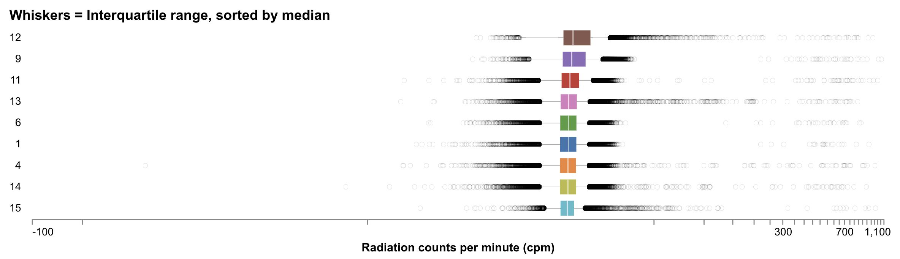

```elm {l=hidden}
mc2StaticIqrBoxplot : Spec
mc2StaticIqrBoxplot =
    let
        enc =
            encoding
                << position X
                    [ pName "cpm"
                    , pMType Quantitative
                    , pScale [ scType scSymLog ]
                    , pAxis [ axTitle "Radiation counts per minute (cpm)", axGrid False ]
                    ]
                << row
                    [ fName "sensorId"
                    , fMType Nominal
                    , fSort [ soByField "cpm" opMedian, soDescending ]
                    , fHeader [ hdTitle "" ]
                    ]
                << color [ mName "sensorId", mMType Nominal, mScale staticColours, mLegend [] ]
    in
    toVegaLite
        [ title "Whiskers = Interquartile range, sorted by median"
        , width 800
        , cfg []
        , mc2StaticSensorReadings
        , enc []
        , boxplot
            [ maExtent (exIqrScale 1)
            , maRule [ maStrokeWidth 0.2 ]
            , maOutliers [ maSize 20, maStrokeWidth 0.1, maOpacity 0.3, maColor "black" ]
            ]
        ]
```

{(observation|}Shows that sensors 4 and 14 have erroneous negative values and that sensors 9 and 12 have a greater (inter-quartile) spread than the others. We also see a sub-distribution at around 500 cpm that is worth looking at in more detail.{|observation)}

Limiting the view to the upper part of the distribution:

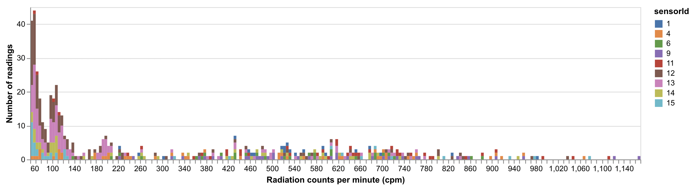

```elm {l=hidden}
mc2StaticSensorDistUpper : Spec
mc2StaticSensorDistUpper =
    let
        trans =
            transform << filter (fiExpr "datum.cpm > 60")

        enc =
            encoding
                << position X
                    [ pName "cpm"
                    , pMType Quantitative
                    , pBin [ biStep 5 ]
                    , pAxis [ axTitle "Radiation counts per minute (cpm)" ]
                    ]
                << position Y
                    [ pAggregate opCount
                    , pMType Quantitative
                    , pAxis [ axTitle "Number of readings" ]
                    ]
                << color [ mName "sensorId", mMType Nominal, mScale staticColours ]
    in
    toVegaLite [ width 800, mc2StaticSensorReadings, trans [], enc [], bar [ maBinSpacing 0 ] ]
```

#### Mobile Sensors

Lower range of radiation distribution (values limited to less than 100 cpm):

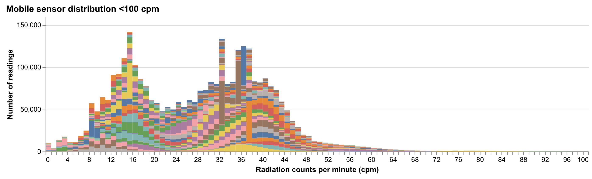

```elm {l=hidden}
mc2MobileSensorDistLower : Spec
mc2MobileSensorDistLower =
    let
        trans =
            transform << filter (fiExpr "datum.cpm < 100")

        enc =
            encoding
                << position X
                    [ pName "cpm"
                    , pMType Quantitative
                    , pBin [ biStep 1 ]
                    , pAxis [ axTitle "Radiation counts per minute (cpm)" ]
                    ]
                << position Y
                    [ pAggregate opCount
                    , pMType Quantitative
                    , pAxis [ axTitle "Number of readings" ]
                    ]
                << color [ mName "sensorId", mMType Nominal, mLegend [] ]
    in
    toVegaLite
        [ cfg []
        , title "Mobile sensor distribution <100 cpm"
        , width 800
        , mc2MobileSensorReadings
        , trans []
        , enc []
        , bar [ maBinSpacing 0 ]
        ]
```

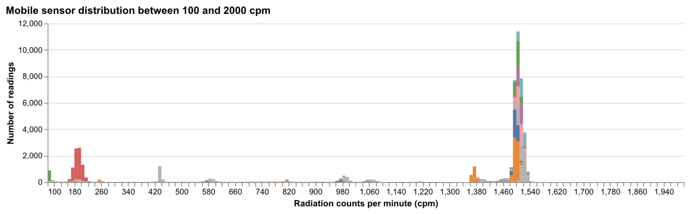

```elm {interactive l=hidden}
mc2MobileSensorDistUpper : Spec
mc2MobileSensorDistUpper =
    let
        trans =
            transform
                << filter (fiExpr "datum.cpm >=100 && datum.cpm < 2000")

        enc =
            encoding
                << position X
                    [ pName "cpm"
                    , pMType Quantitative
                    , pBin [ biMaxBins 200 ]
                    , pAxis [ axTitle "Radiation counts per minute (cpm)" ]
                    ]
                << position Y
                    [ pAggregate opCount
                    , pMType Quantitative
                    , pAxis [ axTitle "Number of readings" ]
                    ]
                << color [ mName "sensorId", mMType Nominal, mLegend [] ]
    in
    toVegaLite
        [ cfg []
        , title "Mobile sensor distribution between 100 and 2000 cpm"
        , width 800
        , mc2MobileSensorReadings
        , trans []
        , enc []
        , bar [ maBinSpacing 0 ]
        ]
```

{(observation|}

Radiation values appear to be quantised to some extent to the nearest whole number and ther are anomolous values for some sensors (yellow sensor **23** at 15 cpm; brown sensor **35** at 32 cpm; brown sensor **26** at 35 cpm; blue sensor **1** at 36 cpm and orange sensor **47** at 37 cpm).

There appear to be two distributions centred around 16 and 38 cpm at the lower end and spikes at 200 and 1500 cpm at the upper end.

To note the spikes at the upper end: red sensor **20** at around 200 cpm; grey sensor **9** at around 430 cpm; orange sensor **10** at 1380 cpm; and sensors **21, 22, 24, 25, 27, 28, 29, 45** at the spike around 1500 cpm.

{|observation)}

Range box-plots on a log scale capture the distribution extrema more effectively:

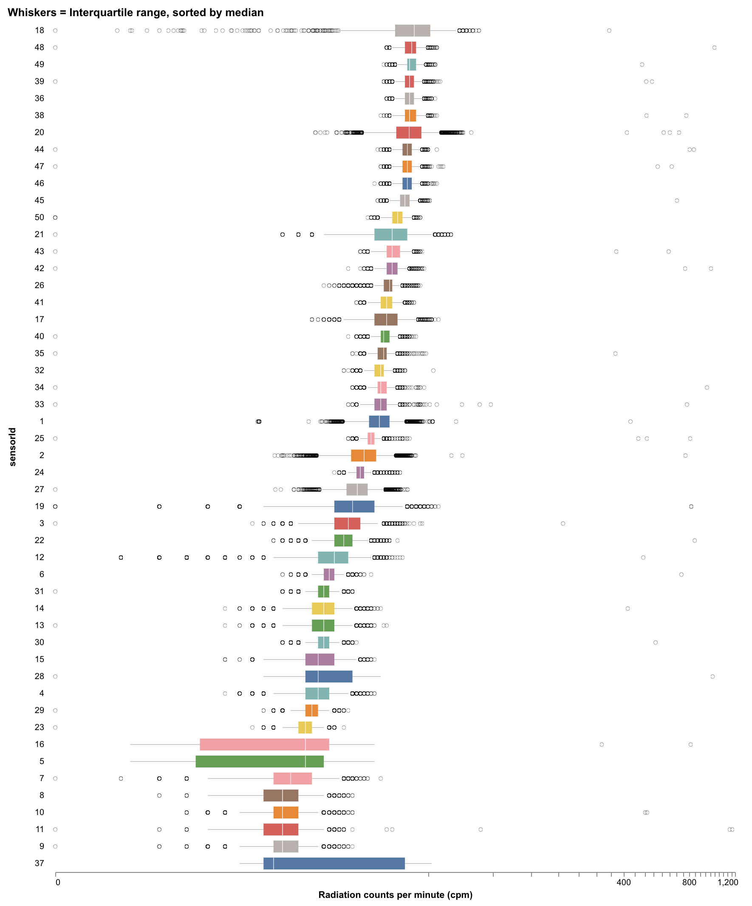

```elm {l=hidden}
mc2MobileRangeBoxplot : Spec
mc2MobileRangeBoxplot =
    let
        enc =
            encoding
                << row [ fName "sensorId", fMType Nominal, fSort [ soByField "cpm" opMedian, soDescending ] ]
                << position X
                    [ pName "cpm"
                    , pMType Quantitative
                    , pScale [ scType scSymLog ]
                    , pAxis [ axTitle "Radiation counts per minute (cpm)", axGrid False ]
                    ]
                << color [ mName "sensorId", mMType Nominal, mLegend [] ]
    in
    toVegaLite
        [ title "Whiskers = Interquartile range, sorted by median"
        , cfg []
        , width 800
        , mobileSensorReadingsRandomSample
        , enc []
        , boxplot
            [ maExtent (exIqrScale 1)
            , maRule [ maStrokeWidth 0.2 ]
            , maOutliers [ maSize 20, maStrokeWidth 0.2, maColor "black" ]
            ]
        ]
```

{(duration|}3 hours{|duration)}

{(timestamp|}1st May, 14:00{|timestamp)}

## MC1 Data Exploration

Unlike MC2, spatial refererencing of shake observations are only referenced to their district so we are dealing with spatially imprecise observations here. Given the low precision the regions may be better represented as a grid so that charts may be placed in their quasi-spatial locations. There are a number of possible grid arrangements (see [Small Multiples with Gaps](http://openaccess.city.ac.uk/15167/)), but 5x7 grid gives a reasonable approximatation allowing all coastal regions to be exterior. Additionally we can add the entrance/exit routes (bridges and highway) to the relevant exterior grid cells.

We can add the grid row and grid column values and the two-letter neighbourhood abbreviations to the file `nhCentroids.csv` created for map labels.

^^^elm {v=gridLayout}^^^

Inevitably, some spatial distortion is required to force a grid layout. Because we are likely to be considering distance from the seismic epicentre as an important factor we can see the relationship between each neighbourbood's centroid distance from the epicentre and its grid centroid distance from the epicentre. This would allow us to see if any gridded lcoation is giving a particularly misleading distortion of space:

```elm {v interactive}
distanceChart : Spec
distanceChart =
    let
        trans =
            transform
                << spatialFilter
                << calculateAs "sqrt((datum.cx - -119.7619)*(datum.cx - -119.7619) + (datum.cy - 0.2332)*(datum.cy - 0.2332))" "geoDist"
                << calculateAs "sqrt((datum.col - 4.5)*(datum.col - 4.5) + (datum.row - -1)*(datum.row - -1))" "grdDist"

        diagData =
            dataFromRows []
                << dataRow [ ( "x1", num 0 ), ( "x2", num 0.22 ), ( "y1", num 0 ), ( "y2", num 5.5 ) ]

        enc =
            encoding
                << position X
                    [ pName "geoDist"
                    , pMType Quantitative
                    , pAxis [ axLabels True, axGrid False, axTitle "Geo distance to epicentre" ]
                    ]
                << position Y
                    [ pName "grdDist"
                    , pMType Quantitative
                    , pAxis [ axLabels True, axGrid False, axTitle "Grid distance to epicentre" ]
                    ]
                << text [ tName "nbrhood", tMType Nominal ]
                << tooltip [ tName "nbrhood", tMType Nominal ]

        diagEnc =
            encoding
                << position X [ pName "x1", pMType Quantitative, pAxis [] ]
                << position Y [ pName "y1", pMType Quantitative, pAxis [] ]
                << position X2 [ pName "x2", pAxis [] ]
                << position Y2 [ pName "y2", pAxis [] ]

        specCircle =
            asSpec [ circle [] ]

        specText =
            asSpec [ textMark [ maAlign haLeft, maFontSize 6, maDx 7 ] ]

        specDiag =
            asSpec [ diagData [], diagEnc [], rule [ maOpacity 0.4 ] ]
    in
    toVegaLite
        [ width 300
        , height 300
        , neighbourhoodCentroids
        , trans []
        , enc []
        , layer [ specCircle, specText, specDiag ]
        ]
```

### Data Tidying

The MC1 report data are not in tidy format (one row per observation). Using a sample of the first few rows:

^^^elm{m=(tableSummary 4 reportTableSample)}^^^

To show the other report data effectively we need to reshape the data table into tidy format with a gather operation:

^^^elm{m=(tableSummary 12 (tidyReport reportTableSample))}^^^

The full tidy table is converted using `tidyReport` and stored as `tidyReports.csv`

Ignoring space for the moment, we can group observations into minute bins and count them.
We can make the chart interactive so can drill down to a finer temporal resolution.

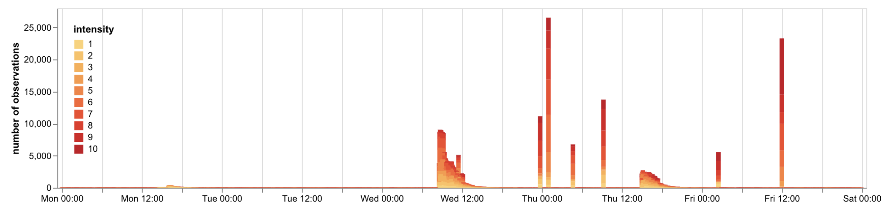

```elm {l=hidden interactive}
reportSummary : Spec
reportSummary =
    let
        trans =
            transform
                << filter (fiExpr "datum.intensity")
                << timeUnitAs yearMonthDateHoursMinutes "timestamp" "binnedTime"
                << joinAggregate [ opAs opCount "intensity" "nRecords" ] [ wiGroupBy [ "binnedTime" ] ]

        countEnc =
            encoding
                << position X
                    [ pName "binnedTime"
                    , pMType Temporal
                    , pAxis [ axTitle "", axFormat "%a %H:%M" ]
                    ]
                << position Y
                    [ pName "intensity"
                    , pAggregate opCount
                    , pMType Quantitative
                    , pAxis [ axTitle "number of observations", axGrid False ]
                    ]
                << color
                    [ mName "intensity"
                    , mMType Ordinal
                    , mLegend [ leOrient loTopLeft ]
                    , mScale [ scScheme "yelloworangered" [] ]
                    ]
                << order [ oName "intensity", oMType Ordinal, oSort [ soAscending ] ]

        sel =
            selection
                << select "mySelection" seInterval [ seBindScales, seEncodings [ chX ] ]

        countSpec =
            asSpec [ sel [], countEnc [], bar [] ]
    in
    toVegaLite [ width 900, mc1ReportData, trans [], layer [ countSpec ] ]
```

Colour as used above gives a broad indication of severity of damage/shake but it is hard to tell whether one spike in report freqiency is associated with greater or lesser severity. We could show the average intensity/damage over time, but need to take into account the number of reports leading to the average as these are highly heterogeneous.

One approach is to show a confidence interval band:

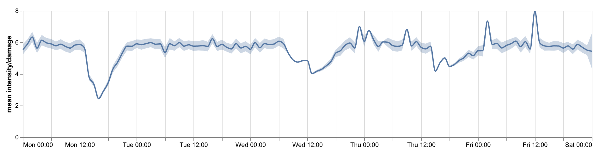

```elm {l=hidden}
reportSummaryCIBand : Spec
reportSummaryCIBand =
    let
        trans =
            transform
                << filter (fiExpr "datum.intensity")
                << timeUnitAs yearMonthDateHours "timestamp" "binnedTime"
                << joinAggregate [ opAs opCount "intensity" "nRecords" ] [ wiGroupBy [ "binnedTime" ] ]
                << filter (fiExpr "datum.nRecords >1")

        lineEnc =
            encoding
                << position X
                    [ pName "binnedTime"
                    , pMType Temporal
                    , pAxis [ axTitle "", axFormat "%a %H:%M" ]
                    ]
                << position Y
                    [ pName "intensity"
                    , pAggregate opMean
                    , pMType Quantitative
                    , pAxis [ axTitle "mean intensity/damage", axGrid False ]
                    ]

        bandEnc =
            encoding
                << position X
                    [ pName "binnedTime"
                    , pMType Temporal
                    , pAxis [ axTitle "" ]
                    ]
                << position Y
                    [ pName "intensity"
                    , pAggregate opCI0
                    , pMType Quantitative
                    , pAxis [ axTitle "mean intensity/damage", axGrid False ]
                    ]
                << position Y2
                    [ pName "intensity"
                    , pAggregate opCI1
                    , pMType Quantitative
                    , pAxis [ axTitle "mean intensity/damage", axGrid False ]
                    ]

        bandSpec =
            asSpec [ bandEnc [], area [ maOpacity 0.3 ] ]

        lineSpec =
            asSpec [ lineEnc [], line [ maInterpolate miMonotone ] ]
    in
    toVegaLite [ width 900, mc1ReportData, trans [], layer [ bandSpec, lineSpec ] ]
```

The intention was to overlay this measure of average reported intensity on the report frequency histogram, but there appears to be little value in doing so as the average report reading of around 5.5 appears to be generated by a small number of erroneous/poorly calibrated readings (just visible as red line along the bottom of the histogram). As report numbers increase, the mean actually degreases as this erroneous signal is drowned out by more realistic reports during high report frequency periods.

Can investigate further by examining the association between report frequency and mean damage score:

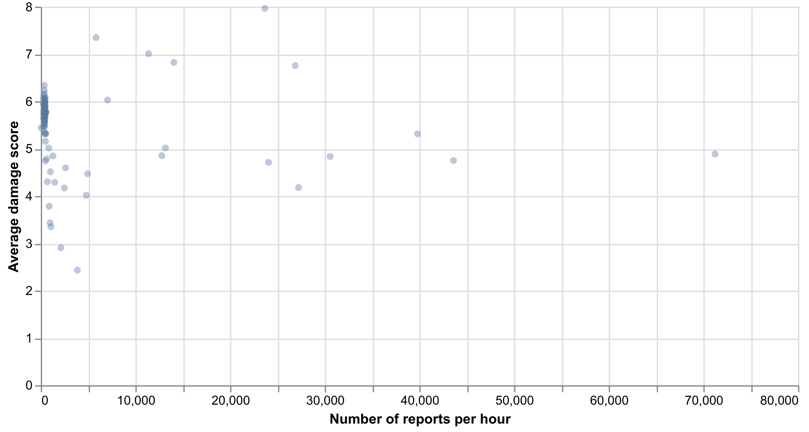

```elm {l=hidden}
reportCorrelation : Spec
reportCorrelation =
    let
        trans =
            transform
                << filter (fiExpr "datum.intensity")
                << timeUnitAs yearMonthDateHours "timestamp" "binnedTime"
                << aggregate
                    [ opAs opCount "intensity" "counts", opAs opMean "intensity" "avs" ]
                    [ "binnedTime" ]

        enc =
            encoding
                << position X [ pName "counts", pMType Quantitative, pAxis [ axTitle "Number of reports per hour" ] ]
                << position Y [ pName "avs", pMType Quantitative, pAxis [ axTitle "Average damage score" ] ]
    in
    toVegaLite [ width 600, height 300, mc1ReportData, trans [], enc [], circle [ maOpacity 0.4 ] ]
```

{(observation|}

Note the cluster of low report frequency (LHS) between 5.5 and 6.5 mean damage score. We are seeing a small number of continuous reports giving high damge/shake scores. We may wish to exclude these from the data, or at least investigate further.

{|observation)}

{(duration|}2 hours{|duration)}

{(timestamp|}11th May, 9:00{|timestamp)}

Faceting the correlations by report type may allow us to identify the source of the low-frequency/high damage reports. Limiting to only those periods of less than 250 reports per minute and faceting by report type:

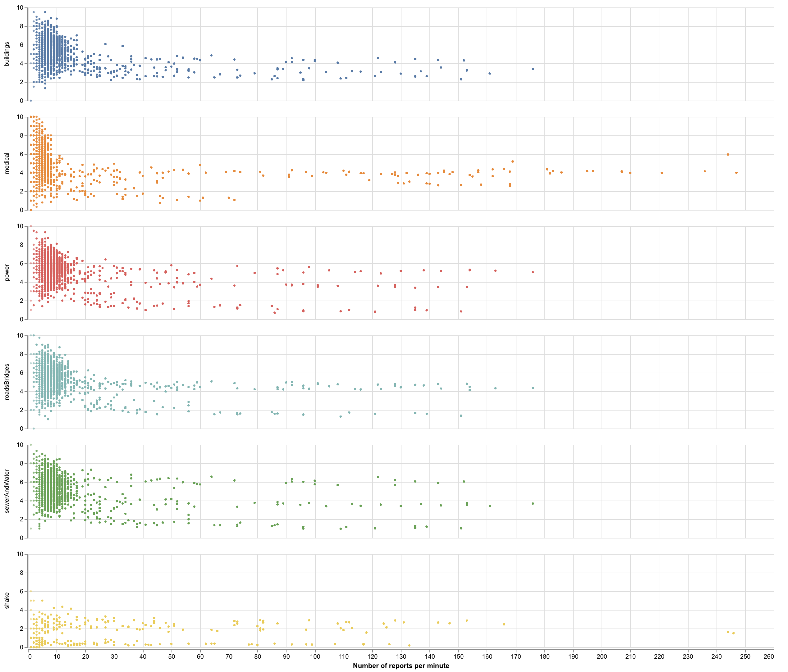

```elm {l=hidden interactive}
reportCorrelation2 : Spec
reportCorrelation2 =
    let
        trans =
            transform
                << timeUnitAs yearMonthDateHoursMinutes "timestamp" "binnedTime"
                << joinAggregate [ opAs opCount "intensity" "counts", opAs opMean "intensity" "avs" ]
                    [ wiGroupBy [ "rType", "binnedTime" ] ]
                << filter (fiExpr "datum.counts < 250")

        enc =
            encoding
                << position X
                    [ pName "counts"
                    , pMType Quantitative
                    , pAxis [ axTitle "Number of reports per minute" ]
                    ]
                << position Y
                    [ pName "avs"
                    , pMType Quantitative
                    , pAxis [ axTitle "" ]
                    ]
                << row [ fName "rType", fMType Nominal, fHeader [ hdTitle "" ] ]
                << color [ mName "rType", mMType Nominal, mLegend [] ]
    in
    toVegaLite [ width 1200, height 150, mc1ReportData, trans [], enc [], circle [ maOpacity 0.5, maSize 10 ] ]
```

{(observation|}

We see some systematic, and presumably erroneous reports at low frequences. For example for medical damage scores (orange), we see for periods where 1 report per minute is generated, there is a full range of damages scores from 0 to 10. For those at 2 per minute we see a simialr pattern (but with aggregate scores showing scores at 1/2 unit intervals' 3 per minute at 1/3 intervals etc.). This systematic pattern can be confirmed by combining the report types (see below) in a single scatterplot.

Shake scores (yellow) exhibit a related pattern, but over a smaller range of magnitudes.

Suggests we should filter out reports with temporal frequencies fewer than around 15 per minute.

{|observation)}

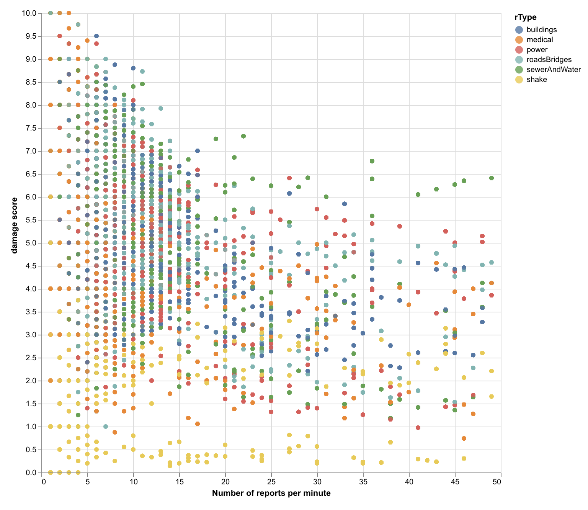

### Spatial Arrangement

Faceting the scatterplot above by location using the grid arrangment may allow us to see if the erroneous low frequency signals have any spatial structure:

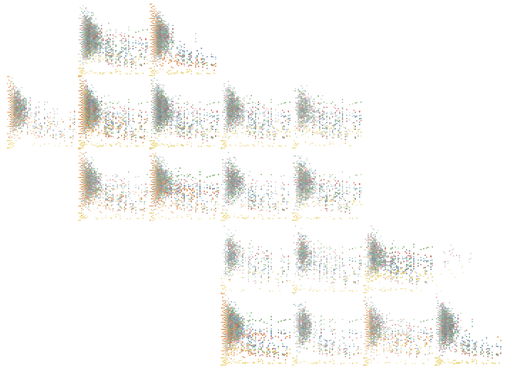

```elm {l=hidden interactive}
reportCorrelationSpatial : Spec
reportCorrelationSpatial =
    let
        trans =
            transform
                << timeUnitAs yearMonthDateHoursMinutes "timestamp" "binnedTime"
                << joinAggregate [ opAs opCount "intensity" "counts", opAs opMean "intensity" "avs" ]
                    [ wiGroupBy [ "rType", "binnedTime" ] ]
                << filter (fiExpr "datum.counts < 50")
                << lookup "location" neighbourhoodCentroids "id" [ "row", "col", "nbrhood" ]

        enc =
            encoding
                << position X [ pName "counts", pMType Quantitative, pAxis [] ]
                << position Y [ pName "avs", pMType Quantitative, pAxis [] ]
                << row [ fName "row", fMType Ordinal, fHeader [ hdTitle "", hdLabelFontSize 0 ] ]
                << column [ fName "col", fMType Ordinal, fHeader [ hdTitle "", hdLabelFontSize 0 ] ]
                << color [ mName "rType", mMType Nominal, mLegend [] ]
                << tooltip [ tName "nbrhood", tMType Nominal ]
    in
    toVegaLite
        [ cfg []
        , mc1ReportData
        , trans []
        , width 130
        , height 130
        , enc []
        , circle [ maOpacity 0.5, maSize 4 ]
        ]
```

{(observation|}

The systematic low frequncy pattern is seen most obviously in the (orange) medical category. The regions where this occurs are associated with those with a hospital (PH, DT, SW, SO, OT BV and TS).

But we also see a similar, but less pronounced effect in other cateogries and neighbourhoods, notably in NW, WE, EP and SV). Note also the comaparative lack of low frequency reports for WF in the east.

{|observation)}

```elm {l=hidden}
hfReportSummary : Spec
hfReportSummary =
    let
        trans =
            transform
                << filter (fiExpr "datum.intensity")
                << timeUnitAs yearMonthDateHoursMinutes "timestamp" "binnedTime"
                << joinAggregate [ opAs opCount "intensity" "nRecords" ] [ wiGroupBy [ "binnedTime" ] ]
                << filter (fiExpr "datum.nRecords > 100")

        countEnc =
            encoding
                << position X
                    [ pName "binnedTime"
                    , pMType Temporal
                    , pAxis [ axTitle "", axFormat "%a %H:%M" ]
                    ]
                << position Y
                    [ pName "intensity"
                    , pMType Quantitative
                    ]

        countSpec =
            asSpec [ countEnc [], circle [] ]
    in
    toVegaLite [ width 900, mc1ReportData, trans [], layer [ countSpec ] ]
```

<!-- ```elm {l=hidden}
reportByType : Spec
reportByType =
    let
        enc =
            encoding
                << position X
                    [ pName "timestamp"
                    , pMType Temporal
                    , pTimeUnit yearMonthDateHoursMinutes
                    , pAxis [ axTitle "", axFormat "%a %H:%M" ]
                    ]
                << position Y
                    [ pName "intensity"
                    , pAggregate opCount
                    , pMType Quantitative
                    , pAxis [ axTitle "", axGrid False ]
                    ]
                << color
                    [ mName "intensity"
                    , mMType Ordinal
                    , mLegend []
                    , mScale [ scScheme "yelloworangered" [] ]
                    ]
                << row [ fName "rType", fMType Nominal ]
                << order [ oName "intensity", oMType Ordinal, oSort [ soAscending ] ]

        sel =
            selection
                << select "mySelection" seInterval [ seBindScales, seEncodings [ chX ] ]
    in
    toVegaLite [ width 900, height 100, mc1ReportData, sel [], enc [], bar [] ]
``` -->
