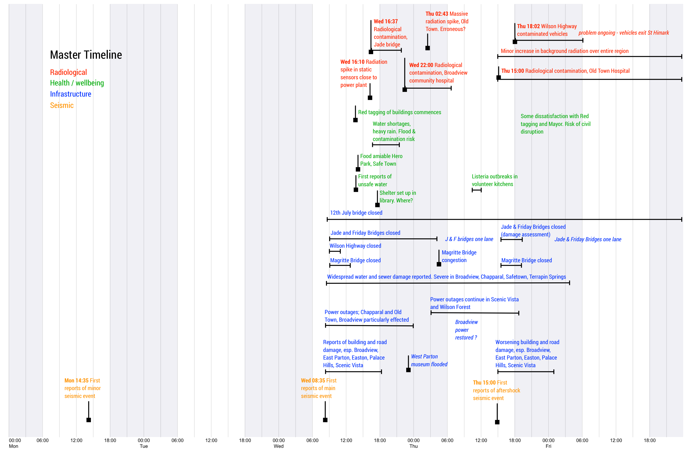
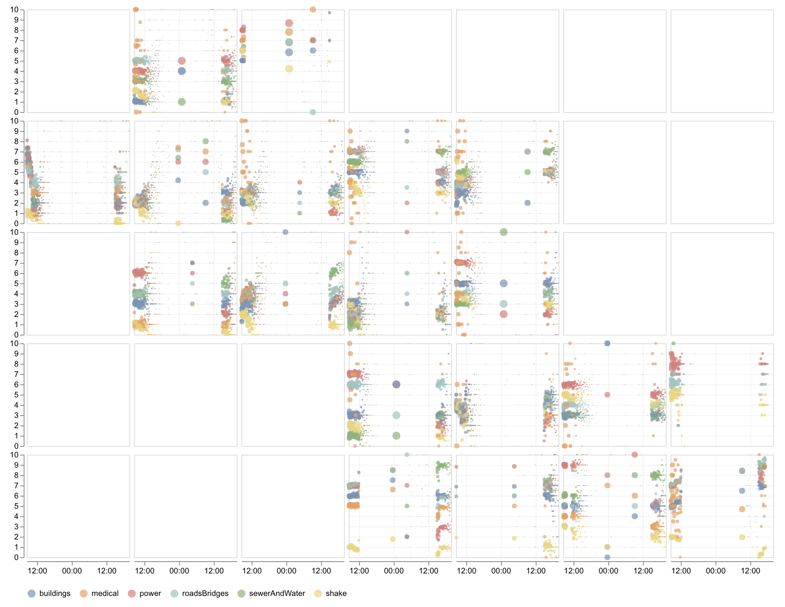
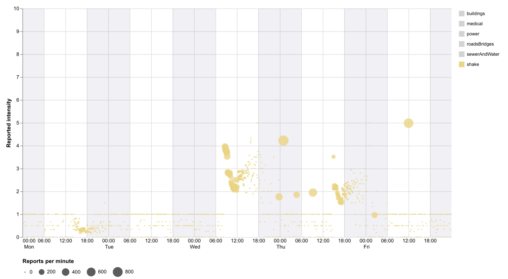
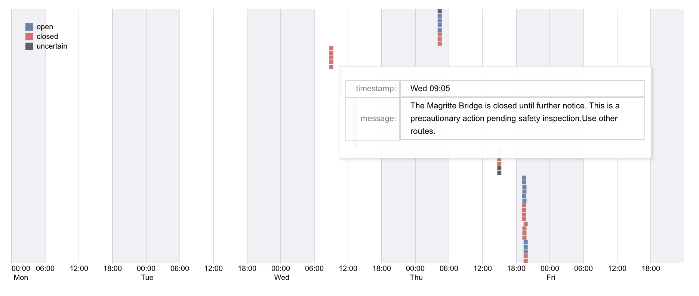
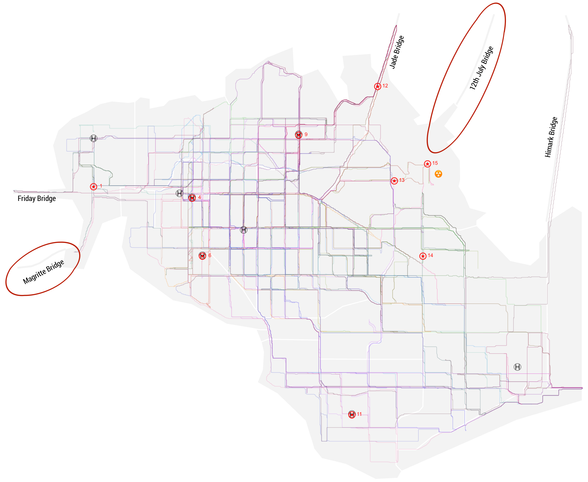
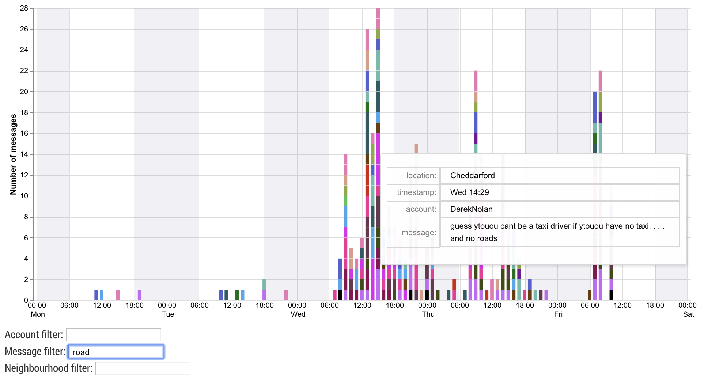
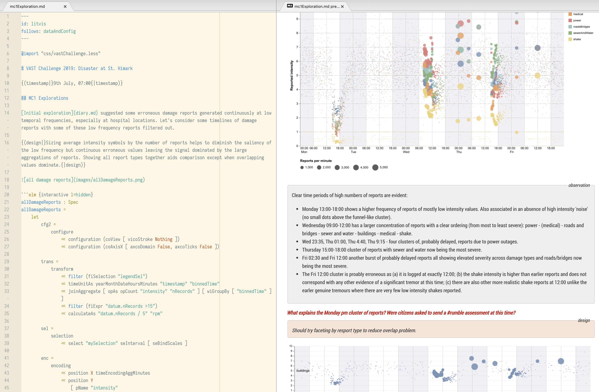
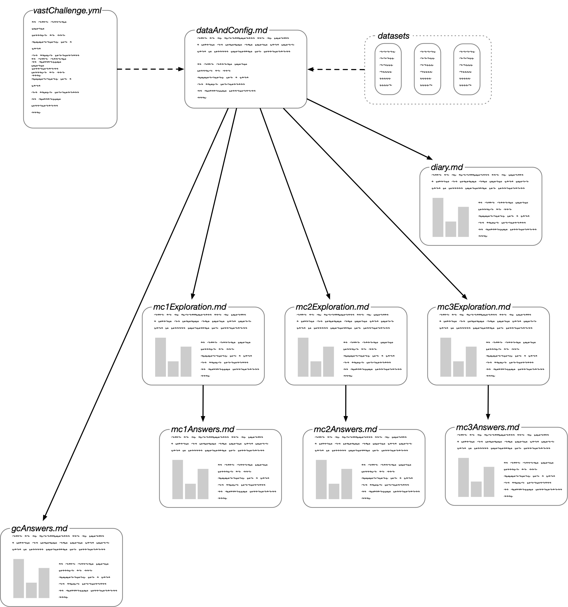
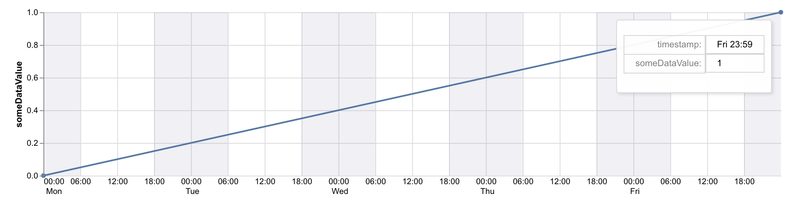

@import "css/vastChallenge.less"

<!-- Everything above this line should probably be left untouched. -->

{(titleEntry|}gc {|titleEntry)}
{(titleYear|} 2019 {|titleYear)}
{(titleChallenge|} Grand Challenge{|titleChallenge)}

**Team Members:**
Jo Wood, giCentre, City, University of London, j.d.wood@city.ac.uk PRIMARY

**Student Team:** No

**Tools Used:**
[LitVis](https://github.com/gicentre/litvis), developed by the giCentre (integrates [Vega](https://vega.github.io/vega/), [Vega-Lite](https://vega.github.io/vega-lite/) with [elm](https://package.elm-lang.org/packages/gicentre/elm-vegalite/latest/VegaLite) and [markdown](https://en.wikipedia.org/wiki/Markdown)), for narrative and visualization document creation.
\*nix command-line tools ([awk](https://www.manpagez.com/man/1/awk/), [sed](https://www.manpagez.com/man/1/sed/), [cut](https://www.manpagez.com/man/1/cut/) etc.) for some data cleaning.

**Approximately how many hours were spent working on this submission in total?** c. 80 hours for all three Mini challenges and Grand Challenge (treated as a single integrated process)

**May we post your submission in the Visual Analytics Benchmark Repository after VAST Challenge 2019 is complete?** Yes.

[Video](https://vimeo.com/347833023)

---

_Note: This document was created in **[LitVis](https://github.com/gicentre/litvis)** - a Literate Visualization environment to support visual design and analysis exposition. This answer page is supported by a series of litvis documents providing design and analysis provenance for this and all three mini challenges. They can be found at https://github.com/jwoLondon/vastchallenge2019 (released after VAST challenge deadline has passed)._

# Questions

## Question GC1

_Generate a master timeline of events and trends during the emergency response. Indicate where it is uncertain and which data underlies that uncertainty._


{(caption|}1: Timeline of main events{|caption)}

Information for the timeline was generated from interaction with the figures described in the mini challenges. Interaction often allowed precise times to be identified easily (e.g. contamination events, Y\*INT messages etc.). The most valuable visualizations for constructing the timeline are summarised below.

### Seismic


{(caption|} 2: Timeline of damage reports. {|caption)}

Yellow circles provided direct evidence of shake timings along with more general clusters of reporting. Details confirmed through interactive query of Y\*INT messages with `shake` and related keywords.

### Infrastructure


{(caption|} 3: Damage report timelines with buildings, roads and bridges highlighted and most severely damaged neighbourhoods selected. {|caption)}

Spatial variations supported by gridmaps of damage reports (Figure 4)


{(caption|} 4: Spatial gridmap of damage reports for period between the two main seismic events. {|caption)}

Filtering of damage reports enabled main infrastructure problems to be identified. Supported by Y\*INT message query (Figure 5)


{(caption|}5: Message content generated by FieldEngineerPhillipCarter with more reliable infrastructure reports.{|caption)}

### Health / wellbeing

Most details here provided by interactive Y\*INT message query of both reliable sources and health related keywords (e.g. Figures 5 and 6).


{(caption|}6: Messages containing keyword `water`{|caption)}

### Radiological

Most useful summary data were provided by the CUSUM plots of static and mobile sensors (Figures 7 and 8). Additional spatio-temporal event details (e.g. Wilson Forest Highway contamination) provided by interactive animation of mobile sensor trajectories (Figure 9).


{(caption|}7: Static sensor CUSUM plots indicating status at end of recording period.{|caption)}


{(caption|}8: Mobile sensor CUSUM plots indicating status at end of recording period.{|caption)}


{(caption|}9: Still from animation of trails of the Wilson Highway event vehicles. The short trail north of the main (pink) hotspot shows the trajectory of mobile sensor 30. The trail to the east is the route all vehicles take to enter and leave St Himark.{|caption)}

## Question GC2

_Identify and explain cases where data from multiple mini-challenges help to resolve uncertainty, and identify cases where data from multiple mini-challenges introduces more uncertainty. Present up to 10 examples. If you find more examples, prioritize those examples that you deem most relevant to emergency response._

### Forequake (Monday 14:35)

Reports from the Shake app (MC1) have much noise and therefore uncertainty. This is particularly the case when the density of Shake reports is low. During the first seismic event (Monday 14:35) the intensity of reported shake magnitude went down not up (see Figure 10). While it was clear that reports at this time differed from those in the hours before and after, it was not certain whether they were indicating a real seismic event.

It was only with confirmation from the Y\*INT messages (e.g. Figure 5 above `Earthquake? Feeling something shaking` from `FieldEngineerPhillipCarter`), that it was possible to build some confidence that this was a real minor seismic event.


{(caption|}10: Shake reports showing noise between intensity 0 and 1 and a lowering of intensity values Monday pm.{|caption)}

### Bridge Closures

Examination of Y\*Int messages on bridge closing and opening (Figure 11) provided precise times on when they were open or closed to traffic. However, trajectories of mobile sensors (MC2) show that some bridges had no traffic at any time (Figure 12). This calls into question one or both of the data sources. Given the 50 vehicle mounted sensors the weight of evidence is in favour of the trajectories, suggesting the Y\*INT messages may be less reliable than originally anticipated.


{(caption|}11: Automatic detection of `open` and `close` bridge related messages (MC3) showing apparent closing (and later opening) of Magritte Bridge.{|caption)}


{(caption|}12: Mobile vehicle-based trajectories showing no traffic on Magritte and 12th July bridges at any stage in the measuring period.{|caption)}

### Road Damage

Y\*INT messages show numerous (and re-messaged) reports of blocked roads preventing vehicular passage (e.g. Figure 13). These are usually without specific spatial reference (e.g. road name) so can paint an overgenerlised and sometimes alarmist picture of transport status. The mobile sensor trajectories (MC2) provide a useful indication of real-time road access that adds detail and clarity in both space and time. For example Figure 14 shows some of the accessible roads early Thursday afternoon.


{(caption|}13: Mobile vehicle-based trajectories showing no traffic on Magritte and 12th July bridges at any stage in the measuring period.{|caption)}


{(caption|}14: Snapshot from animation of mobile vehicle-based trajectories (Thursday 12:20 - 12:50) showing partial picture of accessible roads.{|caption)}

## Question GC3

_Are there instances where a pattern emerges in one set of data before it presents itself in another? Could one data stream be used to predict events in the others? Provide examples you identify._

Y\*INT messages have the potential to catch some patterns before manifesting in others (e.g. shake app reports). The challenge is to identify reliable message accounts as many accounts exaggerate or re-message old or inaccurate information (e.g. see Figure 12 in MC3 showing a wide variation in reported fatalities).

One strategy is to identify the originating author of a widely re-messaged post. This approach led to identifying `FieldEngineerPhillipCarter` as an early and reliable source of damage reports and health risks (e.g. Figure 15). This can be particularly useful in pre-empting Shake App damage reports that are delayed by power outages and server problems.


{(caption|}15: Message content generated by FieldEngineerPhillipCarter.{|caption)}

The CUSUM plots used in MC2 to show systematic changes in radiation levels provide a good early warning of potential problems. In this particular disaster, the radiological risks did not manifest themselves in other data streams (other than some messages on anticipated problems with the Power plant). But they could be used to anticipate road closures or the need to provide emergency evacuation should problems be more severe.

## Question GC4

_The data for the individual mini-challenges can be analyzed either as a static collection or as a dynamic stream of data, as it would occur in a real emergency. Were you able to bring analysis on multiple data streams together for the grand challenge using the same analytic environment? Describe how having the data together in one environment, or not, affected your analysis of the grand challenge._

Central to the analytic process for all challenges was an integrated design, analysis and presentation framework using [Literate Visualization](http://openaccess.city.ac.uk/20081/). Applied in this context, it is an example of _literate visual analytics_, where the process of data cleaning, visualization design, data analysis and findings are recorded explicitly and regarded as part of the same intertwined process (see Figure 16). This provides a record of _visual analytic provenance_ providing a more robust and verifiable justification of findings.


{(caption|}16: Litvis: Integrated visualization specification, design exposition, analysis and reporting environment. The live code on the left generates the formatted output on the right.{|caption)}

Figure 17 shows the literate visual analytic document structure used for all challenges. Initial exploration of the problem across all three challenges was recorded in **diary.md** (markdown document). This provided a 'stream of consciousness' record of early design choices and impressions of the data. Data were assembled along with common visual design components in **dataAndConfig.md**, inheritable by all documents used in the challenge. More focussed analysis was later recorded in each of the mc1, mc2 and mc3 Exploration documents. The final submission reports (mc1Answers.md etc.) inherited these documents so could reuse visualizations generated within them.

To structure exploration and report writing the entire hierarch of documents composes a _narrative schema_ (vastChallenge.yml) that contains elements such as _question_, _observation_ and _design_ that format and structure the visual analytic narrative. Rules may also be added to the schema, for example requiring that all _hypotheses_ require some text or visualizations providing _evidence_.


{(caption|}17: Document structure for the VAST challenge design, analysis and reporting process.{|caption)}

Data were not only integrated in a common VA environment, but visualization components were shared between challenges. In particular a common spatial and temporal framework was used throughout. For data with higher precision spatial data and that required geographic interpretation, a common basemap component was used (Figure 18).


{(caption|}18: Context map used in multiple challenges{|caption)}

For lower precision geospatial referencing a [gridmap](http://openaccess.city.ac.uk/15167/) base (Figure 19) was used into which other visualizations could be embedded.


{(caption|}19: Gridmap for neighbourhood-based geospatial location{|caption)}

As almost all data were referenced by time, a common timeline with day/night guides and interactive tooltip query was used across challenges to support comparison (Figure 20).

```elm {l=hidden}
timeline : Spec
timeline =
    let
        cfg2 =
            configure
                << configuration (coView [ vicoStroke Nothing ])
                << configuration (coAxisX [ axcoDomain False, axcoTicks False ])

        dataBg =
            dataFromColumns []
                << dataColumn "timestamp" (strs [ "2020-04-06 00:00:00", "2020-04-10 23:59:59" ])
                << dataColumn "someDataValue" (nums [ 0, 1 ])

        enc =
            encoding
                << position X timeEncoding
                << position Y
                    [ pName "someDataValue"
                    , pMType Quantitative
                    , pScale [ scDomain (doNums [ 0, 1 ]) ]
                    , pAxis []
                    ]
                << tooltips
                    [ [ tName "timestamp", tMType Temporal, tFormat "%a %H:%M" ]
                    , [ tName "someDataValue", tMType Nominal ]
                    ]

        specData =
            asSpec [ dataBg [], enc [], line [ maPoint (pmMarker []) ] ]
    in
    toVegaLite
        [ width 800
        , height 200
        , cfg2 []
        , resolve (resolution (reAxis [ ( chX, reIndependent ) ]) [])
        , layer [ specData, specNights ]
        ]
```


{(caption|}20: Timeline with example tooltip query{|caption)}

Central to the approach in completing the challenge has been the principle that visual analytic design is part of the same process as interpretation and reporting of findings.
