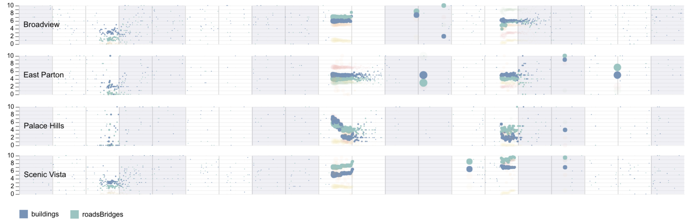
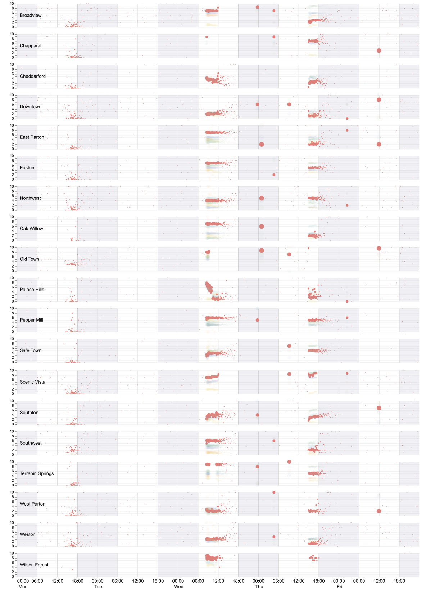
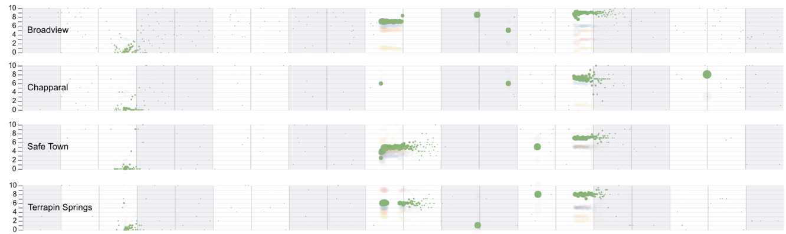
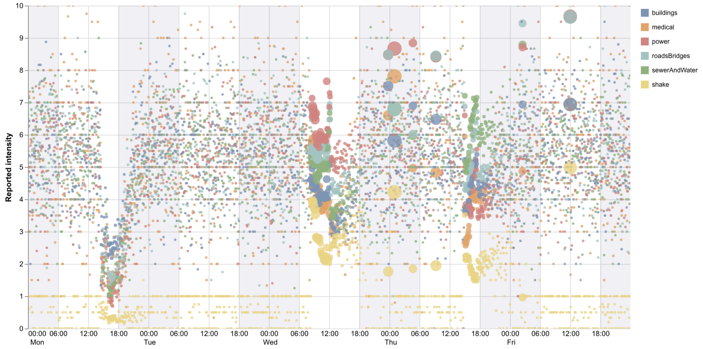
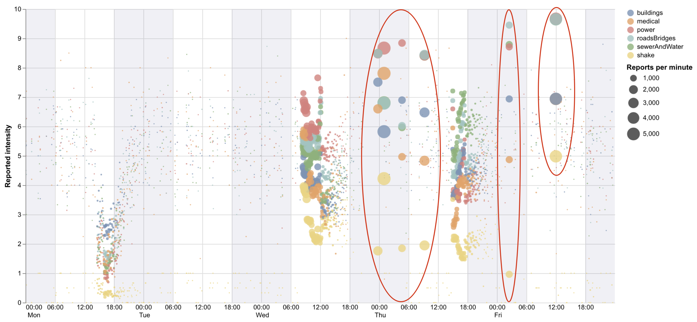
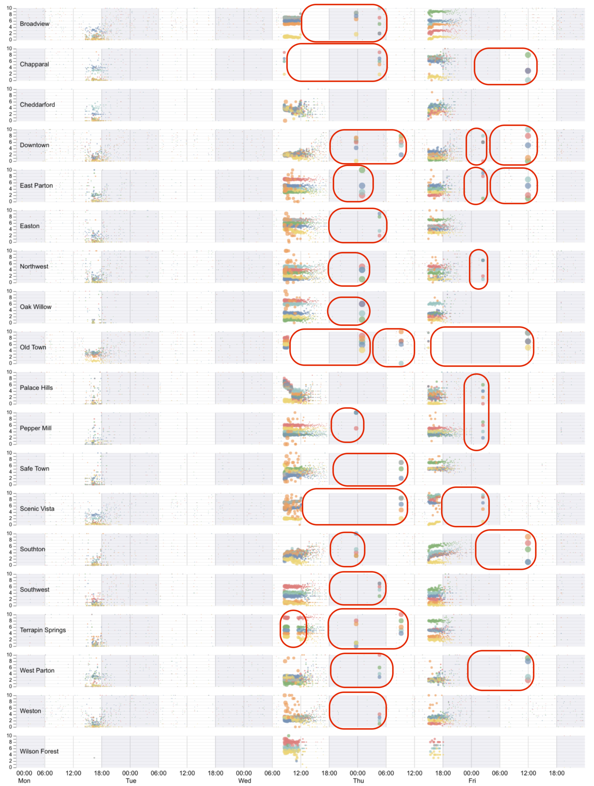
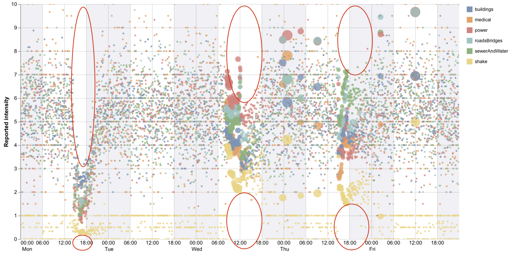

@import "css/vastChallenge.less"

```elm {l=hidden}
```

<!-- Everything above this line should probably be left untouched. -->

{(titleEntry|}mc1 {|titleEntry)}
{(titleYear|} 2019 {|titleYear)}
{(titleChallenge|} Mini-Challenge 1 {|titleChallenge)}

**Team Members:**
Jo Wood, giCentre, City, University of London, j.d.wood@city.ac.uk PRIMARY

**Student Team:** No

**Tools Used:**
[LitVis](https://github.com/gicentre/litvis), developed by the giCentre (integrates [Vega](https://vega.github.io/vega/), [Vega-Lite](https://vega.github.io/vega-lite/) with [elm](https://package.elm-lang.org/packages/gicentre/elm-vegalite/latest/VegaLite) and [markdown](https://en.wikipedia.org/wiki/Markdown)), for narrative and visualization document creation.
\*nix command-line tools ([awk](https://www.manpagez.com/man/1/awk/), [sed](https://www.manpagez.com/man/1/sed/), [cut](https://www.manpagez.com/man/1/cut/) etc.) for some data cleaning.

**Approximately how many hours were spent working on this submission in total?** c. 80 hours for all three Mini challenges and Grand Challenge (treated as a single integrated process)

**May we post your submission in the Visual Analytics Benchmark Repository after VAST Challenge 2019 is complete?** Yes.

[Video](https://vimeo.com/347833023)

---

_Note: This document was created in **[LitVis](https://github.com/gicentre/litvis)** - a Literate Visualization environment to support visual design and analysis exposition. This answer page is supported by a series of litvis documents providing design and analysis provenance for this, the other mini challenges and grand challenge. They can be found at https://github.com/jwoLondon/vastchallenge2019 (released after VAST challenge deadline has passed)._

# Questions

To contextualise reports we provide both a geographic basemap and a gridmap projection for laying out spatially located graphical summaries.

<!-- ^^^elm {v=contextMap}^^^ -->


{(caption|}1: St Himark context map showing neighbourhoods, bridges, hospitals and power plant. Red contours show main quake intensity with epicentre approximately under 12th July Bridge.{|caption)}

<!-- ^^^elm {v=gridLayout}^^^ -->


{(caption|}2: St Himark gridmap showing neighbourhoods and bridges. The two cells bottom-left are reserved for withheld and unknown locations.{|caption)}

## Question MC1.1

_Emergency responders will base their initial response on the earthquake shake map. Use visual analytics to determine how their response should change based on damage reports from citizens on the ground. How would you prioritize neighbourhoods for response? Which parts of the city are hardest hit?_

Damage reports (via the shake app) from citizens on the ground suggest three seismic events that result in damage:

<!-- ^^^elm {v=allDamageReports interactive}^^^ -->


{(caption|} 3: Timeline of damage reports. Circles sized by number of reports per minute, coloured by report type, positioned horizontally by time of report receipt and vertically by average reported intensity. {|caption)}

### Foreshock Monday pm

Excluding background noise and delayed reporting (see [MC1.2](#question-mc12) below) we see the first shake/damage event reported from **Mon 14:35**. The shake intensity (yellow) is low but noticeable. Greatest damage intensity at this time is for buildings (blue), but comparatively low (in range 2 - 3).

### Main shock Wed am

The second main reporting event commences **Wed 08:35** with shaking intensity (yellow) initially at level 4. Highest intensity damage reports are to power infrastructure (red) in the range 6 - 8. Road and bridge damage (cyan) also significant (range 5 - 6) as is water/sewer damage (green) in range 4 - 7.

### Aftershock Thu pm

A damage-inducing aftershock period occurs from **Thu 15:00** for around 3 hours. Shake intensity is less (level 2) but damage reports significant. At this point sewer and water damage is the most significant (range 5 - 7) presenting a public health danger through contaminated water. Road and bridge damage remains significant (range 4 - 7). Power damage reamins, although less than after the main shock (down to 3.5 - 5.5 range). As expected, building damage remains.

### Geographic Patterns

To see where in St Himark, resources should be directed, we view the damage timelines by neighbourhood:

<!-- ^^^elm {v=damageReportsByPlace interactive}^^^ -->


{(caption|} 4: Timeline of damage reports by neighbourhood. Symbolisation as Figure 3. {|caption)}

To assess geographic patterns that might cross neighbourhoods we can view the reports as a gridmap, focussing on the Wed am - Thu pm period covering the main shock and aftershocks:

<!-- ^^^elm {v=damageReportsGridmap interactive}^^^ -->


{(caption|} 5: Gridmap (see Figure 2 for reference) showing damage reports between Wed 08:30 and Thu 20:00. Symbolisation as Figure 3. {|caption)}

### Building Damage (blue)

Widespread across the region with the most severe reports in **Broadview**, **East Parton**, **Easton**, **Palace Hills** and **Scenic Vista**.

Damage appears to be related to two factors: brick and stone building construction (Broadview, East Parton and Easton) and coastal hillside construction (Palace Hills and Scenic Vista).

Priority response should be to the area of dense residential dwellings in Broadview, East Parton and Easton providing adequate shelter and evacuation of residents from affected areas. Will also need some police presence to prevent unsupervised returns to unstable buildings and possible looting.


{(caption|} 6: Damage report timelines with buildings, roads and bridges highlighted and most severely damaged neighbourhoods selected. Symbolisation as Figure 3. {|caption)}

### Roads and bridges (cyan)

Often associated with building damage. Neighbourhoods most affected: **Scenic Vista** (severe and worsening over time), **Wilson Forest**, **Broadview** (improving over time) and **Easton** (improving over time).

Priority road repair / traffic management response should be to Scenic Vista to ensure there is adequate transport capacity in and out of St Himark.

### Power Damage (red)


{(caption|} 7: Damage report timelines with power highlighted. Symbolisation as Figure 3. {|caption)}

Power problems reported throughout the region after the Wednesday quake. Most severe are **Chapparal** and **Old Town** that due to power outage did not receive any damage reports for many hours. Broadview initially badly affected but much improved by Thursday. **Scenic Vista** and **Wilson Forest** continue to have major power damage throughout Thursday.

### Sewer and water (green)


{(caption|} 8: Damage report timelines with sewers/water highlighted and most severely damaged regions selected. Symbolisation as Figure 3. {|caption)}

Most affected, with the possibility of water contamination problems: **Broadview**, **Chapparal**, **Safetown** (adequate water supply to power plant should be ensured) and **Terrapin Springs**.

### Medical Damage (orange)

Most consistently severe in Broadview. Wide range of damage reports in **East Parton**, **Easton**, **Northwest**, **Oak Willow**, **Pepper Mill**, **Safe Town**, **Scenic Vista** and **Weston**. Care should be taken if emergency shelter / treatment areas need to be set up in these neighbourhoods.

### Summary

We have three shock events:

- Monday 3pm foreshock. Acts as a warning to prep emergency response. Some minor building damage may make buildings more vulnerable to collapse, especially in the older brick architecture of Broadview.

- Wednesday 8:30am main shock. Significant building and road damage and associated power outages. Priority response to clear transportation routes, assess and evacuate damaged residential properties, especially in Broadview, East Parton and Easton and restore power infrastructure to support communication.

- Thursday 3pm after shock. Respond to water/sewer damage to limit possible contamination. Focus power and transport restoration on Scenic Vista and Wilson Forest in the SE.

Broadview seems particularly affected in terms of damage in a variety of infrastructure. Wilson Forest and Scenic Vista with the Wilson Forest Highway providing critical transport infrastructure require particular focus in response.

## Question MC1.2

_Use visual analytics to show uncertainty in the data. Compare the reliability of neighbourhood reports. Which neighbourhoods are providing reliable reports? Provide a rationale for your response._

There appear to be at three sources of uncertainty: (i) poorly calibrated reports that show a wide range of intensity values across report types; (ii) periods of delayed reports due to power / server outages; (iii) inability to distinguish fresh damage from reports of previously notified damage.

### Poorly calibrated noise

Removing the filter for low density reports and enlarging the minimum symbol size the distribution of noise is revealed.


{(caption|} 9: 'Report noise' including low density periods of noise reporting. {|caption)}


{(caption|} 10: Average reported damage/intensity with confidence intervals. {|caption)}

Simply examining average reported damage scores over time reveals a counter-intuitive pattern - a relatively high damage for most of the period with dips at the points where actual seismic events occur. Its cause can be identified by plotting the report frequency per hour against damage scores:


{(caption|} 11: Average damage scores as a function of report density. {|caption)}

This suggests we have a longer periods of low density reporting with wildly varying damage scores that appear to be unrelated to actual events. This can be explored more deeply by examining the low density reporting periods breaking down by report type:


{(caption|} 12: Average damage scores as a function of report density. {|caption)}

We see for periods where 1 report per minute is generated, there is a full range of damages scores from 0 to 10. For those at 2 per minute we see a similar pattern (but with aggregate scores showing scores at 1/2 unit intervals' 3 per minute at 1/3 intervals etc.).

By separating the report types we can see that medical damage is particularly vulnerable to this problem:


{(caption|} 13: Average damage scores as a function of report density for each report type. {|caption)}

It suggests that some devices are regularly and automatically submitting damage reports that are of little help in assessing large scale changes in damage over time. The solution is to filter out periods where report density is less than 15 reports per minute.

Examining the spatial pattern of the density vs damage plots for low density periods, we see the pronounced medical reporting problem (orange) in the regions containing hospitals. This provides additional evidence of automated report generation.


{(caption|} 14: Gridmap showing average damage scores as a function of report density for each neighbourhood. {|caption)}

### Delayed / aggregated reports


{(caption|} 15: Timeline of damage reports sized by report density, coloured by type. Highlighted periods show 'report bursts' that follow periods of little or no reports.{|caption)}

Power outages and other infrastructural problems result in periods where reports generated by citizens are not processed by the server. When they do, they are timestamped with the delayed time, resulting in 'bursts' of damage reports accumulated over the previous period. These bursts include not just meaningful damage reports, but the 'noise' identified above. This is most obvious in the apparent very high damage reports at exactly Friday midday but also evident on Thursday morning and early Friday morning.

The regions most vulnerable to these report bursts can be seen by faceting by neighbourhood.


{(caption|} 16: Timeline of damage reports sized by report density broken down by neighbourhood. Highlights are those where a period of absent or low report density are terminated by a burst of delayed reports.{|caption)}

While most neighbourhoods are affected at some point, particularly vulnerable are Chapparal, Old Town and Terrapin Springs.

### New vs existing damage

There is no persistent identity between reports or features being reported, so it is not directly detectable whether a damage report is reporting a previously reported condition or a new damage observation. As such there is some uncertainty in using the existence of a report to indicate temporal change. Evidence for the source of uncertainty is provided by the Figures 12, 13 and 14 above, especially for 'medical' damage. The spatial association with hospital neighbourhoods (Figure 14) provides additional support for this problem.

## Question MC1.3

_How do conditions change over time? How does uncertainty in change over time? Describe the key changes you see._

Change in ground conditions over time are summarised in [MC1.1](#question-mc11) above.

Changes in uncertainty are identified in [MC1.2](#question-mc12). They can be summarised as follows:

- Uncertainty decreases during periods of more intense reporting (the three quake events), as evidenced by the drop in noise during these periods.


{(caption|} 17: Absence of report noise during periods around seismic activity. {|caption)}

- 'report blackouts' following a power or server outage (Figure 16).The blackout periods are most common on Wednesday evening into Thursday morning and on Friday morning (Figure 16 highlights). During these periods with no real-time or near real-time reports it is possible for ground conditions to change without notification. For example East Parton, Thursday evening shows a blackout where it is possible (but not certain) that water/sewer damage has increased.

- 'report bursts' following blackout periods where it is hard to disaggregate the backlog of accumulated reports (large aligned circles in Figure 16).

## Question MC1.4

_The data for this challenge can be analyzed either as a static collection or as a dynamic stream of data, as it would occur in a real emergency. Describe how you analyzed the data - as a static collection or a stream. How do you think this choice affected your analysis?_

Data were analysed as a static collection (as they were provided). However, care was taken to use approaches that would work if the data had been streamed. No time-based calculations required data 'later' in the stream and all scalings were either fixed a priori (e.g. 10 point damage scale) or adaptive as data volumes change (e.g. circle size scaled to number of reports per minute). The timeline-based layout is amenable to constant streaming.

Two challenges remain in the interpretation of streaming data. Firstly, distinguishing between gaps in reporting due to nothing to report from those due to power / server outages. In real-time, some threshold may need to be set beyond which 'silence' should signify a problem. This can be partially addressed by using the background 'noise' in low density report periods to signal complete absences, as evidenced for two periods in Scenic Vista.


{(caption|} 18: Scenic vista report timeline rescaled to reveal low frequency report periods.{|caption)}

Secondly, citizens' calibration of damage scales may change during an event, so reliance on absolute values may be problematic. Without the hindsight of knowing how severe damage has become, it may be difficult to assess damage in absolute terms during the event itself.
