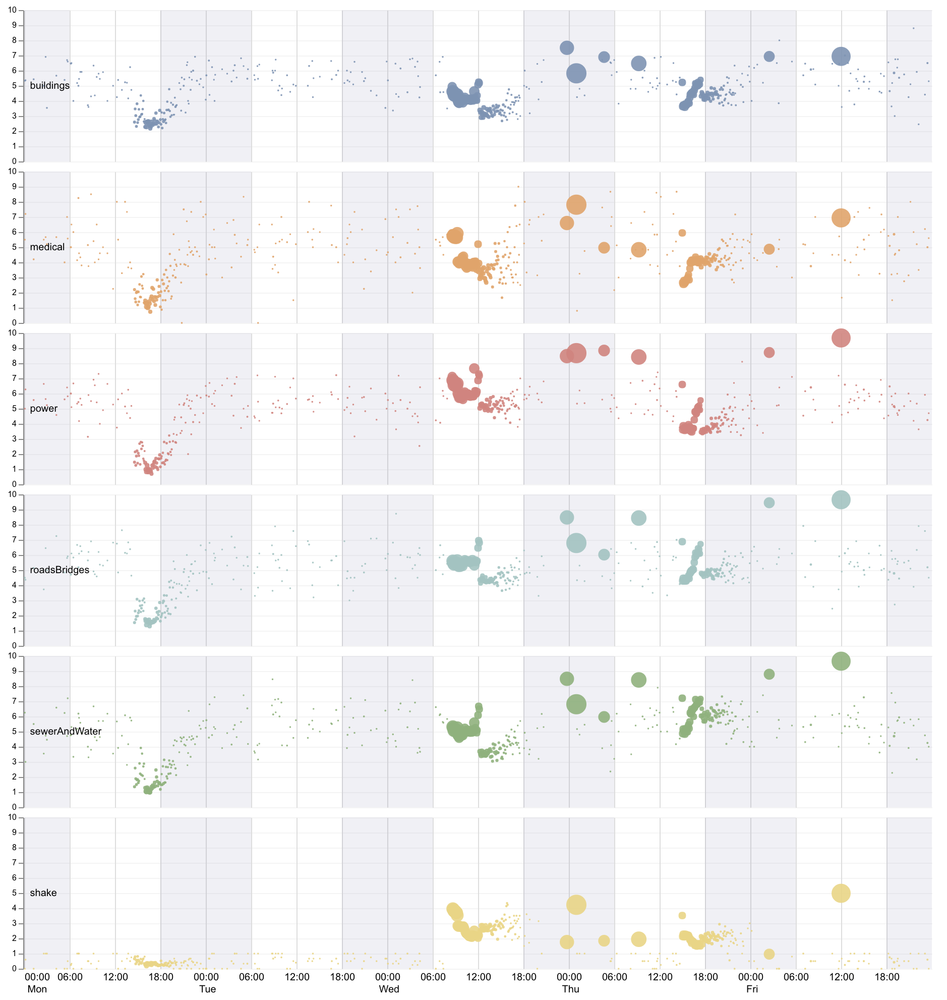
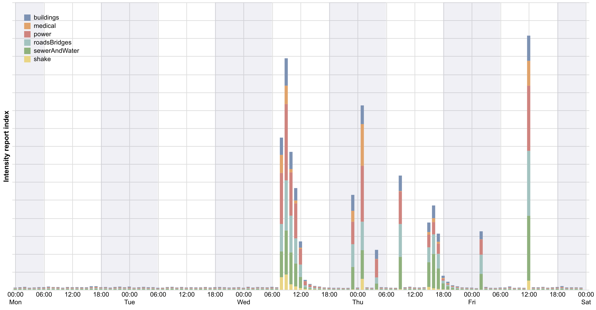
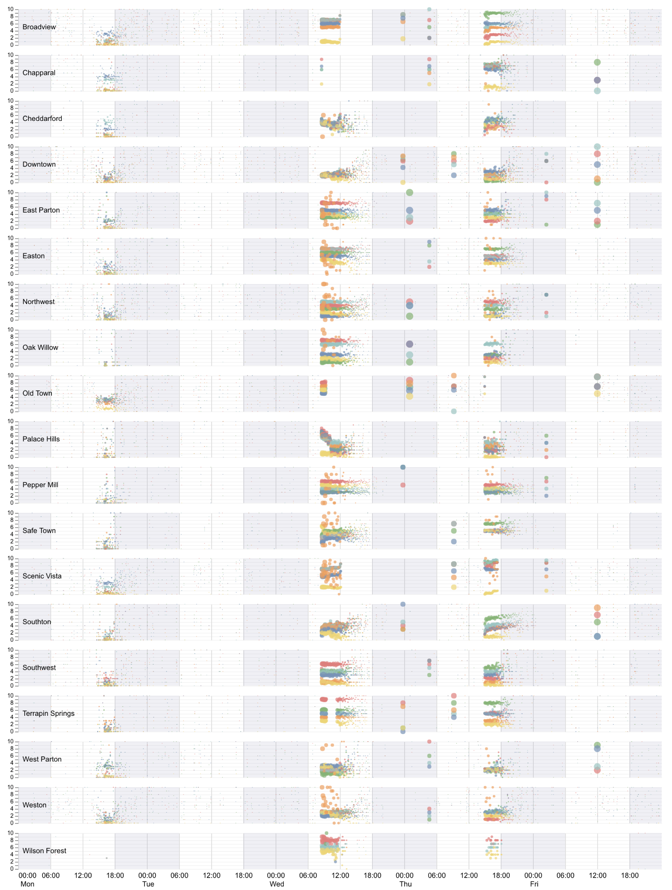
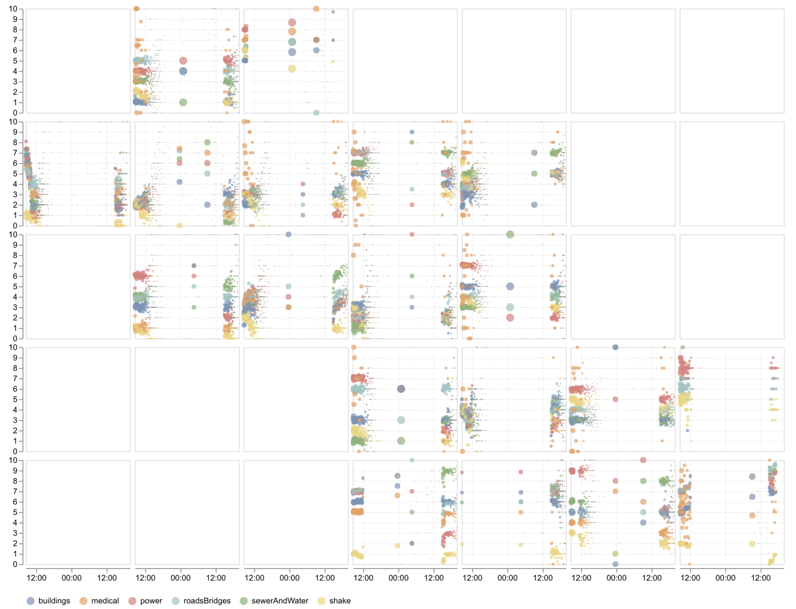

@import "css/vastChallenge.less"

# VAST Challenge 2019: Disaster at St. Himark

{(timestamp|}9th July, 07:00{|timestamp)}

## MC1 Explorations

[Initial exploration](./diary.md) suggested some erroneous damage reports generated continuously at low temporal frequencies, especially at hospital locations. Let's consider some timelines of damage reports with some of these low frequency reports filtered out.

{(design|}Sizing average intensity symbols by the number of reports helps to diminish the saliency of the low frequency but continuous erroneous values leaving the signal dominated by the large aggregations of reports. Showing all report types together aids comparison except when overlapping values dominate.{|design)}

```elm {v interactive l=hidden}
allDamageReports : Spec
allDamageReports =
    let
        trans =
            transform
                << filter (fiSelection "legendSel")
                << timeUnitAs yearMonthDateHoursMinutes "timestamp" "binnedTime"
                << joinAggregate [ opAs opCount "intensity" "nRecords" ] [ wiGroupBy [ "binnedTime" ] ]
                << filter (fiExpr "datum.nRecords >= minThreshold_nRecords")
                << calculateAs "datum.nRecords / 5" "rpm"

        sel =
            selection
                << select "mySelection" seInterval [ seBindScales ]
                << select "minThreshold"
                    seSingle
                    [ seFields [ "nRecords" ]
                    , seInit [ ( "nRecords", num 15 ) ]
                    , seBind [ iRange "nRecords" [ inName "Minimum Reports per minute", inMin 0, inMax 500 ] ]
                    ]

        enc =
            encoding
                << position X timeEncodingAggMinutes
                << position Y
                    [ pName "intensity"
                    , pAggregate opMean
                    , pMType Quantitative
                    , pScale [ scDomain (doNums [ 0, 10 ]) ]
                    , pAxis [ axTitle "Reported intensity" ]
                    ]
                << color [ mName "rType", mMType Nominal, mScale damageColours, mLegend [] ]
                << size
                    [ mName "rpm"
                    , mMType Quantitative
                    , mScale [ scRange (raNums [ 0, 400 ]), scType scPow, scExponent 0.8 ]
                    , mLegend [ leOrient loBottom, leTitle "Reports per minute" ]
                    ]
                << tooltips
                    [ [ tName "timestamp", tMType Temporal, tFormat "%a %H:%M" ]
                    , [ tName "rType", tMType Nominal ]
                    , [ tName "nRecords", tMType Quantitative ]
                    ]

        specDamage =
            asSpec [ sel [], enc [], circle [ maOpacity 0.8 ] ]

        reportSpec =
            asSpec
                [ width 840
                , height 450
                , mc1ReportData
                , trans []
                , timeResolve []
                , layer [ specNights, specDamage ]
                ]
    in
    toVegaLite
        [ cfg []
        , spacing 0
        , hConcat [ reportSpec, reportInteractiveLegend "legendSel" ]
        ]
```

{(observation|}

Clear time periods of high numbers of reports are evident:

- Monday 13:00-18:00 shows a higher frequency of reports of mostly low intensity values. Also associated in an absence of high intensity 'noise' (no small dots above the funnel-like cluster).
- Wednesday 09:00-12:00 has a larger concentration of reports with a clear ordering (from most to least severe): power - (medical) - roads and bridges - sewer and water - buildings - medical - shake.
- Wed 23:35, Thu 01:00, Thu 4:40, Thu 9:15 - four clusters of, probably delayed, reports due to power outages.
- Thursday 15:00-18:00 cluster of reports with sewer and water now being the most severe.
- Fri 02:30 and Fri 12:00 another burst of probably delayed reports all showing elevated severity across damage types and roads/bridges now being the most severe.
- The Fri 12:00 cluster is proably erroneous as (a) it is logged at exactly 12:00; (b) the shake intensity is higher than earlier reports and does not correspond with any other evidence of a significant tremor at this time; (c) there are also other more realistic shake reports at 12:00 unlike the earler genuine tremours where there are very few low intensity shakes reported.

{|observation)}

{(question|}What explains the Monday pm cluster of reports? Were citizens asked to send a #rumble assessment at this time?{|question)}

{(design|}Should try faceting by resport type to reduce overlap problem.{|design)}



```elm {interactive l=hidden}
damageReportsByType : Spec
damageReportsByType =
    let
        trans =
            transform
                << timeUnitAs yearMonthDateHoursMinutes "timestamp" "binnedTime"
                << joinAggregate [ opAs opCount "intensity" "nRecords" ] [ wiGroupBy [ "binnedTime" ] ]
                << filter (fiExpr "datum.nRecords >45")
                << calculateAs "datum.nRecords / 5" "rpm"

        enc =
            encoding
                << position X timeEncodingAggMinutes
                << position Y
                    [ pName "intensity"
                    , pAggregate opMean
                    , pMType Quantitative
                    , pScale [ scDomain (doNums [ 0, 10 ]) ]
                    , pAxis [ axTitle "", axTickCount 10 ]
                    ]
                << color [ mName "rType", mMType Nominal, mScale damageColours, mLegend [] ]
                << size
                    [ mName "rpm"
                    , mMType Quantitative
                    , mScale [ scRange (raNums [ 0, 400 ]), scType scPow, scExponent 0.8 ]
                    , mLegend []
                    ]
                << tooltips
                    [ [ tName "timestamp", tMType Temporal, tFormat "%a %H:%M" ]
                    , [ tName "nRecords", tMType Quantitative ]
                    ]

        specDamage =
            asSpec [ enc [], circle [ maOpacity 0.9 ] ]

        specCombined =
            asSpec
                [ width 900
                , height 150
                , resolve (resolution (reAxis [ ( chX, reIndependent ) ]) [])
                , layer [ specNights, specDamage ]
                ]
    in
    toVegaLite
        [ cfgFacetTimeline []
        , mc1ReportData
        , trans []
        , columns (Just 1)
        , facetFlow [ fName "rType", fMType Ordinal ]
        , specification specCombined
        ]
```

{(design|}

The difficulty is that we need to pay attention to periods where damage reports are high (but ignoring erroneous reports) and where they are frequent (increasing certainty in some instances, but not all). One alternative to the charts above might be to simply sum the damage reports, thus giving a weighting of 10:1 for the most severe : least severe reports while prioritising periods with large numbers of reports. The weighting between number of reports and damage intensity can be controlled by raising the damage score by an exponent (cubed in the example below).

This would also allow us to create a categorical scheme for likely severity.

{|design)}



```elm {l=hidden}
damageBars : Spec
damageBars =
    let
        trans =
            transform
                << timeUnitAs yearMonthDateHours "timestamp" "binnedTime"
                << joinAggregate [ opAs opCount "intensity" "nRecords" ] [ wiGroupBy [ "binnedTime" ] ]
                << filter (fiExpr "datum.nRecords >45")
                << calculateAs "pow(datum.intensity,3)" "i2"

        enc =
            encoding
                << position X timeEncodingAggHours
                << position Y
                    [ pName "i2"
                    , pAggregate opSum
                    , pMType Quantitative
                    , pAxis [ axTitle "Intensity report index", axLabels False, axTicks False, axDomain False ]
                    ]
                << color
                    [ mName "rType"
                    , mMType Nominal
                    , mScale damageColours
                    , mLegend [ leTitle "", leOrient loTopLeft ]
                    ]

        specDamage =
            asSpec [ enc [], bar [] ]
    in
    toVegaLite
        [ width 900
        , height 450
        , cfg []
        , mc1ReportData
        , trans []
        , resolve (resolution (reAxis [ ( chX, reIndependent ) ]) [])
        , layer [ specNights, specDamage ]
        ]
```

The bars are less useful than anticipated and the erroneous Friday 12:00 signal dominates the scaling.

{(design|}An alternative is to facet by location to see if the damage reports have a spatial footprint.{|design)}



```elm {interactive l=hidden}
damageReportsByPlace : Spec
damageReportsByPlace =
    let
        trans =
            transform
                << timeUnitAs yearMonthDateHoursMinutes "timestamp" "binnedTime"
                << joinAggregate [ opAs opCount "intensity" "nRecords" ] [ wiGroupBy [ "binnedTime" ] ]
                << filter (fiExpr "datum.nRecords >45")
                << lookup "location" neighbourhoodCentroids "id" [ "nbrhood" ]

        enc =
            encoding
                << position X timeEncodingAggMinutes
                << position Y
                    [ pName "intensity"
                    , pAggregate opMean
                    , pMType Quantitative
                    , pScale [ scDomain (doNums [ 0, 10 ]) ]
                    , pAxis [ axTitle "", axTickCount 10 ]
                    ]
                << color [ mName "rType", mMType Nominal, mScale damageColours, mLegend [] ]
                << size
                    [ mName "nRecords"
                    , mMType Quantitative
                    , mScale
                        [ scDomain (doNums [ 0, 25000 ])
                        , scRange (raNums [ 0, 100 ])
                        , scType scPow
                        , scExponent 0.8
                        ]
                    , mLegend []
                    ]
                << opacity
                    [ mSelectionCondition (selectionName "legendSel")
                        [ mNum 1 ]
                        [ mNum 0.05 ]
                    ]
                << tooltips
                    [ [ tName "timestamp", tMType Temporal, tFormat "%a %H:%M" ]
                    , [ tName "rType", tMType Nominal ]
                    , [ tName "nRecords", tMType Quantitative ]
                    ]

        specDamage =
            asSpec [ enc [], circle [] ]

        specCombined =
            asSpec
                [ width 860
                , height 50
                , resolve (resolution (reAxis [ ( chX, reIndependent ) ]) [])
                , layer [ specNights, specDamage ]
                ]

        reportSpec =
            asSpec
                [ mc1ReportData
                , trans []
                , columns (Just 1)
                , facetFlow [ fName "nbrhood", fMType Ordinal ]
                , specification specCombined
                ]
    in
    toVegaLite [ cfgFacetTimeline [], spacing 0, hConcat [ reportSpec, reportInteractiveLegend "legendSel" ] ]
```

{(observation|}

Delayed reports are now much more obvious and vary by region.

- most of the low frequency noise lies on integer lines, suggesting either very low numbers or systematic (erroneous) clustering of reported values.
- remarkable separation of intensities by report type in many neighbourhoods (e.g. Southwest)
- Regions affected by delays in reports more obvious. e.g. Chapparal, Broadview Wed, Terrapin Springs Wed and Old Town Wed due to likely power outage; Scenic Vista reports stopping Wed midday; Scenic Vista Thu and Wilson Forest Thu.
- Three priods on Wed night / Thu morning where messaging is restored (power restoration?):

  - **Wed 23:45**: Broadview, Downtown, Peppermill, Southton, Terrapin Springs.
  - **Thu 01:00**: East Parton, Northwest, Oak Willow, Old Town.
  - **Thu 04:40**: Broadview (again), Chapparal, Easton, Southwest, West Parton, Weston.

- Neighbourhoods most affected by reporting outages on Wed/Thu also show the major restoration of a backlog of reports on Friday midday: Chapparal, Downtown, East Parton, Old Town, Southton, West Parton

Of the non delayed signals following the main Wed quake and Thu aftershock, we can identify the regions most affected by different sources of damage:

### Buildings (blue)

Widespread across the region with the most severe reports in Broadview, East Parton, Easton, Palace Hills and Scenic Vista. Broadview, East Parton and Easton are dominated by brick and stone facade architecture and so vulnerable to shake damage. Palace Hills and Scenic Vista both have many luxary apartments located on coastal hillsides.

### Medical (orange)

Most consistently severe in Broadview. Wide range of damage reports in East Parton, Easton, Northwest, Oak Willow, Pepper Mill, Safe Town, Scenic Vista and Weston.

### Power (red)

Power problems reported throughout the region after the Wed quake. Most severe are Chapparal and Old Town that due to power outage did not recieve any damage reports for many hours. Broadview initally badly affected but much improved by Thursday. Scenic Vista and Wilson Forest continue to have major power damage throughout Thursday.

### Roads and bridges (cyan)

Often associated with building damage. Neighbourhoods most affected: Scenic Vista (severe and worsening over time), Wilson Forest, Broadview (improving over time) and Easton (improving over time).

### Sewer and water (green)

Most affected, with the possiblity of water contamination problems: Broadview, Chapparal, Safetown (adequate water supply to power plant should be ensured) and Terrapin Springs.

{|observation)}

{(design|}The most useful information is between the two earthquake events: Wed 08:35 - Thu 20:00. We can limit the temporal sequence to make a more compact representation suitable for grid mapping allowing for easier spatial analysis.{|design)}



```elm {interactive l=hidden}
damageReportsGridmap : Spec
damageReportsGridmap =
    let
        trans =
            transform
                << filter (fiGreaterThan "timestamp" (dt [ dtYear 2020, dtMonth Apr, dtDate 8, dtHour 8, dtMinute 30 ]))
                << filter (fiLessThan "timestamp" (dt [ dtYear 2020, dtMonth Apr, dtDate 9, dtHour 20 ]))
                << timeUnitAs yearMonthDateHoursMinutes "timestamp" "binnedTime"
                << joinAggregate [ opAs opCount "intensity" "nRecords" ] [ wiGroupBy [ "binnedTime" ] ]
                << filter (fiExpr "datum.nRecords >45")
                << lookup "location" neighbourhoodCentroids "id" [ "row", "col", "nbrhood" ]

        enc =
            encoding
                << position X timeEncodingShakeMinutes
                << position Y
                    [ pName "intensity"
                    , pAggregate opMean
                    , pMType Quantitative
                    , pScale [ scDomain (doNums [ 0, 10 ]) ]
                    , pAxis [ axTitle "", axTickCount 10 ]
                    ]
                << color
                    [ mName "rType"
                    , mMType Nominal
                    , mScale damageColours
                    , mLegend [ leOrient loBottom, leTitle "" ]
                    ]
                << size
                    [ mName "nRecords"
                    , mMType Quantitative
                    , mScale
                        [ scRange (raNums [ 0, 100 ])
                        , scType scPow
                        , scExponent 0.8
                        ]
                    , mLegend []
                    ]
                << row [ fName "row", fMType Ordinal, fHeader [ hdTitle "", hdLabelFontSize 0 ] ]
                << column [ fName "col", fMType Ordinal, fHeader [ hdTitle "", hdLabelFontSize 0 ] ]
                << tooltips
                    [ [ tName "nbrhood", tMType Nominal ]
                    , [ tName "timestamp", tMType Temporal, tFormat "%a %H:%M" ]
                    , [ tName "nRecords", tMType Quantitative ]
                    , [ tName "rType", tMType Nominal ]
                    ]
    in
    toVegaLite
        [ mc1ReportData
        , width 130
        , height 130
        , cfgGridSpaced []
        , trans []
        , enc []
        , circle [ maOpacity 0.7 ]
        ]
```

^^^elm {v=gridLayout}^^^
