@import "css/vastChallenge.less"

```elm {l=hidden}
```

<!-- Everything above this line should probably be left untouched. -->

{(titleEntry|}mc2 {|titleEntry)}
{(titleYear|} 2019 {|titleYear)}
{(titleChallenge|} Mini-Challenge 2 {|titleChallenge)}

**Team Members:**
Jo Wood, giCentre, City, University of London, j.d.wood@city.ac.uk PRIMARY

**Student Team:** No

**Tools Used:**
[LitVis](https://github.com/gicentre/litvis), developed by the giCentre (integrates [Vega](https://vega.github.io/vega/), [Vega-Lite](https://vega.github.io/vega-lite/) with [elm](https://package.elm-lang.org/packages/gicentre/elm-vegalite/latest/VegaLite) and [markdown](https://en.wikipedia.org/wiki/Markdown)), for narrative and visualization document creation.
\*nix command-line tools ([awk](https://www.manpagez.com/man/1/awk/), [sed](https://www.manpagez.com/man/1/sed/), [cut](https://www.manpagez.com/man/1/cut/) etc.) for some data cleaning.

**Approximately how many hours were spent working on this submission in total?** c. 80 hours for all three Mini challenges and Grand Challenge (treated as a single integrated process)

**May we post your submission in the Visual Analytics Benchmark Repository after VAST Challenge 2019 is complete?** Yes.

[Video](https://vimeo.com/347833023)

---

_Note: This document was created in **[LitVis](https://github.com/gicentre/litvis)** - a Literate Visualization environment to support visual design and analysis exposition. This answer page is supported by a series of litvis documents providing design and analysis provenance for this, the other mini challenges and grand challenge. They can be found at https://github.com/jwoLondon/vastchallenge2019 (released after VAST challenge deadline has passed)._

# Questions

_Your task, as supported by visual analytics that you apply, is to help St. Himark's emergency management team combine data from the government-operated stationary monitors with data from citizen-operated mobile sensors to help them better understand conditions in the city and identify likely locations that will require further monitoring, cleanup, or even evacuation. Will data from citizen scientists clarify the situation or make it more uncertain? Use visual analytics to develop responses to the questions below. Novel visualizations of uncertainty are especially interesting for this mini-challenge._

To contextualise reports we provide a geographic basemap with sensor locations and points of interest.

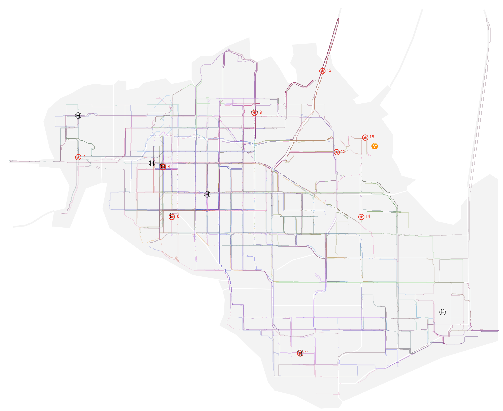
{(caption|}1: St Himark context map showing static (numbered red stars) and mobile (linear trajectories) sensor locations, hospitals and power plant.{|caption)}

## Question MC2.1

_Visualize radiation measurements over time from both static and mobile sensors to identify areas where radiation over background is detected. Characterize changes over time._

### Static Sensor Readings

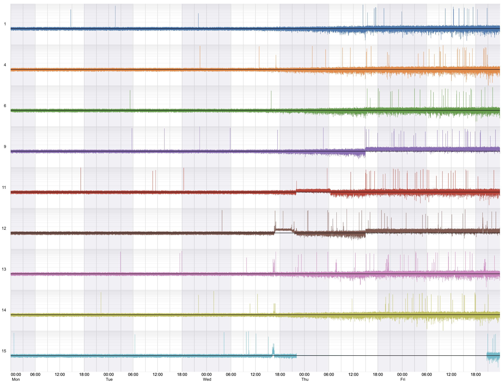
{(caption|}2: Static sensor readings over time with evening/night periods shown as pale blue/grey bands. Radiation counts per minute (CpM) are shown on a log scale.{|caption)}

Figure 2 shows that until approximately Wed 16:00, static sensors recording background radiation level with minor random variation and random but infrequent 'spikes'. Following a sustained spike at Sensor 15, closest to the nuclear power plant commencing **Wed 16:10** we see a 20 minute period of significantly raised CpM in sensors 12, 13, 14 and 15 – those closest to the power plant. Sensor 12, near the plant and Jade bridge shows a continuously raised CpM following this event from 16:37 – 22:00. This is followed by raised CpM at sensor 11 (Broadview Community Hospital) from **Wed 22:00 – Thu 06:25**. From **Thu 15:00 to end of recording period** we see a small elevated background radiation level across all sensors.

To measure absolute CpM values reducing random noise, we aggregate CpM values by the hour and plot confidence interval ranges for each sensor.

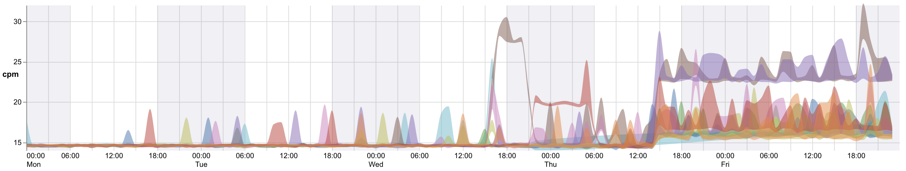
{(caption|}3: Confidence intervals of all static sensors (coloured as Figure 1) over time. CpM shown on a linear scale.{|caption)}

This reveals a consistent pre-quake background radiation level of 15 CpM; elevated levels around Jade Bridge (12, brown) at **c. 28 CpM** and Broadview Community Hospital (11, red) of **c.20 CpM**; and then two distinct elevated background rates: Jade bridge (12, brown) and Old Town Hospital (9, purple) at **c.23 CpM** and remaining static sensors around **17 CpM**.

To show accumulated radiation (important for environmental and health impact assessment) and for a more precise indication of rate of change in radiation levels we plot a [CUSUM chart](https://en.wikipedia.org/wiki/CUSUM) for the static sensors.

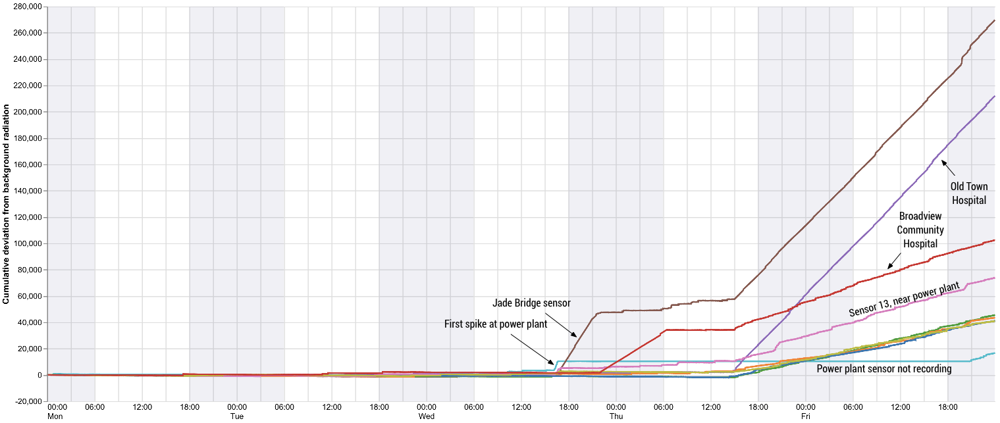
{(caption|}4: CUSUM (cumulative sum) chart of CpM values for static sensors. Assumes a background radiation of the mean of all pre-quake static CpM sensors. {|caption)}

### Mobile Sensor Readings

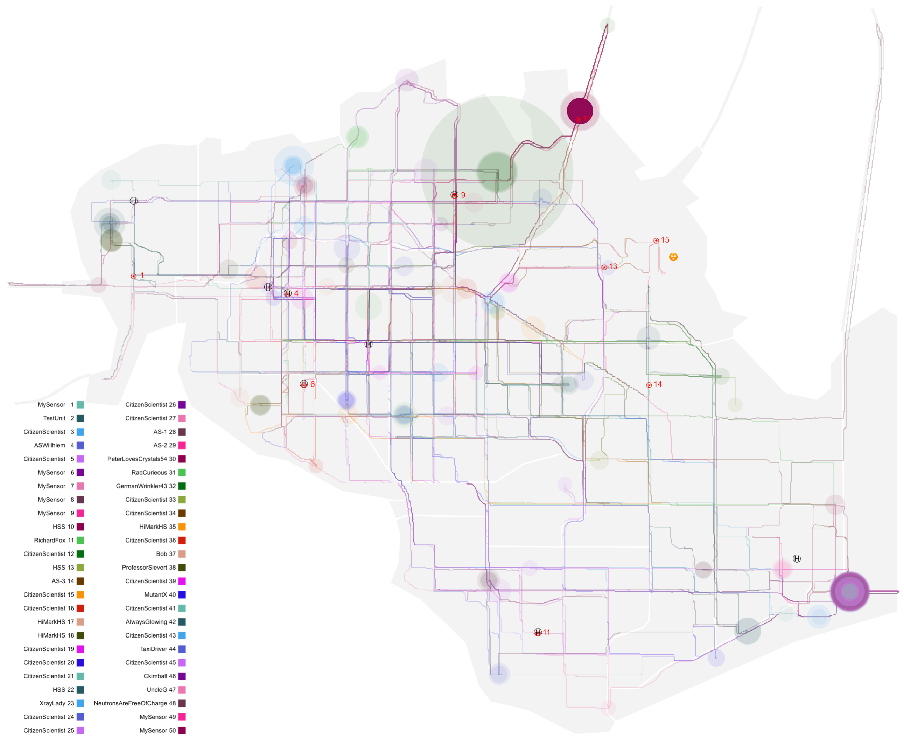
{(caption|}5: Mobile sensor trajectories (lines) and 'hotspots' (circles). Size of circle proportional to radiation CpM, opacity proportional to length of time mobile sensor is at a given location.{|caption)}

The geographic pattern of mobile sensor readings is shown in Figure 5. We see three hotspots worthy of particular note.

- The Jade Bridge hotspot (burgundy) shows a sustained period of high contamination by sensor HSS 10 between **Wed 16:37 – 22:00**
- The Old Town hotspot (large green circle) shows a massive but short lived burst of radiation **Thu 02:43** for Citizen Scientist 12, which also coincides with a step change in background levels for close-by static sensors 9 and 12.
- The Wilson Highway hotspot (purple and grey, bottom right) shows a number of vehicle sensors with significant increase in radiation after sensor 29 approaches from the east on **Thu 18:02**. Subsequent mobile sensors pick up the spike when stopped at the same location over the next 12 hours

To separate overlapping sensors and to assess the degree of prolonged contamination we can view the CUSUM plots for all mobile sensors (Figure 6).

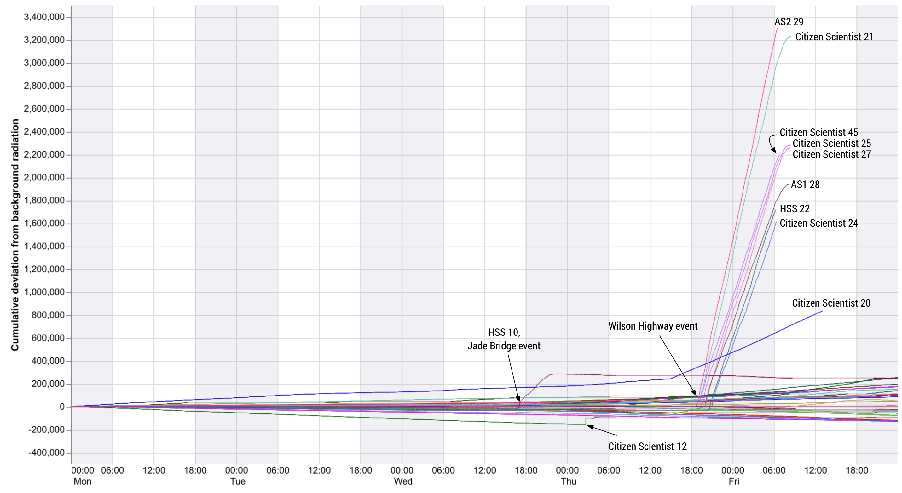
{(caption|}6: CUSUM plots of mobile sensors (coloured as Figure 5). Assumed background radiation is the average for all mobile sensors from Mon 00:00 – 06:00.{|caption)}

## Question MC2.2

_Use visual analytics to represent and analyze uncertainty in the measurement of radiation across the city._

1. _Compare uncertainty of the static sensors to the mobile sensors. What anomalies can you see? Are there sensors that are too uncertain to trust?_

Static sensors appear largely reliable and self-consistent (all showing a similar background CpM of c.15 prior to the first quake event; Figures 2 and 3). The most obvious problem is the absence of readings for static sensor 15 (at the power plant) between **Wed 22:03 and Fri 20:45**.

For fine grained analysis of static sensor anomalies, we can plot the CUSUM line for each static sensor on a log scale. This emphasises systematic changes in low CpM values (Figure 7):

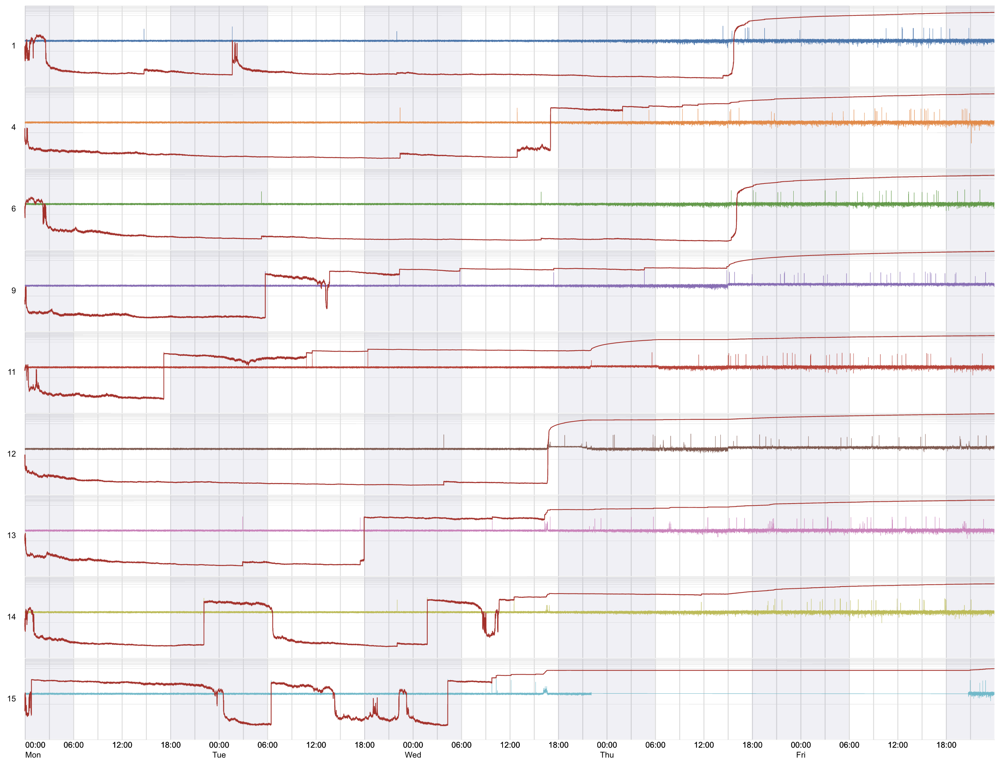
{(caption|}7: CUSUM plots (dark red lines) overlaid on static sensor readings (coloured as Figure 2).{|caption)}

Step changes evident for lower counts are induced by short-lived 'spikes' in measurement, but we also see other small but systematic differences. Sensors 1, 4 and 12 show fewer and smaller spikes for the first three days (and hence a longer period of low cumulative radiation) than the others. The powerplant sensor 15 shows a noisier low-level pattern during this period than the other sensors. This may be due to different environmental conditions or to a different calibration of the sensor, but since the differences relate to low level background counts, it is unlikely to be significant in informing major events.

Consistency in registering changes in background levels across the region (with some explainable geographic variation) suggests the static sensors are reliable indicators of true radiation levels in their immediate proximity.

The CUSUM plots for mobile sensors in Figure 6 shows there is far more variation in calibration of CpM rates than for static devices. The funnel-like spread of CUSUM lines over time both below and above the zero (global average pre-quake value) line.

By viewing each mobile sensor with a linear scaling but spikes removed, we can examine calibration differences in more detail.

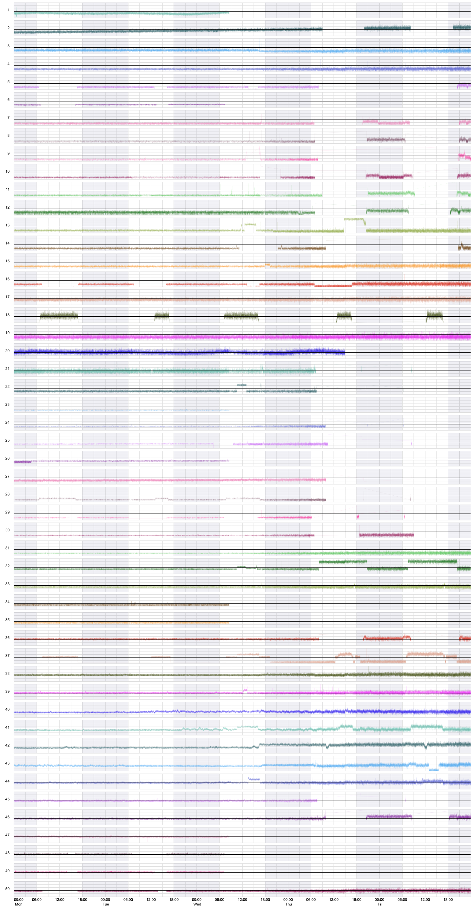
{(caption|}8: All mobile sensors with spikes removed, linear scaling with 40 CpM baseline for reference.{|caption)}

We see at least sources of calibration uncertainty:

- Pre-quake background measurements (which should be approximately similar) vary between sensors. e.g. Sensors 18, 20, 36, 38, 39, 44–49 show a background of around 40 CpM (black baseline) whereas sensors 4 – 11 show a background of 15 – 20 Cpm.
- Fluctuating or increasing background levels in sensors 1, 2, 20 at a frequency unlikely to be due to environmental change.
- Extra noisy background readings in sensors 12, 19, 20 and 21.

In summary, sensors that should be treated with caution: **MySensor 1**, **TestUnit 2**, **CitizenScientist 12**, **CitizenScientist 19**, **CitizenScientist 20** and **CitizenScientist 21**.

2. _Which regions of the city have greater uncertainty of radiation measurement? Use visual analytics to explain your rationale._

Considering the mapped mobile sensor readings (Figure 5), an obvious source of uncertainty is the heterogenous coverage (confined to accessible roads). Gaps in readings include the NE of the Safe Town neighbourhood in the vicinity of the power plant; Wilson Forest (with exception of the Wilson Highway); and large parts of Palace Hills. The Safetown gap is exacerbated by the lack of readings from static sensor 15 close to the power plant for a large period from Wednesday evening to Friday evening.

Transparent hotspots in Figure 5 also indicate temporary, unsustained peaks in measurement that are unlikely to be due to environmental causes (likely erroneous fluctuations in sensor readings). These tend to be concentrated in the central belt running from Northwest, through Weston, Easton, Southton, West Parton, East Parton.

The largest spike (Old Town, large green circle) should be treated with some caution given it is by far the highest reading of any sensor, but is not sustained for any period of time. There is some supporting evidence that this may be associated with a real event (see below), but the uncertainty around its scale remains.

3. _What effects do you see in the sensor readings after the earthquake and other major events? What effect do these events have on uncertainty?_

We see a general increase in the background levels after the main seismic event and the first spike in radiation near the power plant from **Wed 15:00 onwards**. Most sensors show an increase in 'noise' during this period. The Figure 6 CUSUM chart, which can smooth out noise and emphasise systematic trend, summarises both the general trend (cone shaped spread of most sensors) and the discrete changes in radiation for selected vehicles involved in contamination.

The log scaling of CpM readings can show the effect of the release of radioactive steam on sensor uncertainty (Figure 9).

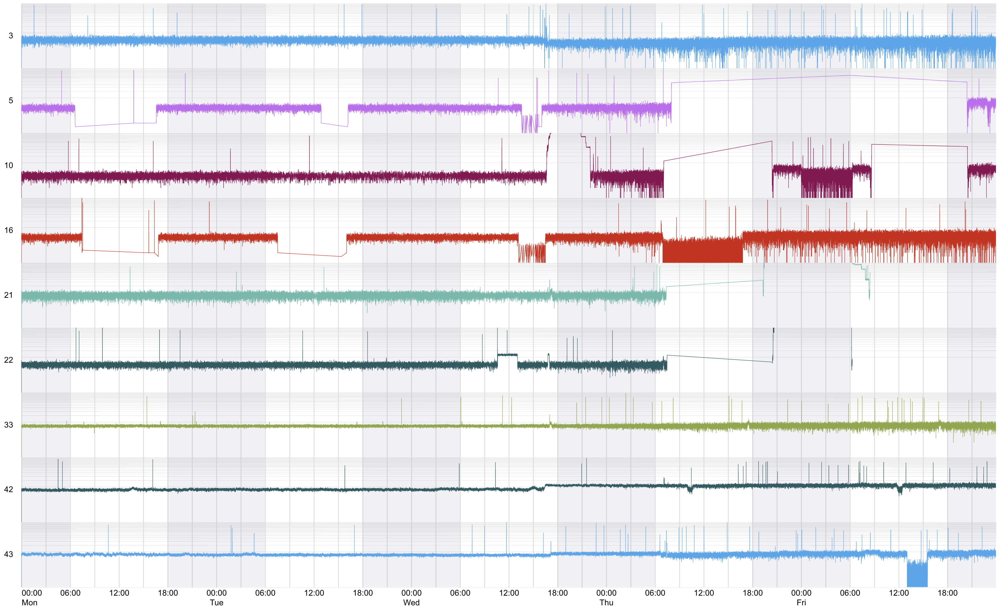
{(caption|}9: Selected mobile sensors (log CpM) following the Web 16:30 spike in radiation levels.{|caption)}

We see an apparent small drop background CpM in blue sensor 3, with many more very low values but also an increase in spike frequency. A similar pattern can be observed in sensors 10 and 16. We also see discrete periods of low CpM values in sensors 16 (Thursday daytime) and 43 (Friday afternoon) without any obvious environmental cause (confirmed by spatio-temporal animation of trajectories for these sensors).

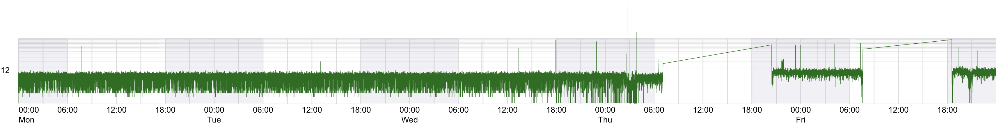
{(caption|}10: Timeline of mobile sensor CitizenScientist 12 (log CpM) responsible for the largest CpM value of any sensor.{|caption)}

The noise shown by mobile sensor 12 is greater than most, exhibiting a greater proportion of very low values than most other sensors. The massive spike at Thu 02:45 is both preceded and followed by an even higher density of very low values, decreasing the confidence in recorded values.

## Question MC2.3

_Given the uncertainty you observed in question 2.2, are the radiation measurements reliable enough to locate areas of concern?_

1. _Highlight potential locations of contamination, including the locations of contaminated cars. Should St. Himark officials be worried about contaminated cars moving around the city?_

As detailed in MC2.1 above there are two clear locations of contaminated cars: Jade Bridge (Wed 16:37 to 22:00) and Wilson Highway (Thu 18:00 to Fri 06:00). There is a third possible location in Old Town where a massive reading was recorded at Thu 02:43, however as identified above mobile sensor 12 that recorded this value has a high degree of uncertainty in its measurements.

2. _Estimate how many cars may have been contaminated when coolant leaked from the Always Safe plant. Use visual analysis of radiation measurements to determine if any have left the area._

### Jade Bridge Event

**Mobile sensor HSS 10** appears to be the only vehicle strongly affected by this contamination (Figure 6). There is a small possibility that there has been some cross contamination with **Citizen Scientist 12** as the two vehicles share similar locations around this time and at various others over the three days.

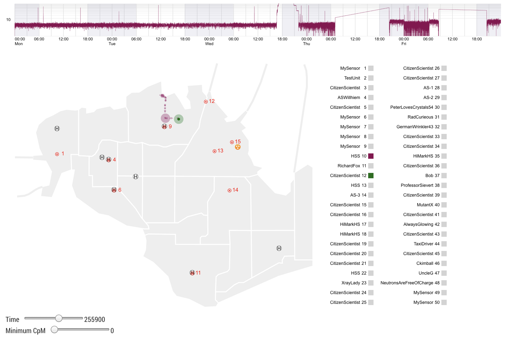
{(caption|}11: Still from animation of trails of sensors 10 (burgundy) and 12 (green) shortly after the Jade Bridge event. Both pass through the same location in Old Town - the one also recording the highest CpM count.{|caption)}

### Wilson Highway Event

The CUSUM chart of Figure 6 above clearly identifies the sensors involved in this contamination event. Identifying the Wilson Highway contaminated vehicles in order of accumulated contamination (highest first) as **AS2 29, Citizen Scientists 21, 45, 25, 27, AS 28, HSS 22 and Citizen Scientist 24.** Additionally, **PeterLovesCrystals54 30** shows some similar movement patterns and related contamination periods, albeit at a much lower level.

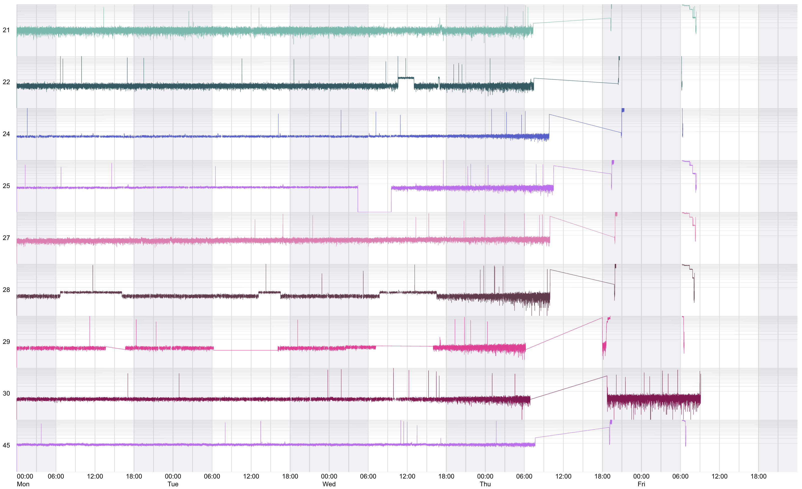
{(caption|}12: Timeline of mobile sensors involved in the Wilson Highway contamination.{|caption)}

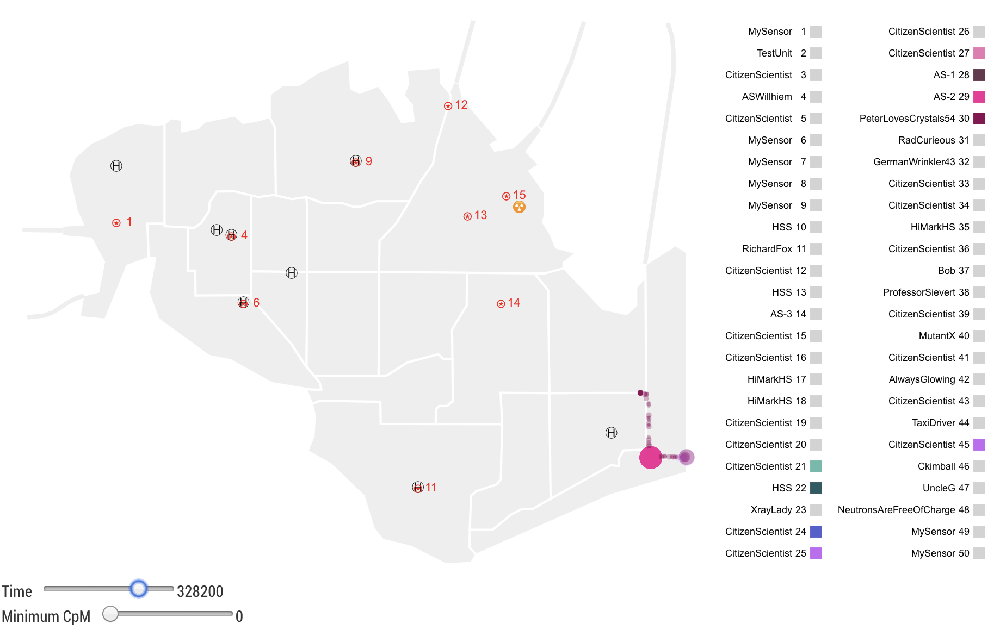
{(caption|}13: Still from animation of trails of the Wilson Highway event vehicles. The short trail north of the main (pink) hotspot shows the trajectory of mobile sensor 30. The trail to the east is the route all vehicles take to enter and leave St Himark.{|caption)}

All vehicles approach and leave the hotspot from the east. Sensor 30 leaves after the others but by the end of the period all contaminated vehicles involved have left St Himark via the Wilson Highway.

3. _Indicate where you would deploy more sensors to improve radiation monitoring in the city. Would you recommend more static sensors or more mobile sensors or both? Use your visualization of radiation measurement uncertainty to justify your recommendation._

The primary vector for radiation contamination appears to be vehicles as indicated via mobile sensors. However there is no guarantee that should a future radiological event occur, it would be vehicles that are the main or only vector. New static sensors (with greater accuracy than their mobile counterparts) would provide a more useful monitoring. The priority would be further sensors in the proximity of the power plant and sensors at the exit routes not currently covered (**Magritte Bridge**, **12th July Bridge**, **Himark Bridge** and **Wilson Highway**).

## Question MC2.4

_Summarize the state of radiation measurements at the end of the available period. Use your novel visualizations and analysis approaches to suggest a course of action for the city. Use visual analytics to compare the static sensor network to the mobile sensor network. What are the strengths and weaknesses of each approach? How do they support each other?_

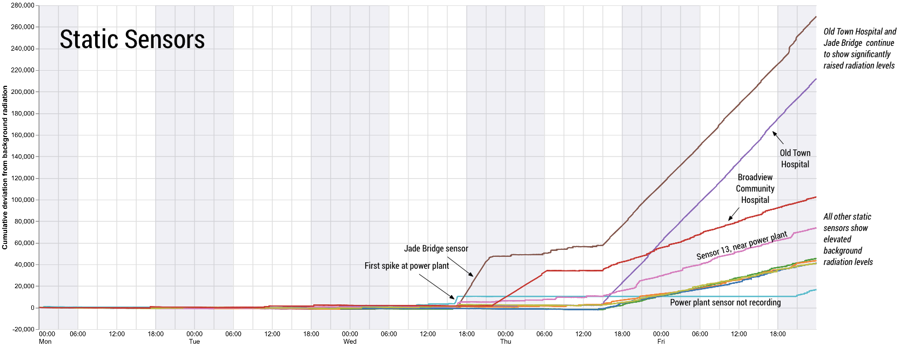
{(caption|}14: Static sensor CUSUM plots indicating status at end of recording period.{|caption)}

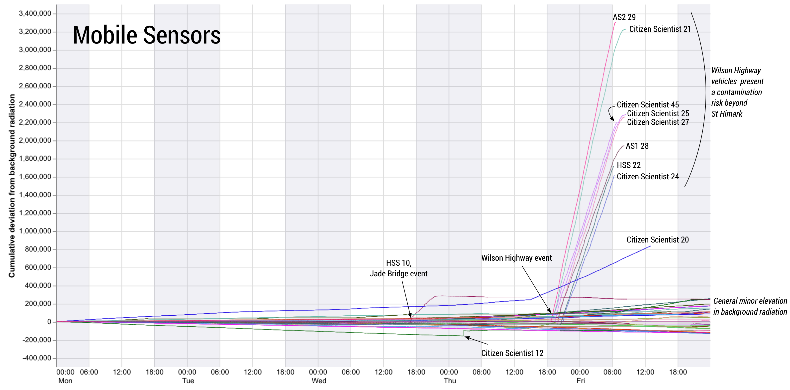
{(caption|}15: Mobile sensor CUSUM plots indicating status at end of recording period.{|caption)}

The two CUSUM plots summarise the status of St Himark at the end of the monitored period (Figures 14 and 15). The status can be summarised as follows:

- A raised background radiation level persists throughout the region. This is approximately a doubling of the normal background radiation level (evidence from all static sensors provides the absolute CpM figures; all sensors provide the relative changes).
- Two hotspots persist at Jade Bridge and Old Town Hospital (evidence from static sensors). The priority should be to decontaminate these two areas, if necessary closing off Jade Bridge until decontamination is complete.
- The Wilson Highway vehicles (21, 22, 24, 25, 27, 28, 29, 30 and 45) should be located as a priority and decontaminated.

Static sensor networks provide more reliable but less comprehensive coverage and are useful for detecting contamination sources at fixed locations. Mobile sensor networks have proven useful when the very devices on which they are mounted are also vectors of contamination, but they will be of less use in detecting other vectors such as wind and water. Monitoring movement patterns allow contaminated vehicles (and possibly people) to be located even if outside the St Himark region which is a particular strength not provided by static sensors. They may also give citizens greater confidence (or at least realism) in understanding the severity and extent of any radiological event. However their comparative unreliability and need for calibration should be considered when monitoring readings.

## Question MC2.5

_The data for this challenge can be analyzed either as a static collection or as a dynamic stream of data, as it would occur in a real emergency. Describe how you analyzed the data - as a static collection or a stream. How do you think this choice affected your analysis?_

Data were analysed as a static collection (as they were provided). However, care was taken to use approaches that would work if the data had been streamed. No time-based calculations required data 'later' in the stream. The timeline-based layout is amenable to constant streaming.

Of particular suitability for streaming analysis is the CUSUM plot (designed specifically for real-time process monitoring). CUSUM plots just require an assumed steady-state background rate with which to compare real-time rates. This level may be established a priori, or constructed empirically as readings are accumulated. CUSUM plots are effective in detecting early shifts in trend of noisy data, something ideally suited to emergency response based on partially uncertain and noisy data.
