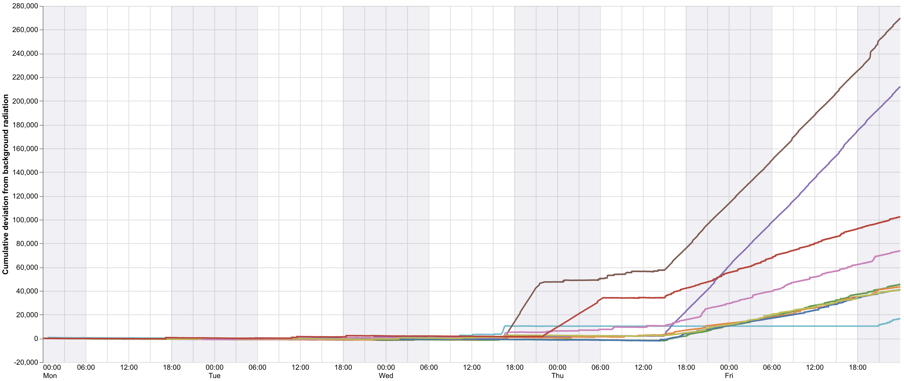
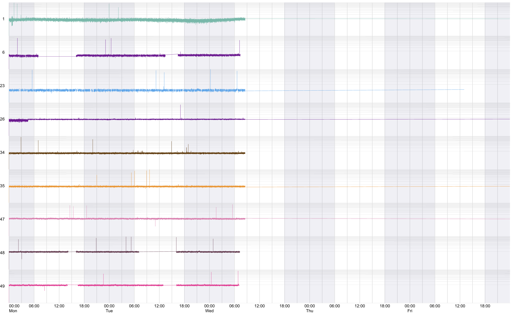
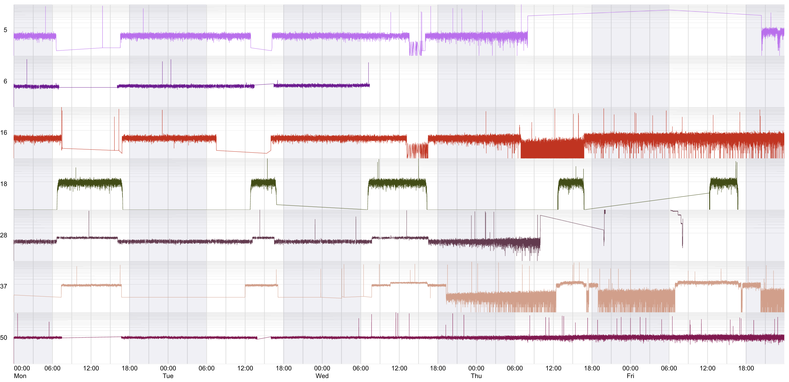
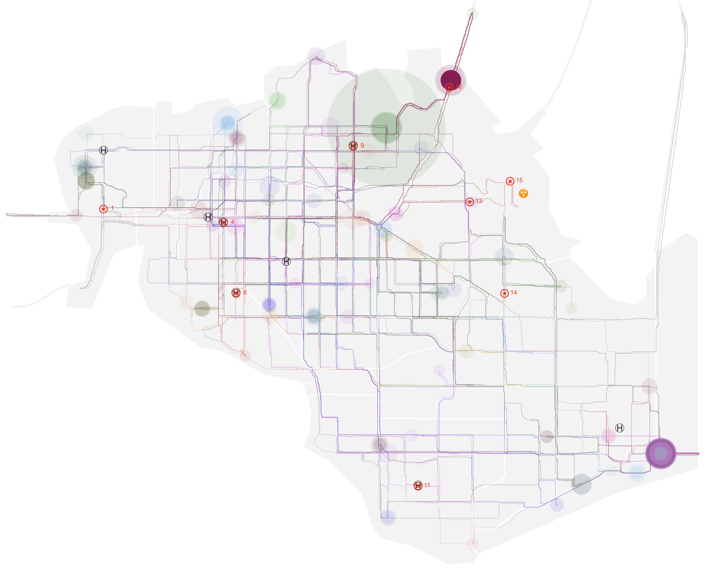
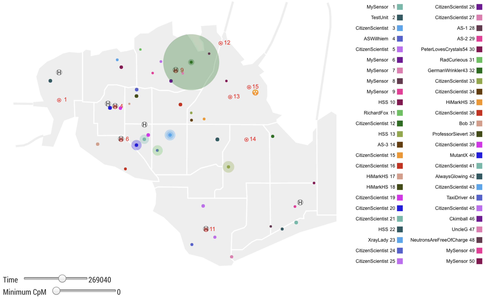

@import "css/vastChallenge.less"

<!-- Everything above this line should probably be left untouched. -->

# VAST Challenge 2019: Disaster at St. Himark

{(timestamp|}10th June, 14:00{|timestamp)}

## MC2 Explorations

Initial explorations showed both the temporal and spatial distributions of sensors.
To investigate further, consdier the radiation measurements of each sensor over time.
This should allow us to identify if any sensors have become contaminated or if any (static) sensors are reporting a consistent change in radiation levels.

Description of the challenge suggests the static sensors are "carefully calibrated" so provide a useful measure of expected background radiation counts.

### Static Sensors

{(design|}To spot consistent temporal patterns across sensors, align vertically on same temporal axis. Show radiation on a log scale so smaller changes can be spotted in addition to spikes. Use consistent colours for each sensor and a reference line for assumed backgound rate (15 CpM).{|design)}


```elm {l=hidden interactive}
mc2StaticCpmSignal : Spec
mc2StaticCpmSignal =
    let
        enc =
            encoding
                << position X timeEncoding
                << position Y
                    [ pName "cpm"
                    , pMType Quantitative
                    , pScale [ scType scSymLog, scDomain (doNums [ 0, 1200 ]) ]
                    , pAxis [ axTitle "", axTickCount 20 ]
                    ]
                << color
                    [ mName "sensorId"
                    , mMType Nominal
                    , mScale staticColours
                    , mLegend []
                    ]
                << tooltips
                    [ [ tName "sensorId", tMType Nominal ]
                    , [ tName "timestamp", tMType Temporal, tFormat "%a %H:%M" ]
                    , [ tName "cpm", tMType Quantitative ]
                    ]

        specSignals =
            asSpec [ enc [], line [ maStrokeWidth 0.5, maClip True ] ]

        specCombined =
            asSpec
                [ width 1200
                , height 100
                , timeResolve []
                , layer [ specNights, specSignals, specReference 15 ]
                ]
    in
    toVegaLite
        [ cfgLogTimeline []
        , mc2StaticSensorReadings
        , columns (Just 1)
        , facetFlow [ fName "sensorId", fMType Ordinal ]
        , specification specCombined
        ]
```

While showing the raw signals directly can reveal spkes, changes in temporally local variance and some step changes, it is not always easy to see small but consistent shifts in cpm values (9 and 12 elevated but more subtle changes not obivous).

To show this we can add the [cusum](https://en.wikipedia.org/wiki/CUSUM) line to each sensor showing the accumulated deviation from expected baseline, taken as the global mean for all readings on Monday and Tuesday (prior to any incidents). They work well for live streamed data as they only require a baseline expected level to calculate and can be added to as new sensor measurements are provided. Cusum plots also have the benefit of smoothing random noise and therefore accounting for non-systematic sources of measurement error.

_Plotting the cusum line seems particularly appropriate as the environmental and health damage from radiation exposure is itself cumulative._


```elm {l=hidden}
mc2StaticWithCusum : Spec
mc2StaticWithCusum =
    let
        enc =
            encoding
                << position X timeEncoding
                << position Y
                    [ pName "cpm"
                    , pMType Quantitative
                    , pScale [ scType scSymLog, scDomain (doNums [ 0, 1200 ]) ]
                    , pAxis [ axTitle "", axTickCount 20 ]
                    ]
                << color
                    [ mName "sensorId"
                    , mMType Nominal
                    , mScale staticColours
                    , mLegend []
                    ]

        encCusum =
            encoding
                << position X timeEncoding
                << position Y [ pName "cusum", pMType Quantitative ]

        specCusum =
            asSpec
                [ encCusum []
                , line [ maStrokeWidth 1, maColor "fireBrick" ]
                ]

        specSignal =
            asSpec [ enc [], line [ maStrokeWidth 0.5, maClip True ] ]

        specCombined =
            asSpec
                [ width 1200
                , height 100
                , timeResolve []
                , layer [ specNights, specSignal, specCusum ]
                ]
    in
    toVegaLite
        [ cfgLogTimeline []
        , mc2StaticSensorReadings
        , columns (Just 1)
        , facetFlow [ fName "sensorId", fMType Ordinal ]
        , specification specCombined
        ]
```

{(design|}The vertical log scale in the charts above is helpful in showing variations in the raw signal as it removes the dominance of spikes. However for the cusum lines, it can mask variation higher cusum values. Consider plotting the cusum lines on a linear vertical scale.{|design)}



```elm {l=hidden}
combinedStaticCusum : Spec
combinedStaticCusum =
    let
        enc =
            encoding
                << position X timeEncoding
                << position Y
                    [ pName "cusum"
                    , pMType Quantitative
                    , pAxis [ axTitle "Cumulative deviation from background radiation" ]
                    ]
                << color
                    [ mName "sensorId"
                    , mMType Nominal
                    , mScale staticColours
                    , mLegend []
                    ]
    in
    toVegaLite
        [ width 1200
        , height 500
        , cfg []
        , mc2StaticSensorReadings
        , timeResolve []
        , layer [ specNights, asSpec [ enc [], line [] ] ]
        ]
```

{(observation|}

We see several distinct patterns worthy of further investigation:

- A 'spike' event around Wednesday 16:10-16:30 (most evident in Sensor 15 but also visible in Sensors 12, 13 and 14). Notable that sensor 15 is located at the Nuclear plant and sensors 12, 13, and 14 are the next closest.

- A small but consistent increase background levels from around the same time (Thursday 15:00) to the end of the measured period. Characterised by an increase in the variance in readings and an increase in 'spike' readings across all static sensors.

- Several small 'step change' increases in sensors 9, 11 and 12:

  - Wednesday 16:13 - 19:30 (sensor 12)
  - Wednesday 22:00 - Thursday 06:30 (sensor 11)
  - Thursday 14:45 to end (sensors 9 and 12 and increase in spike frequency for all sensors except 15 that was not recording in this period).

- Sensors 9 and 12 (purple and brown) show a sharper increase in radiation levels than the other sensors (starting around Thursday 14:45) and so merit special investigation.

- The absense of any measurements from sensor 15 (located at the nuclear plant) is significant and may be masking severe local contamination. When measurements restored (from Friday 20:45), it shows significantly increased levels, although its slope on the Cusum chart suggests it is consistent with sensors 1, 4, 6, 11, 13 and 14 in the rate of increased radition detection.

{|observation)}

{(question|}Comparatively infrequent 'spikes' in cpm values are not what I would expect from direct ionising radition sources. Perhaps this suggests it is the transmission via other vectors (e.g. airborne fallout or waterborne materials)?{|question)}

{(design|}Need to identify aggregate trends in data that isn't dominated by spikes. Consider aggregating over time intervals (e.g. hours) and showing confidence intervals over aggregated periods. Semi-transparent colouring will allow overlapping and consistent patterns to be identified.{|design)}


```elm {l=hidden}
staticCIs : Spec
staticCIs =
    let
        enc =
            encoding
                << position X (pTimeUnit yearMonthDateHours :: timeEncoding)
                << position Y
                    [ pName "cpm"
                    , pMType Quantitative
                    , pAggregate opCI0
                    , pScale [ scDomain (doNums [ 14, 32 ]) ]
                    , pAxis [ axTitle "cpm", axTitleAngle 0 ]
                    ]
                << position Y2
                    [ pName "cpm"
                    , pMType Quantitative
                    , pAggregate opCI1
                    , pAxis [ axTitle "cpm" ]
                    ]
                << color
                    [ mName "sensorId"
                    , mMType Nominal
                    , mScale staticColours
                    , mLegend []
                    ]

        specCpm =
            asSpec [ enc [], area [ maOpacity 0.5, maInterpolate miMonotone ] ]
    in
    toVegaLite
        [ width 1200
        , height 200
        , cfg []
        , timeResolve []
        , mc2StaticSensorReadings
        , layer [ specNights, specCpm ]
        ]
```

{(observation|}

Aggregate confirms a background radiation level of c. 15 CpM with three distinct periods of elevatated radiation: Sensor 12 (brown) between 4-7pm Wednesday; Sensor 11 (red) immediately following (between 10pm Wed and 6am Thu); Sensors 9 and 12 (purple and brown) 3pm Thurs onwards.

This largely confirms patterns note with the raw data above, although the scaling that reduces vertical impact of spikes makes the transations away from background more obvious. Note also that the sensor 11 is elevated as with all sensors in the final period, but not to the same extent as 9 and 12 as previously thought.

{|observation)}

{(timestamp|}15th June, 10:00{|timestamp)}

### Mobile Sensors

### All sensors, linear

All mobile sensors with spikes removed, linear scaling with 40 CpM baseline for reference.


<!-- ^^^elm{v=(mc2MobileSensorTimesLinear (List.range 1 50))}^^^ -->

```elm {l=hidden}
selectIds : List Int -> List LabelledSpec -> List LabelledSpec
selectIds ids =
    let
        exprs =
            ids
                |> List.map (\id -> "datum.sensorId == " ++ String.fromInt id)
                |> List.intersperse " || "
                |> String.concat
    in
    if ids == [] then
        filter (fiExpr "true")

    else
        filter (fiExpr exprs)


mc2MobileSensorTimesLog : List Int -> Spec
mc2MobileSensorTimesLog ids =
    let
        trans =
            transform << selectIds ids

        sel =
            selection
                << select "mySelection" seInterval [ seBindScales, seEncodings [ chX ] ]

        enc =
            encoding
                << position X timeEncoding
                << position Y
                    [ pName "cpm"
                    , pMType Quantitative
                    , pScale [ scType scSymLog, scDomain (doNums [ 0, 1200 ]) ]
                    , pAxis [ axGrid True, axTitle "", axLabels False, axTicks False, axTickCount 20 ]
                    ]
                << color
                    [ mName "sensorId"
                    , mMType Nominal
                    , mScale mobileColours
                    , mLegend []
                    ]
                << tooltips
                    [ [ tName "timestamp", tMType Temporal, tFormat "%a %H:%M" ]
                    , [ tName "secondsFromStart", tMType Quantitative ]
                    , [ tName "cpm", tMType Quantitative ]
                    ]

        encZero =
            encoding
                << position X timeEncoding
                << position Y
                    [ pName "cpm"
                    , pMType Quantitative
                    , pScale [ scType scSymLog, scDomain (doNums [ 0, 1200 ]) ]
                    ]

        encCusum =
            encoding
                << position X timeEncoding
                << position Y [ pName "cusum", pMType Quantitative ]

        specSignal =
            asSpec [ enc [], line [ maStrokeWidth 0.5, maClip True ] ]

        specCusum =
            asSpec [ encCusum [], line [ maStrokeWidth 1, maColor "fireBrick" ] ]

        specCombined =
            asSpec
                [ width 1200
                , height 100
                , sel []
                , timeResolve []
                , layer [ specNights, specSignal, specCusum, specReference 0 ]
                ]
    in
    toVegaLite
        [ cfgLogTimeline []
        , mobileSensorReadingsThinned5
        , trans []
        , columns (Just 1)
        , facetFlow [ fName "sensorId", fMType Ordinal ]
        , specification specCombined
        ]


mc2MobileSensorTimesLinear : List Int -> Spec
mc2MobileSensorTimesLinear ids =
    let
        cfg2 =
            cfg
                << configuration (coHeader [ hdLabelAngle 0, hdTitleFontSize 0, hdLabelOrient siLeft ])
                << configuration (coFacet [ facoSpacing 6 ])
                << configuration (coAxisY [ axcoDomain False, axcoTicks False ])

        trans =
            transform
                << selectIds ids
                << filter (fiExpr "datum.cpm < 100")

        sel =
            selection
                << select "mySelection" seInterval [ seBindScales, seEncodings [ chX ] ]

        enc =
            encoding
                << position X timeEncoding
                << position Y
                    [ pName "cpm"
                    , pMType Quantitative
                    , pScale [ scDomain (doNums [ 0, 100 ]) ]
                    , pAxis [ axGrid True, axTitle "", axLabels False, axTickCount 5 ]
                    ]
                << color
                    [ mName "sensorId"
                    , mMType Nominal
                    , mScale mobileColours
                    , mLegend []
                    ]
                << tooltips
                    [ [ tName "timestamp", tMType Temporal, tFormat "%a %H:%M" ]
                    , [ tName "secondsFromStart", tMType Quantitative ]
                    , [ tName "cpm", tMType Quantitative ]
                    ]

        specSignal =
            asSpec [ enc [], line [ maStrokeWidth 0.05, maOpacity 0.9 ] ]

        specCombined =
            asSpec
                [ width 1200
                , height 40
                , sel []
                , timeResolve []
                , layer [ specNights, specSignal, specReference 30 ]
                ]
    in
    toVegaLite
        [ cfg2 []
        , mobileSensorReadingsThinned5
        , trans []
        , columns (Just 1)
        , facetFlow [ fName "sensorId", fMType Ordinal ]
        , specification specCombined
        ]
```

Examining the radiation CpM values over time for all 50 mobile sensors, we see several distinction groups of signals, shown below on log scale to include spikes.

#### Early Termination

The following all stop recording radiation values between approxmately 7-8:30am Wednesday 8th April.



```elm {l=hidden}
mc2MobileSensorTimesTerminated : Spec
mc2MobileSensorTimesTerminated =
    mc2MobileSensorTimesLog [ 1, 6, 23, 26, 34, 35, 47, 48, 49 ]
```

#### Working Day Periods

Several sensors appear to have a common set of periods (8am-5pm Monday 6th and Tuesday 7th) with no readings or significant changes in readings for those periods. Presumably related to pre-quake work patterns.



```elm {l=hidden}
mc2MobileSensorTimesBlackouts : Spec
mc2MobileSensorTimesBlackouts =
    mc2MobileSensorTimesLog [ 5, 6, 16, 18, 28, 37, 50 ]
```

#### Wednesday 16:30 Event


```elm {l=hidden}
mc2MobileSensorTimesWedPM : Spec
mc2MobileSensorTimesWedPM =
    mc2MobileSensorTimesLog [ 10, 42, 43, 3, 5, 16, 21, 22, 33 ]
```

{(observation|}

A number of mobile sensors show a step change or spike in radiation levels from around 16:30, which corresponds to the spike noted in the static sensors at this time. **There are some small lags in when this precisely happens, so should investigate spatial location of these sensors dunging this time to see if we can map the movement of the spike.**

{|observation)}

#### Thursday 2:45am event


```elm {l=hidden}
mc2MobileSensorTimesSensor12 : Spec
mc2MobileSensorTimesSensor12 =
    mc2MobileSensorTimesLog [ 12 ]
```

{(observation|}

Mobile sensor 12 is slightly unusual in its measurements. Up until approximately Wednesday midday, it shows background of arond 20cpm but with a larger than normal number of very low readings (c. 2-5 cpm). From 12:30pm, we see an increase in frequency of zero readings with a particularly intense period of zeros between Thursday 2:45-3:55am sandwiched between two peak readings of of 57,345 cpm and 2,339 cpm respectively. If these peak values are correct, this is a massive dose of ionising radiation. It suggests this period of zeros between the two spikes may well be erroneous and masking futher radiological events in this hour.

Examining the 5 peaks prior to his event, the first two (Wed 08:54, 762cpm; Wed 13:22, 416cpm) occur at a location in Northwest. The remaining 3 (Wed 17:58, 973cpm; Wed 22:58, 836cpm; Thu 00:37, 442cpm) all occur at the same Old Town location as the extreme spike events.

{|observation)}

{(question|} Is the extreme spike event on Thursday 02:43 (57345cpm) the result of sensor error or a genuine event? This is a critical question given magnitude of the reading. Is there any corroborating evidence from other sensors?{|question)}

{(observation|}

Possible corroborating evidence for the 16:43 spike comes from the two static sensors 9 and 12 (see static sensor charts above) that show a step change increase in background levels from this time onward. They are the two static sensors closest to the location mobile sensor 12 registers this spike. Of the next two closest, sensor 15 (at the power plant) is out of action at this point, but sensor 13 shows no significant change in bacground levels. This suggests that there may be a vector carrying the source of the radiation in a NE direction.

{|observation)}

#### Wilson Highway event


```elm {l=hidden}
mc2MobileSensorTimesWilson : Spec
mc2MobileSensorTimesWilson =
    mc2MobileSensorTimesLog [ 29, 30, 45, 21, 25, 27, 28, 22, 24 ]
```

{(observation|}

Mapped results suggest some kind of radiation spike on Wilson Highway (SE cormer of map) first noticed when mobile sensor 29 approaches from the east on Thursday 18:02. Subequent mobile sensors pick up the spike when parked at the same location over the next 12 hours. Note also that with the exception of sensor 30, which shows increased radiation levels, readings for all other sensors involved in the event stop between approximately Thursday 19:00 and Friday 06:00 (possibly maxed out?) and then all sensors in this group stop broadcasting after Friday 09:00.

{|observation)}

{(timestamp|}29th June, 07:00{|timestamp)}

### All sensors, Cusum


```elm {l=hidden interactive}
combinedMobileCusum : Spec
combinedMobileCusum =
    let
        enc =
            encoding
                << position X timeEncoding
                << position Y
                    [ pName "cusum"
                    , pMType Quantitative
                    , pAxis [ axTitle "Cumulative deviation from background radiation" ]
                    ]
                << color
                    [ mName "sensorId"
                    , mMType Nominal
                    , mScale mobileColours
                    , mLegend []
                    ]

        spec =
            asSpec [ enc [], line [ maStrokeWidth 0.5, maOpacity 0.7 ] ]
    in
    toVegaLite
        [ width 900
        , height 500
        , cfg []
        , mobileSensorReadingsThinned10
        , timeResolve []
        , layer [ specNights, spec, specReference 0 ]
        ]
```

### Mapped Trajectories

{(design|}

Thinning out all mobile records (removing conecutive readings at the same location) allows us to see the trajectories of all mobile sensors as lines.

Separately applying Douglas-Peucker thinning of sensor readings removes consecutive readings of similar CpM values which both reduces data volume and allows us to distinguish repeated hotspots on separate occasions from those that occur in a single continuous period.

We can overlay locations of any sensor readings from with high cpm values and by making them transparent we may identify 'hotspots' recorded where more than one high reading occurs at the same location. This is one way of accounting for a source of uncertainty: possibly erroneous one-off spikes in cpm readings will appear very transparent, so not so salient on map. Only repeated co-located hotspots will be more obvious.

{|design)}



```elm {l=hidden}
mc2MobileSensorMap : Spec
mc2MobileSensorMap =
    let
        specNeighbourhoods =
            asSpec [ neighbourhoodBounds, geoshape [ maStroke "white", maFill "#f3f3f3", maStrokeWidth 2 ] ]

        specBridges =
            asSpec
                [ bridges
                , geoshape [ maStroke "#f3f3f3", maStrokeWidth 4 ]
                ]

        transHotspots =
            transform
                << filter (fiExpr "datum.cpm >= 1000")

        encTrajectory =
            encoding
                << position Longitude [ pName "long", pMType Quantitative ]
                << position Latitude [ pName "lat", pMType Quantitative ]
                << color [ mName "sensorId", mMType Nominal, mScale mobileColours, mLegend [] ]
                << tooltip [ tName "sensorId", tMType Nominal ]

        specTrajectories =
            asSpec
                [ mobileSensorTrajectories
                , encTrajectory []
                , line [ maStrokeWidth 1, maOpacity 0.3 ]
                ]

        encHotspots =
            encoding
                << position Longitude [ pName "long", pMType Quantitative ]
                << position Latitude [ pName "lat", pMType Quantitative ]
                << size
                    [ mName "cpm"
                    , mMType Quantitative
                    , mScale
                        [ scType scPow
                        , scExponent 0.6
                        , scDomain (doNums [ 1000, 50000 ])
                        , scRange (raNums [ 400, 40000 ])
                        ]
                    , mLegend []
                    ]
                << color [ mName "sensorId", mMType Nominal, mScale mobileColours, mLegend [] ]
                << tooltips
                    [ [ tName "sensorId", tMType Nominal ]
                    , [ tName "cpm", tMType Quantitative ]
                    ]

        specHotspots =
            asSpec
                [ mobileSensorReadingsThinned10
                , transHotspots []
                , encHotspots []
                , circle [ maOpacity 0.1 ]
                ]

        encPois =
            encoding
                << position Longitude [ pName "long", pMType Quantitative ]
                << position Latitude [ pName "lat", pMType Quantitative ]
                << text [ tName "label", tMType Nominal ]

        specPois =
            asSpec [ pois, encPois [], textMark [ maFontSize 16 ] ]

        encSensorId =
            encoding
                << position Longitude [ pName "long", pMType Quantitative ]
                << position Latitude [ pName "lat", pMType Quantitative ]
                << text [ tName "id", tMType Ordinal ]

        specSensorId =
            asSpec [ staticSensorLocations, encSensorId [], textMark [ maDx 16, maColor "red" ] ]

        specStaticSensors =
            asSpec [ staticSensorLocations, encPois [], textMark [ maColor "red", maFontSize 32 ] ]
    in
    toVegaLite
        [ width 1280
        , height 1000
        , cfg []
        , layer
            [ specNeighbourhoods
            , specBridges
            , specTrajectories
            , specHotspots
            , specPois
            , specStaticSensors
            , specSensorId
            ]
        ]
```

{(observation|}

_Bridges_:

- Of the three bridges connect the NE of the region, it seems odd that there are no sensor readings for travel along the 12th July bridge (middle one, closest to the power plant). **Investigate why this might be the case.**
- There is an obvious hotspot for sensor 10 (bergundy) by Jade bridge. Trajectories suggest this vehicle may have been in proximity to the large (green) hotspot to the SW of the bridge. Perhaps the bridge hotspot is the result of traffic delays caused by Jade bridge repairs (see City document). **Investigate spatio-temporal pattern of sensor 10.**

{|observation)}


```elm {l=hidden}
mc2MobileSensorTimesSensor10 : Spec
mc2MobileSensorTimesSensor10 =
    mc2MobileSensorTimesLog [ 10 ]
```



```elm {l=hidden interactive}
mc2MobileSensorMapInteractive : Spec
mc2MobileSensorMapInteractive =
    let
        specNeighbourhoods =
            asSpec [ neighbourhoodBounds, geoshape [ maStroke "white", maFill "#eee", maStrokeWidth 2 ] ]

        specBridges =
            asSpec
                [ bridges
                , geoshape [ maStroke "#eee", maStrokeWidth 4 ]
                ]

        sel =
            selection
                << select "minThreshold"
                    seSingle
                    [ seFields [ "cpm" ]
                    , seInit [ ( "cpm", num 30 ) ]
                    , seBind [ iRange "cpm" [ inName "Minimum CpM", inMin 0, inMax 500 ] ]
                    ]
                << select "time"
                    seSingle
                    [ seFields [ "secondsFromStart" ]
                    , seInit [ ( "secondsFromStart", num 269040 ) ]
                    , seBind [ iRange "secondsFromStart" [ inName "Time", inMin 0, inMax 431985, inStep 300 ] ]
                    ]

        trans =
            transform
                << filter (fiSelection "legendSel")
                << filter (fiExpr "((time_secondsFromStart - datum.secondsFromStart) <=1800) && (time_secondsFromStart >= datum.secondsFromStart)")
                << filter (fiExpr "datum.cpm >= minThreshold_cpm")

        encPoints =
            encoding
                << position Longitude [ pName "long", pMType Quantitative ]
                << position Latitude [ pName "lat", pMType Quantitative ]
                << color [ mName "sensorId", mMType Nominal, mScale mobileColours, mLegend [] ]
                << size
                    [ mName "cpm"
                    , mMType Quantitative
                    , mScale
                        [ scType scPow
                        , scExponent 0.8
                        , scDomain (doNums [ 0, 50000 ])
                        , scRange (raNums [ 0.1, 10000 ])
                        ]
                    , mLegend []
                    ]
                << tooltips
                    [ [ tName "sensorId", tMType Nominal ]
                    , [ tName "timestamp", tMType Temporal, tFormat "%a %H:%M" ]
                    , [ tName "secondsFromStart", tMType Quantitative ]
                    , [ tName "cpm", tMType Quantitative ]
                    ]

        specPoints =
            asSpec
                [ mobileSensorReadingsThinned10
                , trans []
                , sel []
                , encPoints []
                , circle [ maOpacity 0.3 ]
                ]

        encPois =
            encoding
                << position Longitude [ pName "long", pMType Quantitative ]
                << position Latitude [ pName "lat", pMType Quantitative ]
                << text [ tName "label", tMType Nominal ]

        specPois =
            asSpec [ pois, encPois [], textMark [] ]

        encSensorId =
            encoding
                << position Longitude [ pName "long", pMType Quantitative ]
                << position Latitude [ pName "lat", pMType Quantitative ]
                << text [ tName "id", tMType Ordinal ]

        specSensorId =
            asSpec [ staticSensorLocations, encSensorId [], textMark [ maDx 12, maColor "red" ] ]

        specStaticSensors =
            asSpec [ staticSensorLocations, encPois [], textMark [ maColor "red", maFontSize 16 ] ]

        mapSpec =
            asSpec
                [ width 640
                , height 500

                -- 1280 x 1000
                , layer
                    [ specNeighbourhoods
                    , specBridges
                    , specPois
                    , specStaticSensors
                    , specSensorId
                    , specPoints
                    ]
                ]
    in
    toVegaLite [ cfg [], hConcat [ mapSpec, sensorInteractiveLegend "legendSel" ] ]
```

## Timeline

_(add to this table as observations are made)_

| Time               | Event                                                                                                                                                                                                  | Evidence                                                                                  |
| ------------------ | ------------------------------------------------------------------------------------------------------------------------------------------------------------------------------------------------------ | ----------------------------------------------------------------------------------------- |
| Wed 07:00 to 08:30 | 9 mobile sensors stop reporting readings.                                                                                                                                                              | Mobile sensors 1, 6, 23, 26, 34, 35, 47, 48 and 49                                        |
| Wed 16:10 to 16:30 | Spikes in static sensor readings closest to power station.                                                                                                                                             | Static sensors 12, 13, 14, 15                                                             |
| Wed 16:30 to end   | A small but continuous steady increase in background radiation                                                                                                                                         | All static sensors show increase in cpm variance                                          |
| Wed 16:37 to 22:00 | Continuous elevated radiation levels close to Jade Bridge                                                                                                                                              | Static ensor 12, mobile sensor 12                                                         |
| Wed 22:03          | Static sensor at power station stops reporting readings. At the same time static sensor 11 (Broadview Community Hospital) reports sustained period of raised background radiation until Thursday 06:20 | Static sensors 15 and 11                                                                  |
| Thu 02:43          | Largest spike: Old Town, 57345cpm                                                                                                                                                                      | Mobile sensor 12 shows spike and static sensors 9 and 12 step change in background levels |
| Thu 15:00 to end   | Small increase radiation levels across region (c. 15% over background, but over 50% closer to power station)                                                                                           | All static sensors                                                                        |
