@import "css/vastChallenge.less"

```elm {l=hidden}
```

<!-- Everything above this line should probably be left untouched. -->

{(titleEntry|}mc3 {|titleEntry)}
{(titleYear|} 2019 {|titleYear)}
{(titleChallenge|} Mini-Challenge 3 {|titleChallenge)}

**Team Members:**
Jo Wood, giCentre, City, University of London, j.d.wood@city.ac.uk PRIMARY

**Student Team:** No

**Tools Used:**
[LitVis](https://github.com/gicentre/litvis), developed by the giCentre (integrates [Vega](https://vega.github.io/vega/), [Vega-Lite](https://vega.github.io/vega-lite/) with [elm](https://package.elm-lang.org/packages/gicentre/elm-vegalite/latest/VegaLite) and [markdown](https://en.wikipedia.org/wiki/Markdown)), for narrative and visualization document creation.
\*nix command-line tools ([awk](https://www.manpagez.com/man/1/awk/), [sed](https://www.manpagez.com/man/1/sed/), [cut](https://www.manpagez.com/man/1/cut/) etc.) for some data cleaning.

**Approximately how many hours were spent working on this submission in total?** c. 80 hours for all three Mini challenges and Grand Challenge (treated as a single integrated process)

**May we post your submission in the Visual Analytics Benchmark Repository after VAST Challenge 2019 is complete?** Yes.

[Video](https://vimeo.com/347833023)

---

_Note: This document was created in **[LitVis](https://github.com/gicentre/litvis)** - a Literate Visualization environment to support visual design and analysis exposition. This answer page is supported by a series of litvis documents providing design and analysis provenance for this, the other mini challenges and grand challenge. They can be found at https://github.com/jwoLondon/vastchallenge2019 (released after VAST challenge deadline has passed)._

# Questions

_The City has been using Y\*INT to communicate with its citizens, even post-earthquake. However, City officials needs additional information to determine the best way to allocate emergency resources across all neighborhoods of St. Himark. Your task, using your visual analytics on the community Y\*INT data, is to determine the types of problems that are occurring across the St. Himark. Then, advise the City on how to prioritize the distribution of resources. Keep in mind that not all sources on Y\*INT are reliable, and that priorities may change over time as the state of neighborhoods also changes._

To contextualise results we provide a gridmap projection for laying out spatially located graphical summaries. This is used because the spatial precision of Y\*INT messages is limited to neighbourhoood.

<!-- ^^^elm {v=gridLayout}^^^ -->

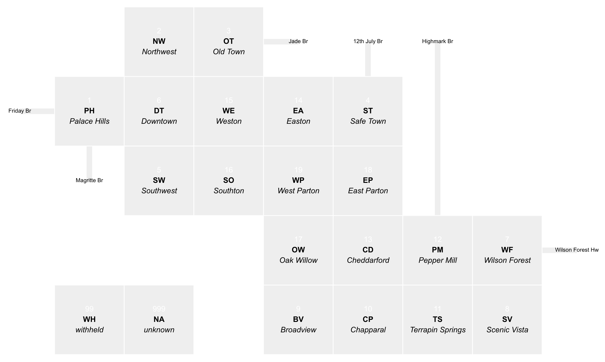
{(caption|}1: St Himark gridmap showing neighbourhoods and bridges. The two cells bottom-left are reserved for withheld and unknown locations.{|caption)}

## Question MC3.1

_Using visual analytics, characterize conditions across the city and recommend how resources should be allocated at 5 hours and 30 hours after the earthquake. Include evidence from the data to support these recommendations. Consider how to allocate resources such as road crews, sewer repair crews, power, and rescue teams._

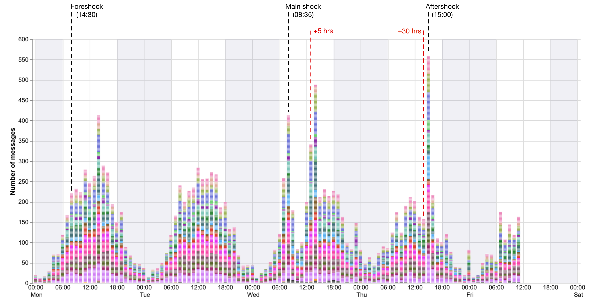
{(caption|}2: Message frequencies over time coloured by origin neighbourhood.{|caption)}


{(caption|}3: Messages containing the text `shak`, coloured by origin neighbourhood.{|caption)}

Using messages alone, the first task is to identify the shake events. Messages were first filtered to remove most common spam messages (see litvis documents for details). Interactive regular expression filtering was then used to identify message theme. Messages containing `shak` suggested three distinct seismic events (Figures 2 and 3) identified by the following messages that were then subsequently reMessaged :

- **Monday 14:39, Safetown** _FieldEngineerPhillipCarter_: `Earthquake? Feeling something shaking.`
- **Wed 08:37, Cheddarford** _Rogers1971_: `Please tell me I imagine the floors shaking`
- **Thu 15:08, Weston** _LockhartBear1968_: `Why is the coffee mug shaking?`

Spanning the main quake event, 5 hours following and 30 hours following, the state of St Himark can be summarised by temporal word clouds aggregated in three hour blocks (stopwords and spam messages filtered out).

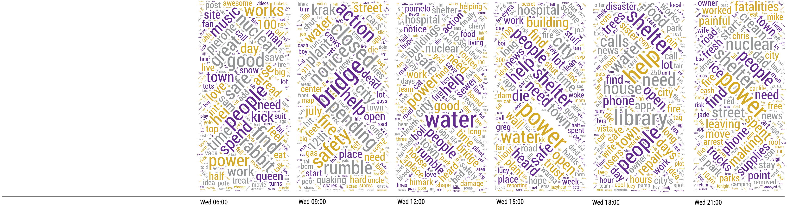

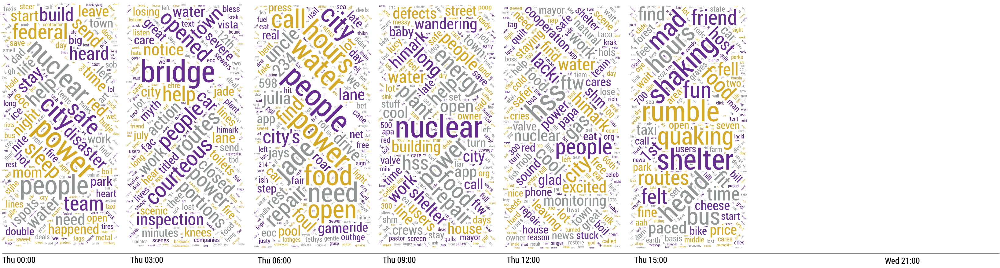

{(caption|}4: Wordclouds spanning the main shock periods.{|caption)}

Wordclouds suggest a number of demands on resources during the period:

### After 5 hours

- Maintaining **emergency fire services** is an early priority (see Figure 5) as damage to fire stations and road access is limiting ability to control fires following power problems.
- Assessment and containment of **nuclear power plant damage**.
- **Transportation, including bridge access** is an early priority to allow citizens who have lost their homes to leave and external resources to arrive.
- **Restoration of power** is critical for good information flow.
- **Evacuation of damaged buildings** and 'red tagging' to indicate unsafe to enter. This is especially important with the risk of further aftershocks (Figure 6).

### After 30 hours

- **Emergency shelter provision** with adequate **food** for those who have lost homes or their homes temporarily too dangerous to enter.
- **Restoration of clean water supply** in response to sewer and water pipe damage. Messages suggest some water contamination, evident among shelter volunteers is a priority by the 30 hour period.
- **Flood damage to Easton museum** requires volunteer effort to protect valuable artifacts.
- **Civil unrest** should be managed by the 30 hour period as dissatisfaction with 'red tagging' of unsafe buildings and the Mayor's apparent lack of response mounts.

Interactive time and location-based browsing of messages provides evidence of demand for resource allocation. Example snapshots are shown below, but content of messages provided as interactive 'tooltips'.

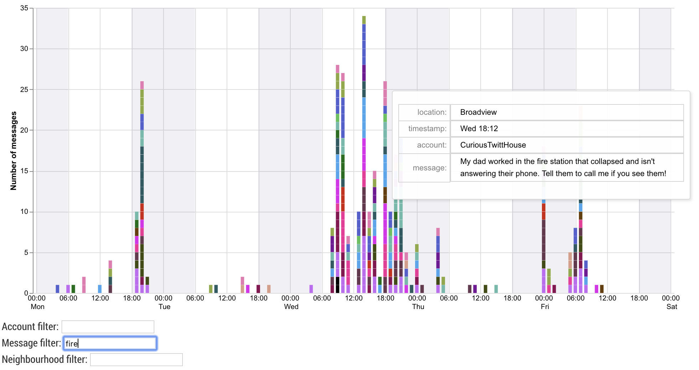
{(caption|}5: Interactive browsing of messages over time containing the `fire` keyword.{|caption)}

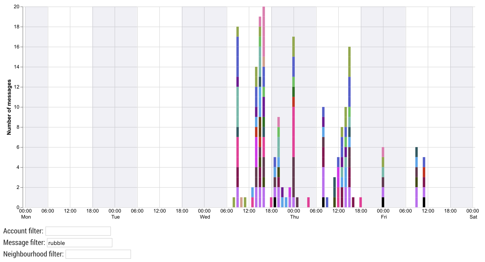
{(caption|}6: Interactive browsing of messages over time containing the `rubble` keyword.{|caption)}

Some message accounts are particularly useful in gathering evidence for resource allocation. By filtering out non re-messaged content we can find the originators of common time-critical re-messages. Of particular value are `FieldEngineerPhillipCarter` (Figure 7) and `TVHostBrad` (identified by originator of messages containing `contamination`).

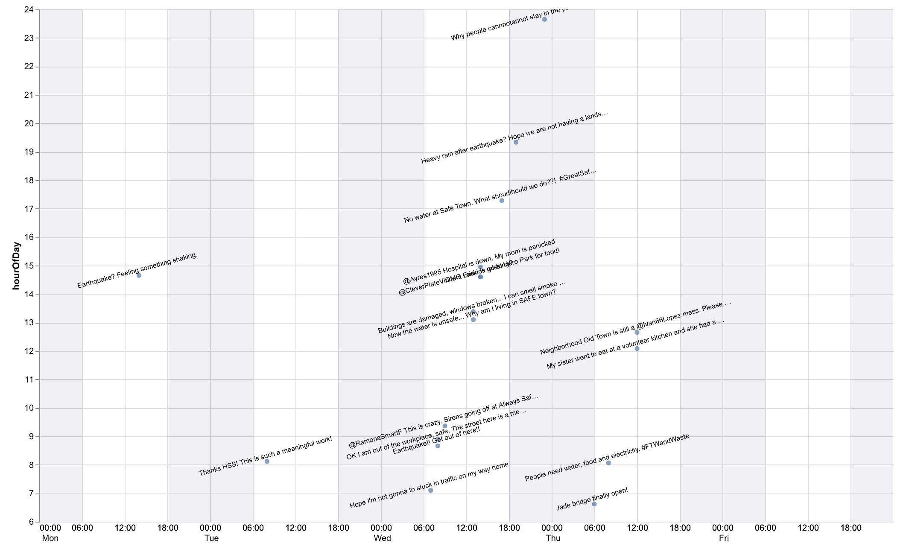
{(caption|}7: Message content generated by FieldEngineerPhillipCarter.{|caption)}

## Question MC3.2

_Identify at least 3 times when conditions change in a way that warrants a re-allocation of city resources. What were the conditions before and after the inflection point? What locations were affected? Which resources are involved?_

### Transportation Changes

Transportation in and out of the area is critical and given the geography of St Himark, bridge access is key. Monitoring the status of the bridges shows an initial period where most bridges are closed (Figure 8) severely limiting capacity to leave for those uninjured who might otherwise be a strain on local resources.

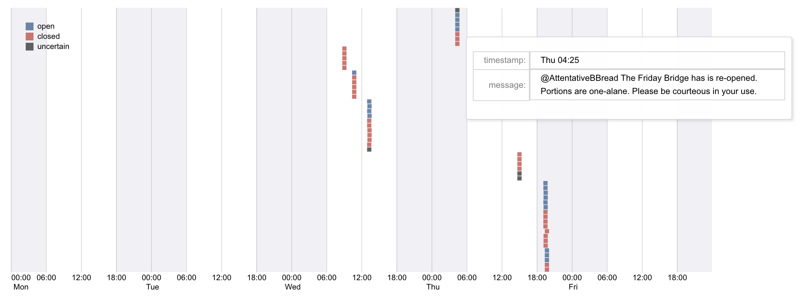
{(caption|}8: Automatic detection of `open` and `close` bridge related messages.{|caption)}

### Flooding, water supply and contamination

By browsing keywords `flood` `water`, `contamination` (prompted by word cloud summary in Figure 4) we see the changing status of clean water supply problems.

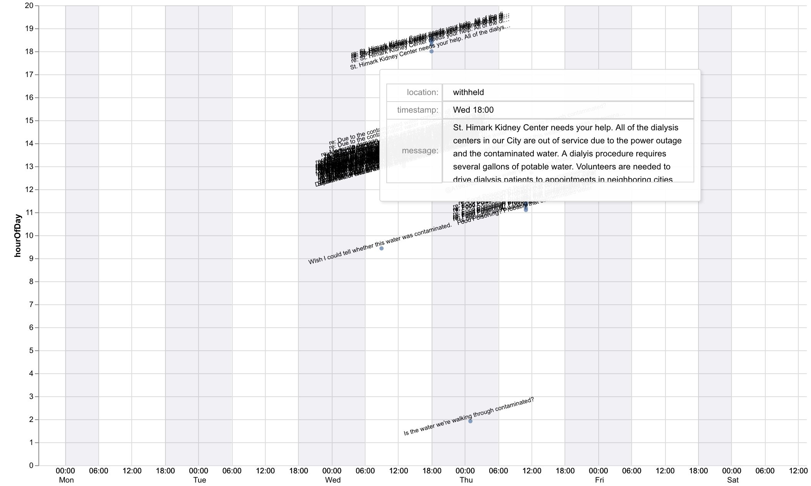
{(caption|}9: Snapshot of interactive message browsing using `contaminated` keyword.{|caption)}

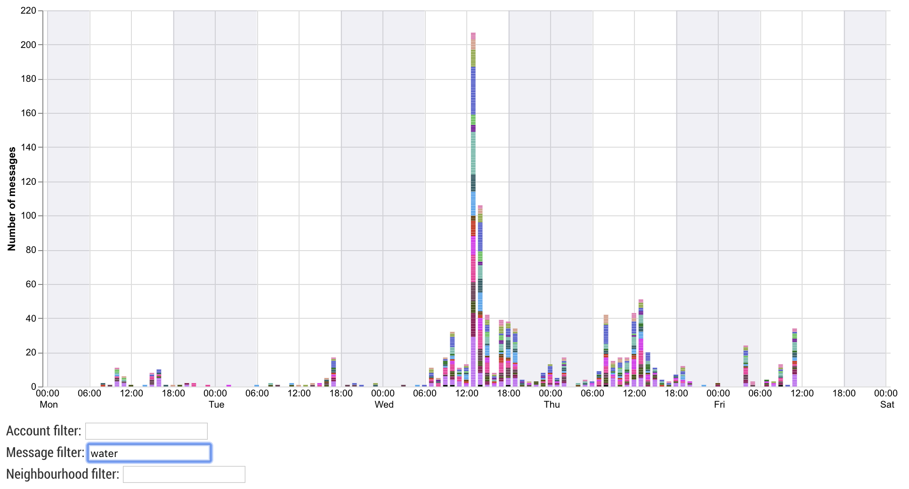
{(caption|}10: Messages containing keyword `water`{|caption)}

- **Wed 13:00** message `Department of Health and the St Himark Water and Sewer Department: Broken water and sewer pipes create of risk of contaminated drinking water. The following neighborhoods should boil their water: 4, 8,9,10,14.` If the numbers correspond to neighbourhood IDs, these refer respectively to Safe Town, Scenic Vista, Broadview, Chapparal and Easton.
- At the same time, the message was sent from `HeathDept` with named neighbourhoods: `Broken water and sewer pipes pose a risk of contaminated water. Neighborhoods Old Town, Safe Town, Scenic Vista, Broadview, Chapparal, Easton should boil their drinking water for 2 minutes.`. Note the addition of Old Town that was not mentioned in the other message.
- Further general reports of contamination in these areas reported from `TVHostBrad`: `Water is contaminated. Serious reactions reported in the following neighborhoods Old Town,Safe Town,Scenic Vista,Broadview,Chapparal`
- **Thu 08:35**, message from `SmartRBowl`: `Department of Health and the St. Himark Water and Sewer Department: The extent of damage to the sewer system is more than we initial thought. All St. Himark residents should boil their drinking water until further notice. We have put out a nationwide call for portable restrooms since the sewer system will take months to repair.`
- Likely contamination leading to Listeria outbreak in some volunteer kitchens, as reported by `HealthDept` **Thu 10:30**, `TVHostBrad` at **Thu 11:06** and `FieldEngineerPhillipCarter` **Thu 12:05** (Figure 7)

### Shelters in Local Library

Some libraries were allocated as shelters for those made homeless, but confusion arose when it was not clear which libraries had been designated.


{(caption|}11: Messages containing keyword `library`{|caption)}

- Wed 17:45 message `So glad the library is offering shelter` is the earliest indication that a library is being used for shelter. The message (from FigueroaOctopus1959) has a withheld location so it is not immediately clear which library this refers to.
- Wed 18:24 Weston is the earliest geolocated message suggesting planned shelter in a library.
- Much confusion implied by subsequent tweets around this time of people turning up to libraries with no shelter or destroyed library buildings.

## Question MC3.3

_Take the pulse of the community. How has the earthquake affected life in St. Himark? What is the community experiencing outside the realm of the first two questions? Show decision makers summary information and relevant/characteristic examples._

### Fatalities and information management

A significant issue with a disaster with imperfect information and social media propagating information of questionable veracity is effective information management. As an example, searching for messages on fatalities, we see wide ranges of figures being circulated varying from 5 to 1000 (see Figure 12). There is a risk with such misinformation of fomenting panic that can hamper emergency response.

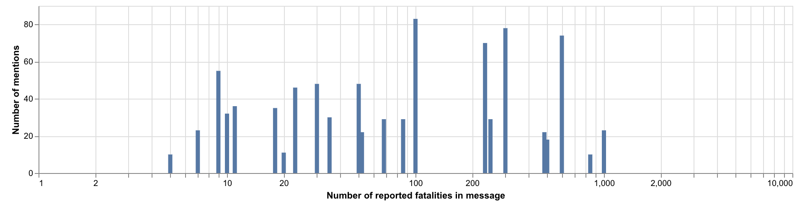
{(caption|}12: Figures for numbers of reported fatalities (all messages, log scale){|caption)}

### Red-tagging buildings and civil unrest

A system of 'red-tagging' of unsafe buildings was swiftly enacted. While a necessary step, particularly with the risk of aftershocks damaging already weakened buildings, there is evidence this has led to considerable dissatisfaction by some citizens. Towards Thursday midday there appears even to be a risk of civil unrest (Figure 14), in part driven by a lack of obvious leadership from the Mayor.

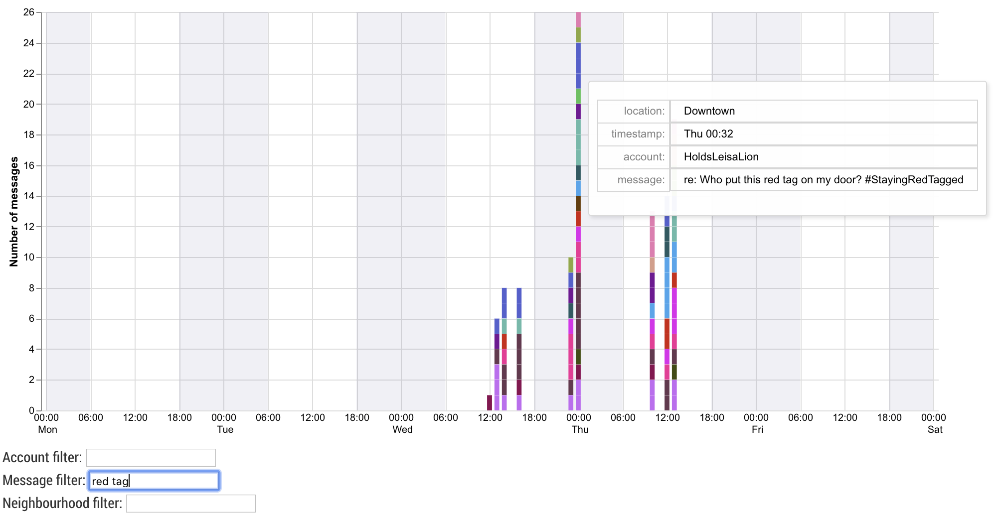
{(caption|}13: Messages with phrase `red tag`{|caption)}

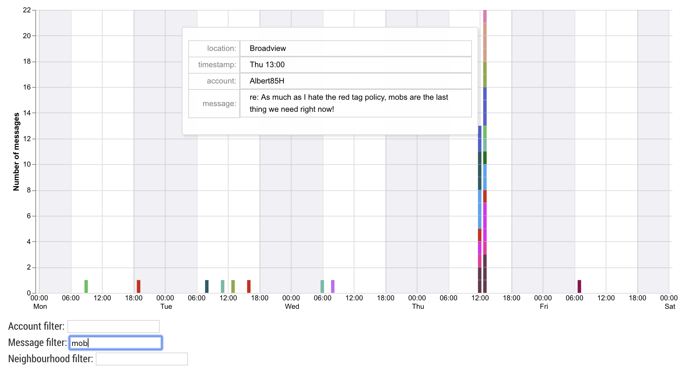
{(caption|}14: Messages with phrase `mob`{|caption)}

### Animal Care

We see evidence in messages of inadequate support for animals (largely pets) in the disaster. They appear not to be provided for in shelters and specific animal support is being charged for, resulting in considerable dissatisfaction among some without access to funds.

## Question MC3.4

_The data for this challenge can be analyzed either as a static collection or as a dynamic stream of data, as it would occur in a real emergency. Describe how you analyzed the data - as a static collection or a stream. How do you think this choice affected your analysis?_

Data were analysed as a static collection (as they were provided). However, care was taken to use approaches that would work if the data had been streamed. No time-based calculations required data 'later' in the stream. The timeline-based layout and interactive browsing of messages is amenable to constant streaming.

What was required was the pre-filtering of stopwords and 'spammy' content. While standard stopword lists were used as a basis. This was amended to include irrelevant content more typical of the messages in the sample. This therefore requires some degree of 'pre-disaster' processing of messages to establish the baseline content.
