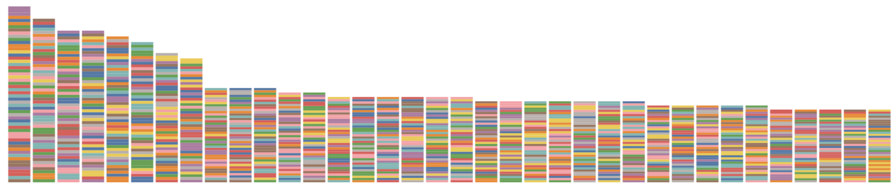
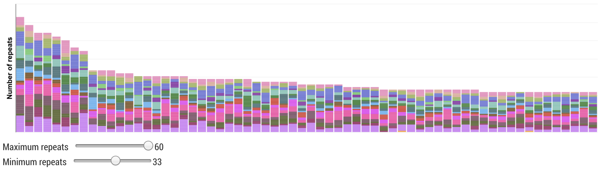
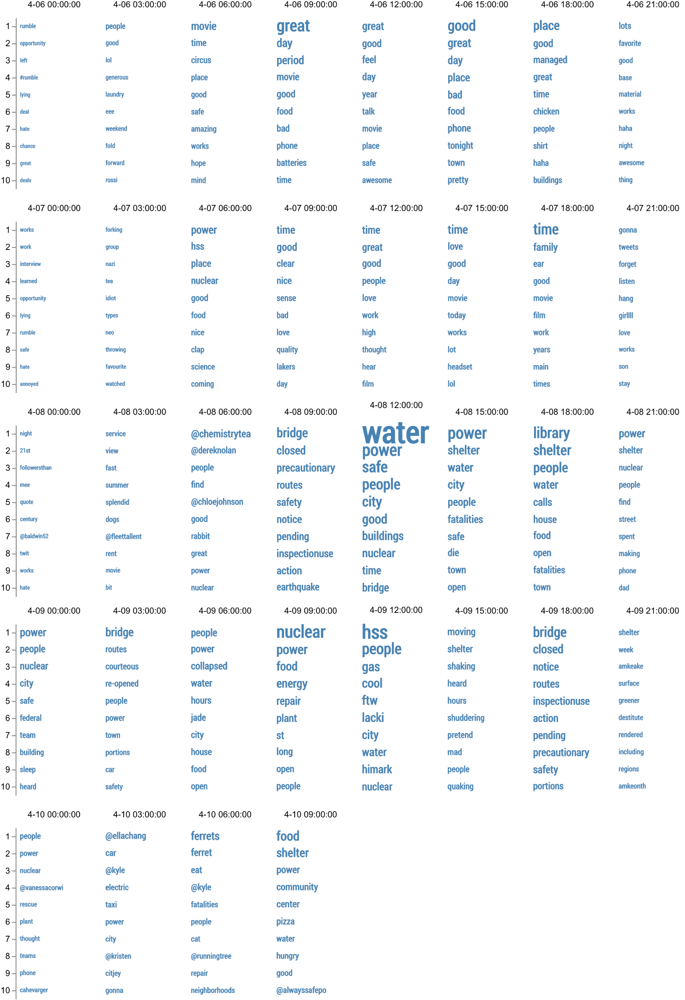

@import "css/vastChallenge.less"

<!-- Everything above this line should probably be left untouched. -->

# VAST Challenge 2019: Disaster at St. Himark

{(timestamp|}19th June, 14:00{|timestamp)}

## Diary of Progress (MC3)

### Minor cleaning of YInt.csv

Cleaning involved stripping quotes from timestamp and location fields; renaming column heading `time` to `timestamp` for consistency with other MC datasets; removing blank lines for c.15 messages with closing quotes on new line.

### Timeline distribution

{(design|}Use a consistent timeline representation between this an the other mini challanges.{|design)}

Check we can read in the Y\*INT data by showing the distribution of messages over time filtering out the most obvious spammy messages:


```elm { interactive l=hidden}
messageDist : Spec
messageDist =
    let
        enc =
            encoding
                << position X timeEncoding
                << position Y
                    [ pAggregate opCount
                    , pMType Quantitative
                    , pAxis [ axTitle "messages per minute" ]
                    ]

        specMessages =
            asSpec [ enc [], bar [ maOpacity 0.2 ] ]
    in
    toVegaLite
        [ width 900
        , cfgTimeline []
        , mc3MessageData
        , transform (noSpamFilter [])
        , resolve (resolution (reAxis [ ( chX, reIndependent ) ]) [])
        , layer [ specNights, specMessages ]
        ]
```

{(observation|}

Reported messages are up to midday on Friday 10th only (relevant for comparison with MC1 and MC2 which continue to midnight on the 10th). There is an obvious diurnal pattern but several notible peaks that are likely related to external events:

- Mon 6th, c.15:00
- Mon 6th, c.19:30
- Tue 7th, c, 08:00 (but could be normal breakfast peak)
- Tue 7th, c. 18:30
- Wed 8th, c. 07:30 and 09:00
- Wed 8th, c. 13:00-15:30, clearly the major spike
- Wed 8th, c. 23:30 - Thu 00:50
- Thu 9th, c. 15:30
- Thu 9th, c. 20:00
- Fri 10th, c. 00:05
- Fri 10th, c. 07:50

{|observation)}

We should filter the messages to remove irrelevant ones so we can be more precise about timings of events and disaster-related content.

{(duration|}1 hour{|duration)}

{(timestamp|}20th June, 06:00{|timestamp)}

### Repeated messages?

Perhaps looking for multiple instances of the same message might allow us to filter out some spam?

{(design|}Colouring by `account` may be useful to see if we have any particular spammy accounts, even though with so many accounts, colour does not serve a 'lookup' role.{|design)}



{(design|}This turns out not to be as useful as anticipated, so try colouring by `location` to see if we have any regional structure. Adding an interactive filter to control minimum and maximum number of repeats to show helpful in focusing on different parts of the distribution.{|design)}



```elm {l=hidden interactive}
messageFreq : Spec
messageFreq =
    let
        trans =
            transform
                --<< filter (fiExpr "test(/^(?!re: )/, datum.message)")
                --<< filter (fiExpr "datum.account == 'FastMCar1995'")
                << joinAggregate [ opAs opCount "message" "numRepeats" ]
                    [ wiGroupBy [ "message" ] ]
                << filter (fiExpr "datum.numRepeats >= minRepeats.numRepeats && datum.numRepeats <= maxRepeats.numRepeats")

        enc =
            encoding
                << position X
                    [ pName "message"
                    , pMType Nominal
                    , pAxis []
                    , pSort [ soByField "numRepeats" opMean, soDescending ]
                    ]
                << position Y
                    [ pName "numRepeats"
                    , pMType Quantitative
                    , pSort [ soByChannel chColor ]
                    , pAxis [ axLabels False, axTicks False, axTitle "Number of repeats" ]
                    ]
                << color [ mName "location", mMType Nominal, mScale neighbourhoodColours, mLegend [] ]
                << tooltips
                    [ [ tName "location", tMType Nominal ]
                    , [ tName "timestamp", tMType Temporal, tFormat "%a %H:%M" ]
                    , [ tName "account", tMType Nominal ]
                    , [ tName "message", tMType Nominal ]
                    , [ tName "numRepeats", tMType Quantitative ]
                    ]

        sel =
            selection
                << select "minRepeats"
                    seSingle
                    [ seFields [ "numRepeats" ]
                    , seInit [ ( "numRepeats", num 40 ) ]
                    , seBind [ iRange "numRepeats" [ inName "Minimum repeats", inMin 1, inMax 60, inStep 1 ] ]
                    ]
                << select "maxRepeats"
                    seSingle
                    [ seFields [ "numRepeats" ]
                    , seInit [ ( "numRepeats", num 60 ) ]
                    , seBind [ iRange "numRepeats" [ inName "Maximum repeats", inMin 1, inMax 60, inStep 1 ] ]
                    ]
    in
    toVegaLite
        [ width 900
        , cfg []
        , mc3MessageData
        , sel []
        , trans []
        , enc []
        , bar [ maOpacity 0.8 ]
        ]
```

Using interactive tooltip exploration of this distribution, it becomes apparent that it is also useful for identifying the most 'retweeted' messages.

{(observation|}The most repeated message `The 12th of July Bridge is closed until further notice. This is a precautionary action pending safety inspection.Use other routes.` is clearly not spam and helps to identify `DOT-StHimark` as an official information source. {|observation)}

### Department of Transportation Bridge Messages

{(design|}To avoid overlaps of messages sent at the same or similar times, use the y-axis to order messages by time of day and then by length of message {|design)}


```elm {interactive l=hidden}
dotMessages : Spec
dotMessages =
    let
        trans =
            transform
                << filter (fiExpr "datum.account == 'DOT-StHimark'")
                << calculateAs "hours(datum.timestamp)+minutes(datum.timestamp)/60 + length(datum.message)/240" "hourOfDay"
                << calculateAs "test(/.*closed/, datum.message) ? 'closed' : test(/.*open/, datum.message) ? 'open' : 'uncertain'" "status"

        enc =
            encoding
                << position X timeEncoding
                << position Y [ pName "hourOfDay", pMType Ordinal, pAxis [] ]
                << color
                    [ mName "status"
                    , mMType Nominal
                    , mScale statusColours
                    , mLegend [ leOrient loTopLeft, leTitle "" ]
                    ]
                << tooltips
                    [ [ tName "timestamp", tMType Temporal, tFormat "%a %H:%M" ]
                    , [ tName "message", tMType Nominal ]
                    ]

        specMessages =
            asSpec [ enc [], square [ maSize 30, maOpacity 0.9 ] ]
    in
    toVegaLite
        [ width 900
        , height 340
        , cfgTimeline []
        , mc3MessageData
        , trans []
        , resolve (resolution (reAxis [ ( chX, reIndependent ) ]) [])
        , layer [ specNights, specMessages ]
        ]
```

{(duration|}2 hours{|duration)}

{(timestamp|}23rd June, 07:00{|timestamp)}

### Wordclouds

See [wordcloud.md](./wordcloud.md) for details of data processing and Vega wordcloud generation.


### Message Explorer

{(design|}A bar chart withh messages stacked in hourly aggregations might be more useful for larger numbers of messages. Can colour by region to see if any geographical associations with message frequency. Add text fields to allow interactive regex filtering and colour by location. This makes keyword related hypotheses quick and easy to investigate.{|design)}

```elm {l=hidden}
messageExplorer : String -> String -> String -> Spec
messageExplorer initMsg initAcc initNbr =
    let
        sel =
            selection
                << select "nbrFilter"
                    seSingle
                    [ seInit [ ( "fiNbr", str initNbr ) ]
                    , seBind [ iText "fiNbr" [ inName "Neighbourhood filter: " ] ]
                    ]
                << select "msgFilter"
                    seSingle
                    [ --seInit [ ( "fiMsg", str "^((?!re:).)*$" ) ]
                      seInit [ ( "fiMsg", str initMsg ) ]
                    , seBind [ iText "fiMsg" [ inName "Message filter: " ] ]
                    ]
                << select "accFilter"
                    seSingle
                    [ seInit [ ( "fiAcc", str initAcc ) ]
                    , seBind [ iText "fiAcc" [ inName "Account filter: " ] ]
                    ]

        trans =
            transform
                << noSpamFilter
                << filter (fiExpr "test(msgFilter_fiMsg, datum.message) && test(accFilter_fiAcc, datum.account) && test(nbrFilter_fiNbr, datum.location)")

        enc =
            encoding
                << position X
                    [ pName "timestamp"
                    , pTimeUnit yearMonthDateHours
                    , pMType Temporal
                    , pScale [ dateDomain ]
                    , pAxis [ axTitle "", axFormat "%H:%M", axOrient siBottom, axGrid True ]
                    ]
                << position Y [ pAggregate opCount, pAxis [ axTitle "Number of messages" ] ]
                << color
                    [ mName "location"
                    , mMType Nominal
                    , mScale neighbourhoodColours
                    , mLegend []
                    ]
                --<< color [ mName "timestamp", mMType Ordinal, mLegend [] ]
                << tooltips
                    [ [ tName "location", tMType Nominal ]
                    , [ tName "timestamp", tMType Temporal, tFormat "%a %H:%M" ]
                    , [ tName "account", tMType Nominal ]
                    , [ tName "message", tMType Nominal ]
                    ]

        specMessages =
            asSpec [ sel [], enc [], bar [ maStroke "#fff", maStrokeWidth 0.15 ] ]
    in
    toVegaLite
        [ width 900
        , height 400
        , cfgTimeline []
        , mc3MessageData
        , trans []
        , resolve (resolution (reAxis [ ( chX, reIndependent ) ]) [])
        , layer [ specNights, specMessages ]
        ]
```

```elm {l=hidden}
noRetweets =
    "^((?!re:).)*$"
```

^^^elm {interactive v=(messageExplorer noRetweets "" "")}^^^

The keyword fliter allows us to identify some of the spam signatures, including `deal!`, `deals`, `sale`, `sales`. We can then prefilter all messages to reduce the frequency of these spammy messages in subsequent analysis.

Some possible (sometimes partial) keywords : `evacuat`, `damage`, `collaps`, `radiation`, `red tag`, `medicine`, `blood`, `#alwayssafe`, `rubble`, `road`, `contam`(inated)

### Shaking Events

^^^elm {interactive v=(messageExplorer "shak" "" "")}^^^

{(observation|}

Messages containing `shak` suggest at least three separate shaking events, with the following being the first messages in each event:

- **Monday 14:39, Safetown** _FieldEngineerPhillipCarter_: `Earthquake? Feeling something shaking.`
- **Wed 08:37, Cheddarford** _Rogers1971_: `Please tell me I imagine the floors shaking`
- **Thu 15:08, Weston** _LockhartBear1968_: `Why is the coffee mug shaking?`

{|observation)}

### Reliable Information Sources

Both the name of `FieldEngineerPhillipCarter` and the content of their messages suggest this might be a useful person to examine:

{(design|}Useful to be able to see the messages without interaction, positioned by time, but overlapping messages close in time can obscure some of them. Truncating longer messages with a tooltip for full message partially overcomes this. As does allowing interactive zooming. {|design)}

```elm {l=hidden}
messageDisplay : String -> Spec
messageDisplay acc =
    let
        trans =
            transform
                << noSpamFilter
                << filter (fiExpr ("datum.account == '" ++ acc ++ "'"))
                << calculateAs "hours(datum.timestamp)+minutes(datum.timestamp)/60" "hourOfDay"
                << calculateAs "truncate(datum.message,60)" "truncatedMessage"

        sel =
            selection
                << select "mySelection" seInterval [ seBindScales, seEncodings [ chX ] ]

        enc =
            encoding
                << position X
                    [ pName "timestamp"
                    , pTimeUnit yearMonthDateHours
                    , pScale [ dateDomain ]
                    , pMType Temporal
                    , pAxis [ axTitle "", axFormat "%H:%M", axOrient siBottom, axGrid True ]
                    ]
                << position Y [ pName "hourOfDay", pMType Quantitative, pScale [ scZero False ] ]
                << text [ tName "truncatedMessage", tMType Nominal ]
                << tooltips
                    [ [ tName "location", tMType Nominal ]
                    , [ tName "timestamp", tMType Temporal, tFormat "%a %H:%M" ]
                    , [ tName "message", tMType Nominal ]
                    ]

        specMessageTime =
            asSpec [ enc [], circle [] ]

        specMessages =
            asSpec [ enc [], sel [], textMark [ maAngle -15, maAlign haCenter, maFontSize 8, maDy -6 ] ]
    in
    toVegaLite
        [ width 1000
        , height 600
        , cfgTimeline []
        , mc3MessageData
        , trans []
        , resolve (resolution (reAxis [ ( chX, reIndependent ) ]) [])
        , layer [ specNights, specMessageTime, specMessages ]
        ]


messageDisplayByContent : Spec
messageDisplayByContent =
    let
        trans =
            transform
                << noSpamFilter
                << filter (fiExpr "test(msgFilter_fiMsg, datum.message)")
                << calculateAs "hours(datum.timestamp)+minutes(datum.timestamp)/60" "hourOfDay"
                << calculateAs "truncate(datum.message,60)" "truncatedMessage"

        sel =
            selection
                << select "mySelection" seInterval [ seBindScales, seEncodings [ chX ] ]
                << select "msgFilter"
                    seSingle
                    [ --seInit [ ( "fiMsg", str "^((?!re:).)*$" ) ]
                      seInit [ ( "fiMsg", str "contamination" ) ]
                    , seBind [ iText "fiMsg" [ inName "Message filter: " ] ]
                    ]

        enc =
            encoding
                << position X
                    [ pName "timestamp"
                    , pTimeUnit yearMonthDateHours
                    , pScale [ dateDomain ]
                    , pMType Temporal
                    , pAxis [ axTitle "", axFormat "%H:%M", axOrient siBottom, axGrid True ]
                    ]
                << position Y [ pName "hourOfDay", pMType Quantitative, pScale [ scZero False ] ]
                << text [ tName "truncatedMessage", tMType Nominal ]
                << tooltips
                    [ [ tName "location", tMType Nominal ]
                    , [ tName "timestamp", tMType Temporal, tFormat "%a %H:%M" ]
                    , [ tName "message", tMType Nominal ]
                    ]

        specMessageTime =
            asSpec [ enc [], circle [] ]

        specMessages =
            asSpec [ enc [], sel [], textMark [ maAngle -15, maAlign haCenter, maFontSize 8, maDy -6 ] ]
    in
    toVegaLite
        [ width 1000
        , height 600
        , cfgTimeline []
        , mc3MessageData
        , trans []
        , resolve (resolution (reAxis [ ( chX, reIndependent ) ]) [])
        , layer [ specNights, specMessageTime, specMessages ]
        ]
```

^^^elm {interactive v=(messageDisplay "FieldEngineerPhillipCarter")}^^^

Similarly for `TVHostBrad` (as idientified from other keywords such as `contamination`):

^^^elm {interactive v=(messageDisplay "TVHostBrad")}^^^

#### Contamination messages

^^^elm {interactive v=messageDisplayByContent}^^^

{(duration|}3 hours{|duration)}

{(timestamp|}24th June, 08:00{|timestamp)}

### Confusion over library shelter

The wordcloud for Wed 18:00 suggests `library` is an important keyword around this time. We can look in more detail at all library-related messages:

^^^elm {interactive v=(messageExplorer "library" "" "")}^^^

{(observation|}

- Wed 17:45 message `So glad the library is offering shelter` is the earliest indication that a library is being used for shelter. The message (from FigueroaOctopus1959) has a withheld location so it is not immediately clear which library this refers to.
- Wed 18:24 Weston is the earliest geolocated message suggesting planned shelter in a library.
- Much confusion implied by subsequent tweets around this time of people turning up to libraries with no shelter or destroyed library buildings.

{|observation)}

### Sewers and Contaminated Water

Searching for `sewer` related messages indicates a collapsed sewer pipe causing water contamination problems.

^^^elm {interactive v=(messageExplorer "sewer" "" "")}^^^

{(observation|}

- Wed 13:00 message `Department of Health and the St Himark Water and Sewer Department: Broken water and sewer pipes create of risk of contaminated drinking water. The following neighborhoods should boil their water: 4, 8,9,10,14.` If the numbers correspond to neighbourhood IDs, these refer respectively to Safe Town, Scenic Vista, Broadview, Chapparal and Easton.
- At the same time, the message was sent from `HeathDept` with named neighbourhoods: `Broken water and sewer pipes pose a risk of contaminated water. Neighborhoods Old Town, Safe Town, Scenic Vista, Broadview, Chapparal, Easton should boil their drinking water for 2 minutes.`. Note the addition of Old Town that was not mentioned in the other message.
- Further general reports of contamination in these areas reported from `TVHostBrad`: `Water is contaminated. Serious reactions reported in the following neighborhoods Old Town,Safe Town,Scenic Vista,Broadview,Chapparal`
- Thu 08:35, message from `SmartRBowl`: `Department of Health and the St. Himark Water and Sewer Department: The extent of damage to the sewer system is more than we initial thought. All St. Himark residents should boil their drinking water until further notice. We have put out a nationwide call for portable restrooms since the sewer system will take months to repair.` As this was not released by an official account, should be treated with caution, but consider it possibly true.
- Likely contamination leading to Listeria outbreak in some volunteer kitchens, as reported by `HealthDept` Thu 10:30, `TVHostBrad` at Thu 11:06 and `FieldEngineerPhillipCarter` Thu 12:05

{|observation)}

### Rumour and Information Management

Without adequate circulation of official information, there is a danger of rumours spreading without basis in fact. Searching tweets for metions of `fatal` show the problem:

^^^elm {interactive v=(messageExplorer "fatal" "" "")}^^^

Extracting the numbers of fatailities claimed in the various messages can be achieved with the command line:

    grep -r "fatal" YInt.csv | cut -d ',' -f 4-99 | grep -Eo '[0-9]+' >fatalNumbers.csv

_(search for lines that contain `fatal` within them; cut out the comma-separated column(s) containing the message txt; extract the digits from the filtered messages)_


```elm {interactive l=hidden}
fatalityReportsHisto : Spec
fatalityReportsHisto =
    let
        enc =
            encoding
                << position X
                    [ pName "fatalNum"
                    , pMType Quantitative
                    , pScale [ scType scLog ]
                    , pAxis [ axTitle "Number of reported fatalities in message" ]
                    ]
                << position Y
                    [ pMType Quantitative
                    , pAggregate opCount
                    , pAxis [ axTitle "Number of mentions" ]
                    ]
    in
    toVegaLite [ width 900, fatalityData, bar [], enc [] ]
```

### Notes from exploration

#### Flooded Museum

Need to remove artifacts to avoid damage

#### Security

Wed 11:30 `Oconnor83` reports security fence down at the Nuclear Plant

#### Animal Shelter

Various power outages; demanding cash for services.

### Spatial Distributions

{(design|}Y\*INT messages are only located to neighbourhood, not precise longitude/latitude, so this suggests a gridmap layout may be appropriate for showing spatial arrangement of messages.{|design)}

^^^elm {v=gridLayout}^^^

```elm {l=hidden}
messageGrid : String -> String -> Spec
messageGrid initMsg initAcc =
    let
        cfgMsgGrid =
            configure
                << configuration (coFacet [ facoSpacing 5 ])
                << configuration (coBar [ maContinuousBandSize 2, maOpacity 0.7 ])

        sel =
            selection
                << select "msgFilter"
                    seSingle
                    [ seInit [ ( "fiMsg", str initMsg ) ]
                    , seBind [ iText "fiMsg" [ inName "Message filter: " ] ]
                    ]
                << select "accFilter"
                    seSingle
                    [ seInit [ ( "fiAcc", str initAcc ) ]
                    , seBind [ iText "fiAcc" [ inName "Account filter: " ] ]
                    ]

        trans =
            transform
                << noSpamFilter
                << filter (fiExpr "test(msgFilter_fiMsg, datum.message) && test(accFilter_fiAcc, datum.account)")
                << lookup "location" neighbourhoodCentroids "nbrhood" [ "row", "col" ]

        enc =
            encoding
                << position X
                    [ pName "timestamp"
                    , pTimeUnit yearMonthDateHours
                    , pMType Temporal
                    , pScale [ dateDomain ]
                    , pAxis []
                    ]
                << position Y [ pAggregate opCount, pAxis [] ]
                << row [ fName "row", fMType Ordinal, fHeader [ hdTitle "", hdLabelFontSize 0 ] ]
                << column [ fName "col", fMType Ordinal, fHeader [ hdTitle "", hdLabelFontSize 0 ] ]
                << detail [ dName "timestamp", dMType Ordinal ]
                << tooltips
                    [ [ tName "location", tMType Nominal ]
                    , [ tName "timestamp", tMType Temporal, tFormat "%a %H:%M" ]
                    , [ tName "account", tMType Nominal ]
                    , [ tName "message", tMType Nominal ]
                    ]
    in
    toVegaLite
        [ width 110, height 110, cfgMsgGrid [], mc3MessageData, trans [], sel [], enc [], bar [] ]
```

<!-- ^^^elm {interactive v=(messageGrid "shak" "")}^^^ -->

### Propagation of messages

{(design|}Idea - examine transmission of message (e.g. 'heard from' but also retweet times). Word tree?{|design)}

_Idea rejected due to time constraints, but we should log this as a possible future design/approach_

### Word frequency changes over time

Message word frequencies with stopwords removed and aggregated into 3-hours blocks generated separately (see [wordcloud.md](wordcloud.md)).

```elm {v}
msgHisto : Spec
msgHisto =
    let
        enc =
            encoding
                << position X [ pName "timestamp", pMType Temporal, pAxis [ axTickCount 20 ] ]
                << position Y
                    [ pMType Quantitative
                    , pAggregate opCount
                    , pAxis [ axTitle "Number of words" ]
                    ]

        specMessageFreq =
            asSpec [ enc [], bar [ maXOffset 10 ] ]
    in
    toVegaLite [ width 900, cfgMsgTimeline [], wordFreqData, layer [ specNights, specMessageFreq ] ]
```

{(design|}The timline of total word frequencies doesn't show much more than the original histogram. More useful would be to know which words are most common in each time period. This could be shown with a dot plot, filterable by the ranking of word frequency.{|design)}

```elm {v interactive}
rankPoints : Spec
rankPoints =
    let
        sel =
            selection
                << select "minRank"
                    seSingle
                    [ seInit [ ( "rank", num 10 ) ]
                    , seBind [ iRange "rank" [ inName "Show the top", inMin 1, inMax 400 ] ]
                    ]

        trans =
            transform
                << window [ ( [ wiOp woRank ], "rank" ) ]
                    [ wiSort [ wiDescending "freq" ], wiGroupBy [ "timestamp" ] ]
                << filter (fiExpr "datum.rank <= minRank_rank")

        enc =
            encoding
                << position X [ pName "timestamp", pMType Temporal ]
                << position Y
                    [ pName "freq"
                    , pMType Quantitative
                    , pAxis [ axTitleAngle 0, axTitlePadding 28, axTicks False ]
                    ]
                << detail [ dName "word", dMType Nominal ]
                << tooltips
                    [ [ tName "word", tMType Nominal ]
                    , [ tName "timestamp", tMType Temporal, tFormat "%a %H:%M" ]
                    , [ tName "rank", tMType Ordinal ]
                    , [ tName "freq", tMType Quantitative ]
                    ]

        specMessageRank =
            asSpec [ sel [], trans [], enc [], circle [] ]
    in
    toVegaLite [ width 860, height 200, cfgMsgTimeline [], wordFreqData, layer [ specNights, specMessageRank ] ]
```

It is worth noting that most frequent words (dots above) don't necessarily correspond to the total word count (bars above). See for example, Monday 9:00-15:00, showing a greater diversity of words at 12:00. This is indicative of no particularly strong signal in word themes.

{(design|}Perhaps we should plot individual word concentration against total word frequency for each word. This would allow us to detect concentrations of a particular word in any one time period even if the absolute numbers of messages in any period is low.{|design)}

```elm {v interactive}
wordConcentration : Spec
wordConcentration =
    let
        sel =
            selection
                << select "minRank"
                    seSingle
                    [ seInit [ ( "rank", num 1 ) ]
                    , seBind [ iRange "rank" [ inName "Rank in time period", inMin 1, inMax 400, inStep 1 ] ]
                    ]

        trans =
            transform
                << joinAggregate [ opAs opCount "word" "numWords" ] [ wiGroupBy [ "timestamp" ] ]
                << calculateAs "datum.numWords / 3" "wordsPerHour"
                << window [ ( [ wiOp woRank ], "rank" ) ]
                    [ wiSort [ wiDescending "freq" ], wiGroupBy [ "timestamp" ] ]
                << filter (fiExpr "datum.rank == minRank_rank")
                << calculateAs "datum.freq / datum.wordsPerHour" "concentration"

        encPoint =
            encoding
                << position X
                    [ pName "wordsPerHour"
                    , pMType Quantitative
                    , pAxis [ axTitle "Total number of words per hour" ]
                    ]
                << position Y
                    [ pName "concentration"
                    , pMType Quantitative
                    , pScale [ scDomain (doNums [ 0, 0.5 ]) ]
                    , pAxis [ axTitle "Word concentration", axFormat "%" ]
                    ]
                << color [ mName "timestamp", mMType Temporal, mScale [ scScheme "plasma" [] ] ]
                << tooltips
                    [ [ tName "word", tMType Nominal ]
                    , [ tName "timestamp", tMType Temporal, tFormat "%a %H:%M" ]
                    , [ tName "rank", tMType Ordinal ]
                    , [ tName "freq", tMType Quantitative ]
                    ]

        encText =
            encoding
                << position X
                    [ pName "wordsPerHour"
                    , pMType Quantitative
                    , pAxis [ axTitle "Total number of words per hour" ]
                    ]
                << position Y
                    [ pName "concentration"
                    , pMType Quantitative
                    , pAxis [ axTitle "Word concentration", axFormat "%" ]
                    ]
                << text [ tName "word", tMType Nominal ]

        specPoints =
            asSpec [ encPoint [], sel [], circle [] ]

        specText =
            asSpec [ encText [], textMark [ maAlign haLeft, maDx 4, maFontSize 8 ] ]
    in
    toVegaLite [ width 800, height 800, wordFreqData, trans [], layer [ specPoints, specText ] ]
```

{(design|}What the dot plot fails to capture is whether there is any continuity of word popularity over time. To do this we could show changes in word rank position over time.{|design)}

```elm {v interactive}
rankLines : Spec
rankLines =
    let
        sel =
            selection
                << select "minRank"
                    seSingle
                    [ seInit [ ( "rank", num 10 ) ]
                    , seBind [ iRange "rank" [ inName "Show the top", inMin 2, inMax 400 ] ]
                    ]

        trans =
            transform
                << window [ ( [ wiOp woRank ], "rank" ) ]
                    [ wiSort [ wiDescending "freq" ], wiGroupBy [ "timestamp" ] ]
                << filter (fiExpr "datum.rank <= minRank_rank")

        enc =
            encoding
                << position X [ pName "timestamp", pMType Temporal ]
                << position Y
                    [ pName "rank"
                    , pMType Ordinal
                    , pAxis [ axTitleAngle 0, axTitlePadding 28, axTicks False ]
                    ]
                << detail [ dName "word", dMType Nominal ]
                << size
                    [ mName "freq"
                    , mMType Quantitative
                    , mScale [ scRange (raNums [ 0.01, 5 ]), scType scPow, scExponent 1.7 ]
                    , mLegend []
                    ]
                << tooltips
                    [ [ tName "word", tMType Nominal ]
                    , [ tName "timestamp", tMType Temporal, tFormat "%a %H:%M" ]
                    , [ tName "rank", tMType Ordinal ]
                    , [ tName "freq", tMType Quantitative ]
                    ]

        specMessageRank =
            asSpec [ sel [], trans [], enc [], trail [] ]
    in
    toVegaLite [ width 860, height 200, cfgMsgTimeline [], wordFreqData, layer [ specNights, specMessageRank ] ]
```

{(design|}Changes of many words in and out of the top-n make this a little less useful than anticipated. Could try a simple solution of simply listing the top-n as a table.{|design)}

Top 10 words in three hour blocks, sized by word frequency.



```elm {l=hidden}
topN : Spec
topN =
    let
        trans =
            transform
                << calculateAs "datum.freq + random()/10" "uFreq"
                << window [ ( [ wiOp woRank ], "rank" ) ]
                    [ wiSort [ wiDescending "uFreq" ], wiGroupBy [ "timestamp" ] ]
                << filter (fiExpr "datum.rank <= 10")
                << calculateAs "substring(datum.timestamp,6)" "ts"
                << calculateAs "substring(datum.word,0,13)" "truncatedWord"

        enc =
            encoding
                << position Y [ pName "rank", pMType Ordinal ]
                << size
                    [ mName "freq"
                    , mMType Quantitative
                    , mScale [ scRange (raNums [ 6, 36 ]) ]
                    , mLegend []
                    ]
                << text [ tName "truncatedWord", tMType Nominal ]

        specCombined =
            asSpec
                [ trans []
                , enc []
                , textMark
                    [ maColor "steelBlue"
                    , maAlign haLeft
                    , maFont "Roboto Condensed"
                    , maFontWeight Bold
                    , maDx -40
                    ]
                ]
    in
    toVegaLite
        [ cfg []
        , spacing 10
        , wordFreqData
        , columns (Just 8)
        , facetFlow [ fName "ts", fMType Ordinal, fHeader [ hdTitleFontSize 0 ] ]
        , specification specCombined
        ]
```
