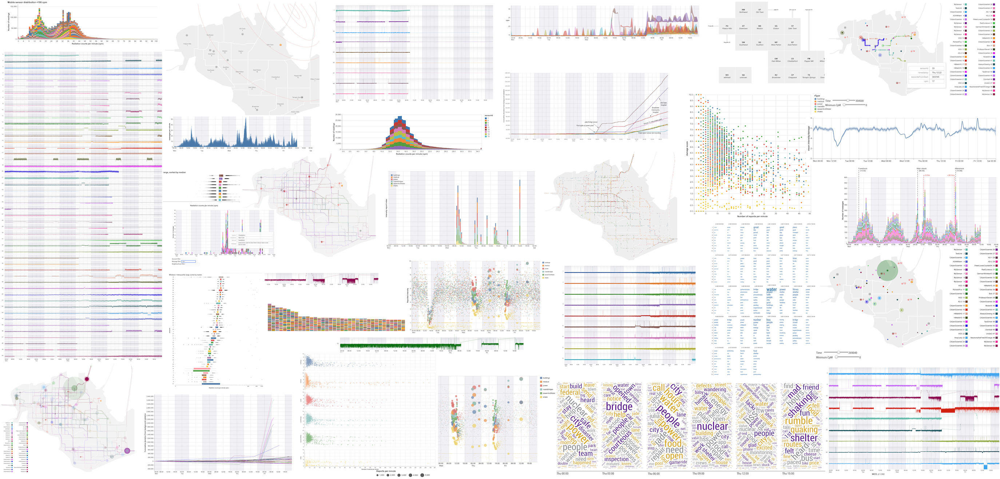
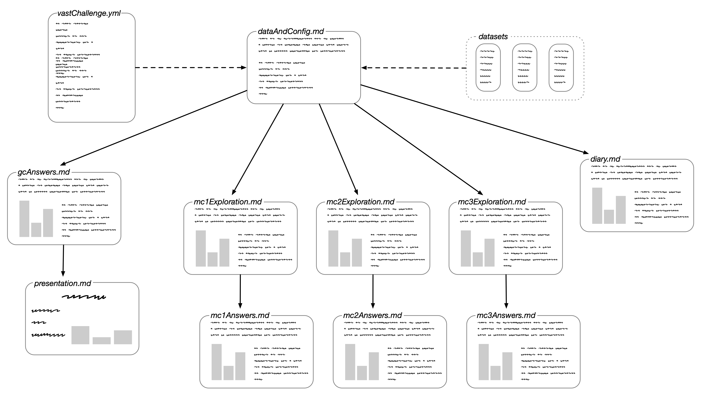

@import "css/vastChallengePresentation.less"

```elm {l=hidden}
```

<!-- Everything above this line should probably be left untouched. -->

<!--For presentation schedule, see https://vast-challenge.github.io/2019/ -->

<!-- ---------------------------------------------------------------------- -->

{(slide|}

# Literate Visual Analytics<br/>for<br/>Crisis Management

<br />

## Jo Wood<br />giCentre, City University of London

###  jwoLondon

{|slide)}

<!-- ---------------------------------------------------------------------- -->

{(slide|}

# Challenges of VAST Challenges

_Reflections on 10 years of VAST challenge entries_

- So many design choices, so little time
- Objective observations of data risk being mixed with hypotheses about patterns in the data
- Assumptions can remain unchallenged, especially under time pressure
- Each mini-challenge can feel like starting again; no time for grand challenge
- Report writing takes as much time as analysis

{|slide)}

<!-- ---------------------------------------------------------------------- -->

{(slide|}

<br /><br />
<br /><br />

# So little time!

{|slide)}

<!-- ---------------------------------------------------------------------- -->

{(slide|}

# Literate Visual Analytics

- Embed all analytic and design choices in written narrative in a single environment
- Make constructing the narrative as low-cost as possible
- Provide support to structure narrative
- Follows Knuth's _literate programming_ and Wood et al (2019) _Literate Visualization_

<br /><br />

#### Sources

- [github.com/jwoLondon/vastchallenge2019](https://github.com/jwoLondon/vastchallenge2019)
- [github.com/gicentre/litvis](https://github.com/gicentre/litvis)
- [litvis.org](http://litvis.org)

{|slide)}

<!-- ---------------------------------------------------------------------- -->

{(slide|}

_Example from `diary.md`:_

#### Distribution of Radiation Measurements: Static Sensors

```elm {v interactive}
mc2StaticSensorDist : Spec
mc2StaticSensorDist =
    let
        enc =
            encoding
                << position X
                    [ pName "cpm"
                    , pMType Quantitative
                    , pBin [ biExtent 0 35, biStep 0.25 ]
                    , pAxis [ axTitle "Radiation counts per minute (cpm)" ]
                    ]
                << position Y
                    [ pAggregate opCount
                    , pMType Quantitative
                    , pAxis [ axTitle "Number of readings" ]
                    ]
                << color [ mName "sensorId", mMType Nominal, mScale staticColours ]
    in
    toVegaLite
        [ width 1000
        , height 300
        , mc2StaticSensorReadings
        , enc []
        , bar [ maBinSpacing 0, maTooltip ttEncoding ]
        ]
```

{(observation|}

Radiation values appear to be quantised to some extent to the nearest whole number.
The chart above is constrained between 0 and 36 cpm, but there are some negative values and some outliers with very high values (see right-hand bar).

{|observation)}

Range box-plots on a log scale would capture the distribution extrema more effectively.

{|slide)}

<!-- ---------------------------------------------------------------------- -->

{(excerpt|}

{(timestamp|}17th April, 09:00{|timestamp)}

## MC2 Data Exploration

I want to get a better sense of the spatial coverage of the sensor data in MC2 before considering approaches to VA.

- Added a simple character symbol and PoI name to `staticSensorLocations.csv` for mapping convenience and consistency with hospital/powerplant PoI file:

```
id,poi,label,long,lat
12,sSensor,⍟,-119.81556,0.20764
15,sSensor,⍟,-119.79033,0.16849
13,sSensor,⍟,-119.80715,0.15979
11,sSensor,⍟,-119.82861,0.04147
6,sSensor,⍟,-119.9043,0.1218
1,sSensor,⍟,-119.9594,0.15689
9,sSensor,⍟,-119.85558,0.18299
14,sSensor,⍟,-119.79265,0.1218
4,sSensor,⍟,-119.90952,0.15109
```

Overlaying data on the basemap, noting that four of the sensors are located at hospitals.

{(question|}Could sensor data at the hospitals indicate higher background radiation rates due to equipment (x-rays etc.)?{|question)}

{(question|}Could sensor data at the hospitals indicate higher radiation rates if contaminated casualties are located there?{|question)}

^^^elm {v=mc2StaticSensorMap}^^^

Visual inspection of `StaticSensorReadings.csv` and `MobileSensorReadings.csv` suggests the `Units` column is superfluous, so I've made copies without this column to reduce file size. Large file cut with

```bash
cut -d, -f1-5,7  ../../MC2/data/MobileSensorReadings.csv > mobileSensorReadings.csv
```

Removed superfluous spaces and quotation marks from `mobileSensorReadings` to avoid possible data matching problems.

{|excerpt)}

<!-- ---------------------------------------------------------------------- -->

{(slide|}

# Distinct activities recorded in documents:

- Data wrangling
- Initial freeform exploration (diary)
- Generation of (interactive) visualizations
- Non-visual analytics
- Structured exploration including hypothesis generation
- Exploration of visual design choices
- Adoption of visual conventions (stylesheet)
- Selection of key observations
- Structured analysis
- Report writing
- Presentation (today!)

{|slide)}

<!-- ---------------------------------------------------------------------- -->

{(slide|}

# Achieved with...

- Markdown
- VegaLite and Vega
- Elm

{|slide)}

<!-- ---------------------------------------------------------------------- -->

{(slide|}

## elm-vega / elm-vegaLite



{|slide)}

<!-- ---------------------------------------------------------------------- -->

{(slide|}



{|slide)}

<!-- ---------------------------------------------------------------------- -->

{(slide|}

# What is interaction in a Literate VA Context?

#### Transmission

_From Dimara and Perin (2019) (Tuesday pm): The rate at which information is exchanged between person and machine in the presence of noise._

<br /><br />

- Low effort, low volume, high transmission
- Moderate effort, moderate volume, high transmission
- Higher effort, high volume, low transmission

{|slide)}

<!-- ---------------------------------------------------------------------- -->

{(slide|}

## Tooltips: Low effort and volume, high transmission

```elm {v interactive}
damageReportsGridmap : Spec
damageReportsGridmap =
    let
        trans =
            transform
                << filter (fiGreaterThan "timestamp" (dt [ dtYear 2020, dtMonth Apr, dtDate 8, dtHour 8, dtMinute 30 ]))
                << filter (fiLessThan "timestamp" (dt [ dtYear 2020, dtMonth Apr, dtDate 9, dtHour 20 ]))
                << timeUnitAs yearMonthDateHoursMinutes "timestamp" "binnedTime"
                << joinAggregate [ opAs opCount "intensity" "nRecords" ] [ wiGroupBy [ "binnedTime" ] ]
                << filter (fiExpr "datum.nRecords >45")
                << lookup "location" neighbourhoodCentroids "id" [ "row", "col", "nbrhood" ]

        enc =
            encoding
                << position X timeEncodingShakeMinutes
                << position Y
                    [ pName "intensity"
                    , pAggregate opMean
                    , pMType Quantitative
                    , pScale [ scDomain (doNums [ 0, 10 ]) ]
                    , pAxis [ axTitle "", axTickCount 10 ]
                    ]
                << color
                    [ mName "rType"
                    , mMType Nominal
                    , mScale damageColours
                    , mLegend [ leOrient loBottom, leTitle "" ]
                    ]
                << size
                    [ mName "nRecords"
                    , mMType Quantitative
                    , mScale
                        [ scRange (raNums [ 0, 100 ])
                        , scType scPow
                        , scExponent 0.8
                        ]
                    , mLegend []
                    ]
                << row [ fName "row", fMType Ordinal, fHeader [ hdTitle "", hdLabelFontSize 0 ] ]
                << column [ fName "col", fMType Ordinal, fHeader [ hdTitle "", hdLabelFontSize 0 ] ]
                << tooltips
                    [ [ tName "nbrhood", tMType Nominal ]
                    , [ tName "timestamp", tMType Temporal, tFormat "%a %H:%M" ]
                    , [ tName "nRecords", tMType Quantitative ]
                    , [ tName "rType", tMType Nominal ]
                    ]
    in
    toVegaLite
        [ mc1ReportData
        , width 130
        , height 130
        , cfgGridSpaced []
        , trans []
        , enc []
        , circle [ maOpacity 0.7 ]
        ]
```

{|slide)}

<!-- ---------------------------------------------------------------------- -->

{(slide|}

## Trajectory animation: Moderate effort, volume and transmission

```elm {v interactive}
mc2MobileSensorMapInteractive : Spec
mc2MobileSensorMapInteractive =
    let
        specNeighbourhoods =
            asSpec [ neighbourhoodBounds, geoshape [ maStroke "white", maFill "#eee", maStrokeWidth 2 ] ]

        specBridges =
            asSpec
                [ bridges
                , geoshape [ maStroke "#eee", maStrokeWidth 4, maFilled False ]
                ]

        sel =
            selection
                << select "minThreshold"
                    seSingle
                    [ seFields [ "cpm" ]
                    , seInit [ ( "cpm", num 30 ) ]
                    , seBind [ iRange "cpm" [ inName "Minimum CpM", inMin 0, inMax 500 ] ]
                    ]
                << select "time"
                    seSingle
                    [ seFields [ "secondsFromStart" ]
                    , seInit [ ( "secondsFromStart", num 269040 ) ]
                    , seBind [ iRange "secondsFromStart" [ inName "Time", inMin 0, inMax 431985, inStep 300 ] ]
                    ]

        trans =
            transform
                << filter (fiSelection "legendSel")
                << filter (fiExpr "((time_secondsFromStart - datum.secondsFromStart) <=1800) && (time_secondsFromStart >= datum.secondsFromStart)")
                << filter (fiExpr "datum.cpm >= minThreshold_cpm")

        encPoints =
            encoding
                << position Longitude [ pName "long", pMType Quantitative ]
                << position Latitude [ pName "lat", pMType Quantitative ]
                << color [ mName "sensorId", mMType Nominal, mScale mobileColours, mLegend [] ]
                << size
                    [ mName "cpm"
                    , mMType Quantitative
                    , mScale
                        [ scType scPow
                        , scExponent 0.8
                        , scDomain (doNums [ 0, 50000 ])
                        , scRange (raNums [ 0.1, 10000 ])
                        ]
                    , mLegend []
                    ]
                << tooltips
                    [ [ tName "sensorId", tMType Nominal ]
                    , [ tName "timestamp", tMType Temporal, tFormat "%a %H:%M" ]
                    , [ tName "secondsFromStart", tMType Quantitative ]
                    , [ tName "cpm", tMType Quantitative ]
                    ]

        specPoints =
            asSpec
                [ mobileSensorReadingsThinned10
                , trans []
                , sel []
                , encPoints []
                , circle [ maOpacity 0.3 ]
                ]

        encPois =
            encoding
                << position Longitude [ pName "long", pMType Quantitative ]
                << position Latitude [ pName "lat", pMType Quantitative ]
                << text [ tName "label", tMType Nominal ]

        specPois =
            asSpec [ pois, encPois [], textMark [] ]

        encSensorId =
            encoding
                << position Longitude [ pName "long", pMType Quantitative ]
                << position Latitude [ pName "lat", pMType Quantitative ]
                << text [ tName "id", tMType Ordinal ]

        specSensorId =
            asSpec [ staticSensorLocations, encSensorId [], textMark [ maDx 12, maColor "red" ] ]

        specStaticSensors =
            asSpec [ staticSensorLocations, encPois [], textMark [ maColor "red", maFontSize 16 ] ]

        mapSpec =
            asSpec
                [ width 768
                , height 600

                -- 1280 x 1000
                , layer
                    [ specNeighbourhoods
                    , specBridges
                    , specPois
                    , specStaticSensors
                    , specSensorId
                    , specPoints
                    ]
                ]
    in
    toVegaLite [ cfg [], hConcat [ mapSpec, sensorInteractiveLegend "legendSel" ] ]
```

{|slide)}

<!-- ---------------------------------------------------------------------- -->

## Iterative coding: Higher effort and volume, low transmission

{(excerpt|}

_From `diary.md`:_

Ignoring space for the moment, we can group observations into minute bins and count them.
We can make the chart interactive so can drill down to a finer temporal resolution.


Colour as used above gives a broad indication of severity of damage/shake but it is hard to tell whether one spike in report freqiency is associated with greater or lesser severity. We could show the average intensity/damage over time, but need to take into account the number of reports leading to the average as these are highly heterogeneous.

One approach is to show a confidence interval band:


The intention was to overlay this measure of average reported intensity on the report frequency histogram, but there appears to be little value in doing so as the average report reading of around 5.5 appears to be generated by a small number of erroneous/poorly calibrated readings (just visible as red line along the bottom of the histogram). As report numbers increase, the mean actually degreases as this erroneous signal is drowned out by more realistic reports during high report frequency periods.

Can investigate further by examining the association between report frequency and mean damage score:


{(observation|}

Note the cluster of low report frequency (LHS) between 5.5 and 6.5 mean damage score. We are seeing a small number of continuous reports giving high damage/shake scores. We may wish to exclude these from the data, or at least investigate further.

{|observation)}

{(duration|}2 hours{|duration)}

Faceting the correlations by report type may allow us to identify the source of the low-frequency/high damage reports. Limiting to only those periods of less than 250 reports per minute and faceting by report type:


{(observation|}

We see some systematic, and presumably erroneous reports at low frequencies. For example for medical damage scores (orange), we see for periods where 1 report per minute is generated, there is a full range of damages scores from 0 to 10. For those at 2 per minute we see a similar pattern (but with aggregate scores showing scores at 1/2 unit intervals' 3 per minute at 1/3 intervals etc.). This systematic pattern can be confirmed by combining the report types (see below) in a single scatterplot.

Shake scores (yellow) exhibit a related pattern, but over a smaller range of magnitudes.

Suggests we should filter out reports with temporal frequencies fewer than around 15 per minute.

{|observation)}


### Spatial Arrangement

Faceting the scatterplot above by location using the grid arrangement may allow us to see if the erroneous low frequency signals have any spatial structure:


{(observation|}

The systematic low frequncy pattern is seen most obviously in the (orange) medical category. The regions where this occurs are associated with those with a hospital (PH, DT, SW, SO, OT BV and TS).

But we also see a similar, but less pronounced effect in other cateogries and neighbourhoods, notably in NW, WE, EP and SV). Note also the comaparative lack of low frequency reports for WF in the east.

{|observation)}

{|excerpt)}

<!-- ---------------------------------------------------------------------- -->

{(slide|}

# Conclusions

- Integrating _all_ VA steps in single environment provides record of analytic provenance.
- Literate Visual Analytics attempts to ease this process, encouraging low-cost documentation.
- Schema can help structure narrative (questions, hypotheses, observations, actions)
- New aspects of the VA process:

  - Exploration of design choices as important as analytic choices
  - 'Interaction' includes the coding process integrated with analysis and reporting process.
  - Report writing part of the same process as ideation, exploration and analysis.

- Literate VA may be particularly relevant to crisis management where time is critical and provenance of action rationale must be easily retrievable.

{|slide)}
